# 快速开始

## 添加数据源

1. 打开配置数据源的标签

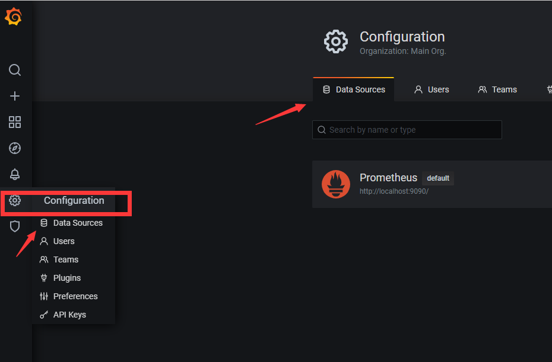

2. 添加**Prometheus**数据源

3. 添加url,然后保存

   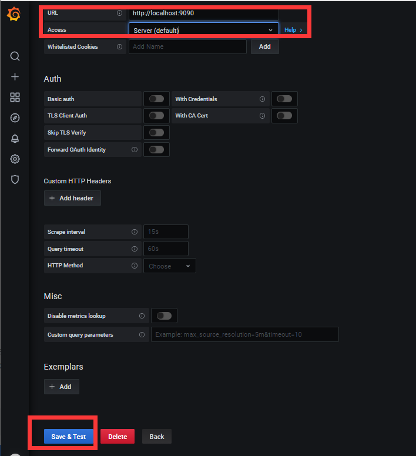

## 探索指标

Grafana Explore 是一个用于故障排除和数据探索的工作流。 在此步骤中，您将使用 Explore 创建即席查询以了解示例应用程序公开的指标。

1. 点击左侧的**Explore** 图标

2. 在查询编辑器中，输入 PromQL 查询，输入 prometheus_http_requests_total，然后按 Shift + Enter, 出现一个图表。

   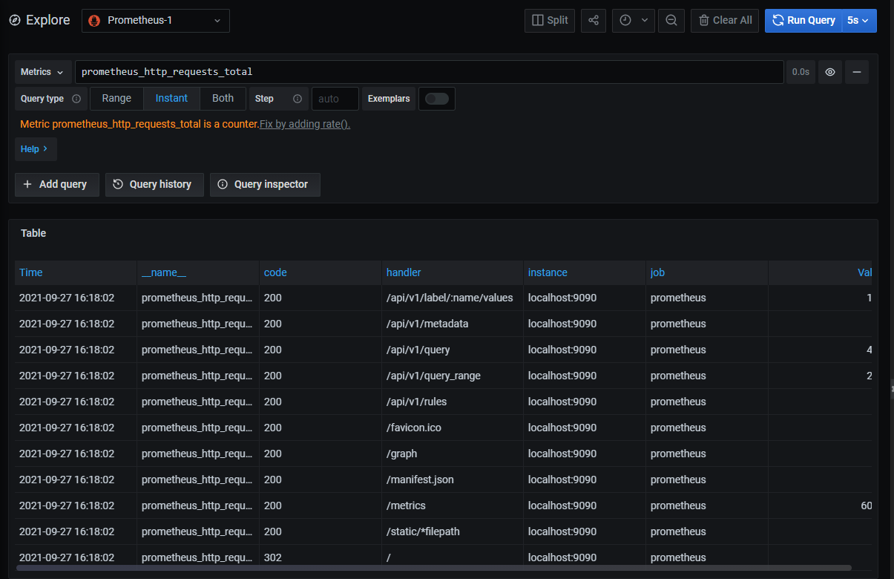

3. 在右上角，单击 Run Query 按钮上的下拉箭头，然后选择 5s。 Grafana 运行您的查询并每 5 秒更新一次图表。

4. 将 rate 函数添加到您的查询以可视化每秒请求的速率。 在查询编辑器中输入以下内容，然后按 Shift + Enter。

5. 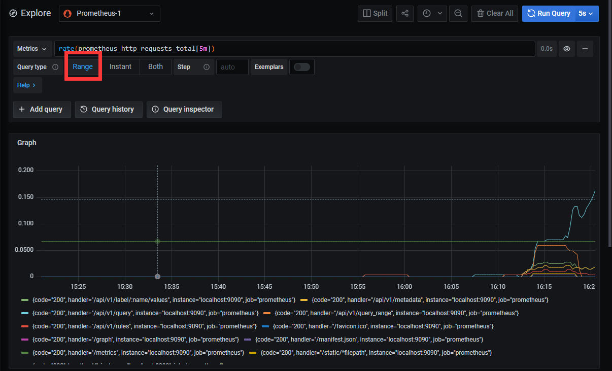

6. 在右上角，单击时间选择器，然后选择过去 5 分钟。 通过放大最后几分钟，可以更容易地看到您何时收到新数据。

   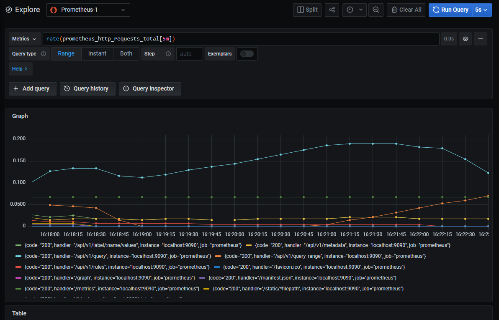

## 构建dashboard

仪表板可让您一目了然地查看数据，并让您通过不同的可视化来跟踪指标。仪表板由面板组成，每个面板代表您希望仪表板讲述的故事的一部分。每个面板都包含一个查询和一个可视化。 查询定义了要显示的数据，而可视化定义了数据的显示方式。

1. 打开dashboard页面

   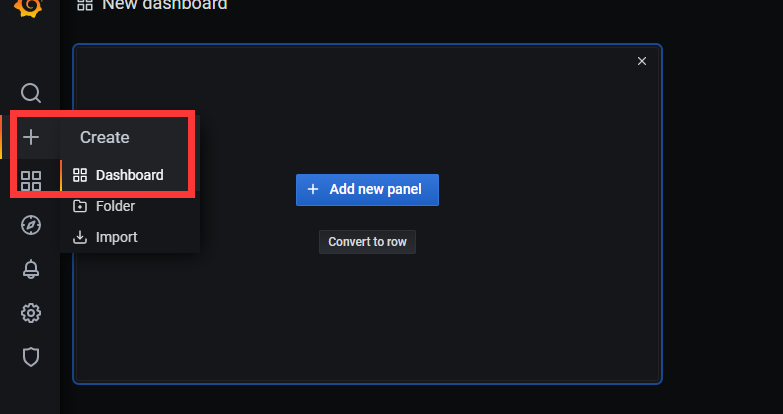

2. 点击**Add new panel**

3. 在图表下方的查询编辑器中，输入之前的查询，然后按 Shift + Enter：

4. 在**Legend** 字段中，输入 {{handler}} 以重命名图例中的时间序列。 当您在字段外单击时，图表图例会更新。

   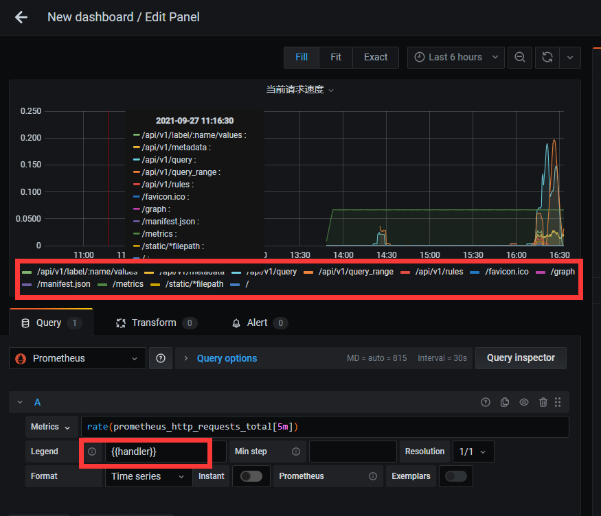

5. 在右侧面板编辑器的**Settings**，将面板title更改为“当前请求速度”。

6. 单击右上角的apply以保存面板并返回仪表板视图。

7. 单击仪表板顶部的 save dashboard图标以保存仪表板。

## 图表上标注事件

异常事件可以被标注。假如你看到图标上某个数据或者某段数据异常，你可以在这个位置上添加备注信息。

1. 要手动添加注释，请单击图表中的任意位置，然后单击 add notion。

   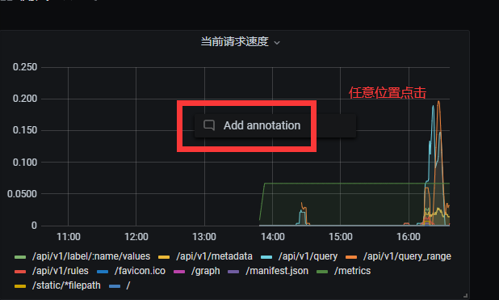

2. 输出**Description** ，然后 点击 save

3. Grafana 将您的注释添加到图表中。 将鼠标悬停在注释的底部以阅读文本。

   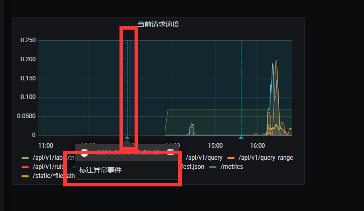

Grafana 还允许您使用区域注释来注释时间间隔。

1.按 Ctrl（或 macOS 上的 Cmd），然后在图形上单击并拖动以选择一个区域。

2. 输出description 和 tags内容 ，然后保存

对于这些单个事件，手动注释仪表板是很好的。 对于定期发生的事件，例如部署新版本，Grafana 支持从您的数据源之一查询注释。 让我们使用我们之前添加的 Loki 数据源创建一个注释。

## 告警

告警有两部分组成：

* 通知渠道 - 如何传递警报。 当满足警报规则的条件时，Grafana 会通知为该警报配置的通道。
* 警报规则 - 触发警报时。 警报规则由 Grafana 定期评估的一个或多个条件定义。

### 通知渠道

1. 打开配置界面

   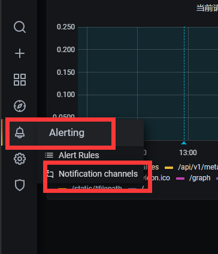

   2. 配置邮件信息

      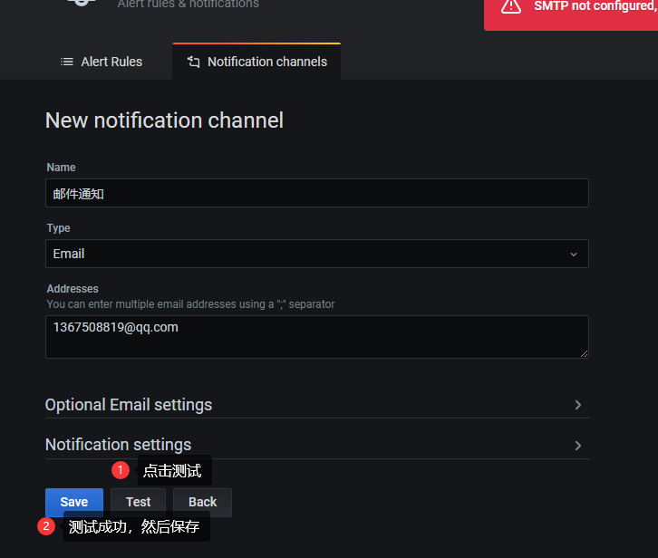

### 配置告警规则

1. 找到先前的dashboard,然后点击edit

2. 选择alert标签

   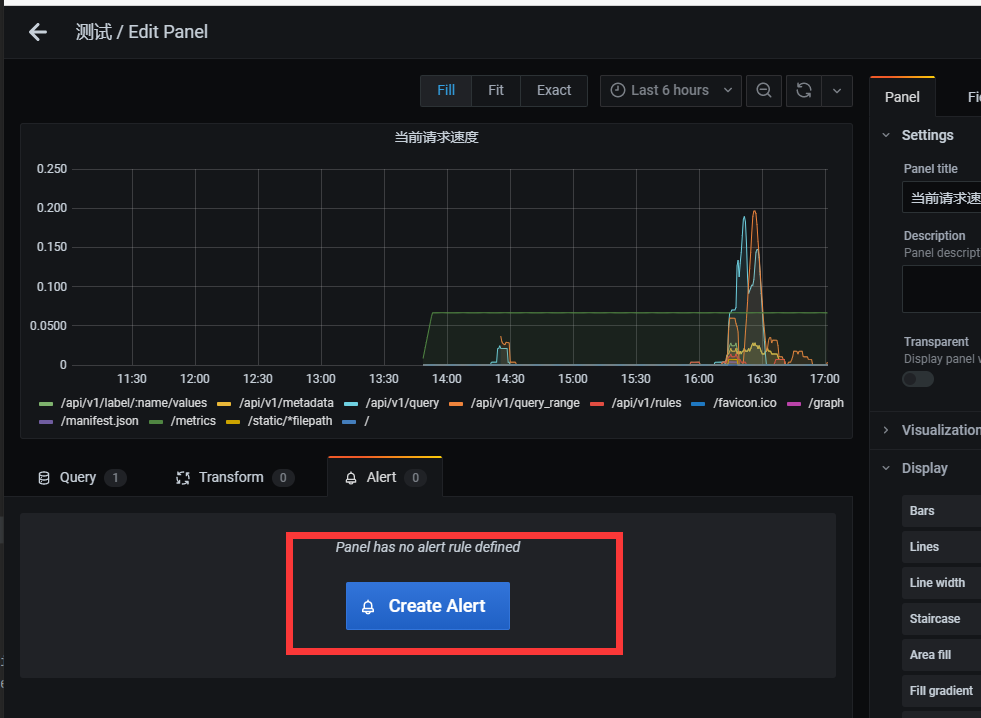

3. 编辑告警规则

   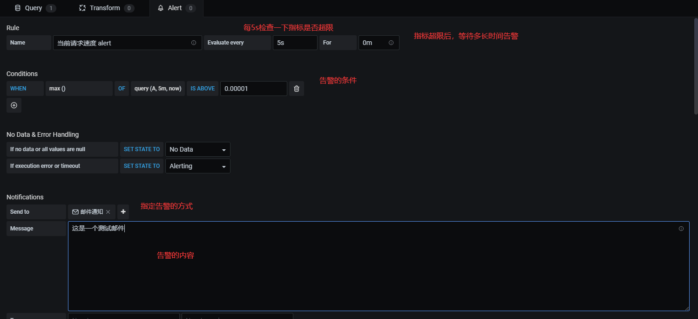

   

