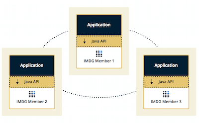
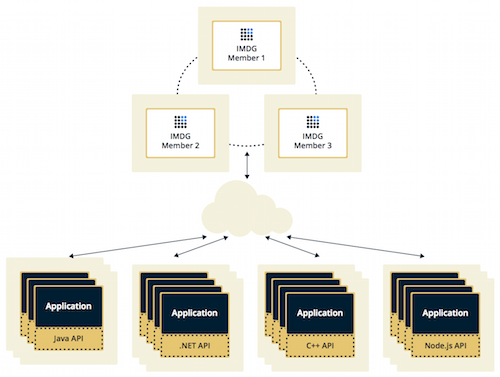
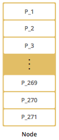
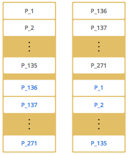
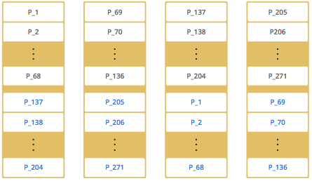

# 概览

## 版本信息

Hazelcast IMDG（内存数据网格）参考手册。

本参考手册涵盖 Hazelcast IMDG 的所有版本。 在本手册中：

* Hazelcast 或 Hazelcast IMDG 是指 Hazelcast 内存数据网格中间件的开源版本。 Hazelcast 也是提供 Hazelcast 产品的公司 (Hazelcast, Inc.) 的名称。

* Hazelcast IMDG Pro 是 Hazelcast IMDG 的商业许可版本，它在 Hazelcast 管理中心提供 CP 子系统持久性、热重启持久性和无限成员（在免费但未许可的管理中心版本上限制为 3 个成员）

* Hazelcast IMDG Enterprise 是 Hazelcast IMDG 的商业许可版本，它提供 Pro Edition 的所有功能，以及高密度内存存储、安全套件（RBAC、TLS、相互验证、客户端证书）、WAN 复制（在两个地理区域之间同步数据）和蓝/绿部署。

## 用途

* 事件广播
* 类似Memcache的 Near Cache（近端缓存）
*  需要在某些成员上执行的某些进程的云范围调度程序
* 在 OSGI 环境下与不同安装中的多个成员即时共享信息（用户信息、队列、地图等）
* 在集群中共享密钥，其中应用程序服务器上有一个 Web 服务接口和一些验证
* 作为分布式主题（发布/订阅服务器）为智能手机构建可扩展的聊天服务器
* 作为其并发 API 的强一致性层，它是 Hazelcast 的 CP（CP 与 CAP 原则）子系统建立在 Raft 共识算法之上
* 作为 Cassandra 后端的前层
* 在集群中分布用户对象状态，在对象之间传递消息并共享系统数据结构（静态初始化状态、镜像对象、对象身份生成器）
* 作为多租户缓存，每个租户都有自己的Map
* 共享数据集，例如类似表格的数据结构，供应用程序使用
* 从使用例如 Spring 框架开发前端的 Amazon EC2 服务器分配负载并收集状态
* 作为性能检测的实时流媒体
* 作为 Web 应用程序中会话数据的存储（启用 Web 应用程序的水平可扩展性）。

## 基本概念

Hazelcast IMDG 是一个开源分布式内存对象存储，支持多种数据结构。

您可以使用 Hazelcast IMDG 将数据存储在 RAM 中，在您的机器集群中传播和复制数据，并在其上执行计算。复制是为了保障单点故障发生时，数据不丢失仍能堆外提供服务。

Hazelcast IMDG 具有高度可扩展性和可用性。分布式应用程序可以将其用于分布式缓存、同步、集群、计算、发布/订阅消息等。

它是用 Java 语言实现的，并拥有 Java、C++、.NET、REST、Python、Go 和 Node.js 的客户端。 Hazelcast IMDG 还使用 Memcached 和 REST 协议。它插入到 Hibernate 中，可以很容易地与任何现有的数据库系统一起使用。

Hazelcast 提供开箱即用的分布式数据结构。例如，Map 接口提供了基于内存的k-v存储。

Hazelcast IMDG 设计轻巧且易于使用。 由于它是作为一个紧凑库 (JAR) 交付的，并且除了 Java 之外没有任何外部依赖项，因此它可以轻松插入您的项目中。

 当您添加新成员时，它们会自动发现集群并线性增加内存和处理容量。 成员之间保持 TCP 连接，所有通信都通过这一层进行。 每个集群成员在功能方面都配置为相同。 最早的成员（在集群中创建的第一个成员）自动执行对集群成员的数据分配。 如果最老的成员去世，则由第二个最老的成员接管。

Hazelcast IMDG 提供简单的可扩展性、分区（分片）和开箱即用的重新平衡。 它不需要任何额外的协调过程。 NoSQL 和传统数据库难以横向扩展和管理。 它们需要额外的协调和高可用性流程。 使用 Hazelcast IMDG，当您添加新成员以添加更多容量时，数据和备份会自动且均匀地平衡。

Hazelcast IMDG 是点对点的； Hazelcast IMDG 集群中没有单点故障；集群中的每个成员都配置为功能相同。它们都存储等量的数据并进行等量的处理。

您可以在以下架构图中看到所有 Hazelcast IMDG 版本的功能：


## 拓扑结构

您可以通过两种方式部署 Hazelcast 集群：**嵌入式或客户端/服务器**。

### 嵌入式

如果您的应用程序的主要焦点是异步或高性能计算和大量任务执行，那么嵌入式部署是首选方式。 在嵌入式部署中，成员包括应用程序、 Hazelcast 数据和其服务。 嵌入式部署的优势是具有低延迟的数据访问。请参阅下图：



### 客户端/服务器

在客户端/服务器部署中，Hazelcast 数据和服务集中在一个或多个服务器成员中，应用程序通过客户端访问它们。 您可以拥有一个可以独立创建和扩展的服务器成员集群。 您的客户与这些成员沟通，以获取 Hazelcast 数据和关于他们的服务。



Hazelcast 提供本地客户端（Java、.NET 和 C++）、Memcache 和 REST 客户端、Python 和 Node.js 客户端实现。

客户端/服务器部署的优势包括更可预测和更可靠的 Hazelcast 性能、更容易识别问题原因以及最重要的是更好的可扩展性。 当您需要扩展这种部署类型时，只需添加更多 Hazelcast 服务器成员即可。 您可以分别解决客户端和服务器可扩展性问题。

请注意，Hazelcast 成员库仅在 Java 中可用。 因此，将成员嵌入到业务服务中，只能使用 Java 实现。 用其他语言（.NET、C++、Node.js 等）编写的应用程序可以使用 Hazelcast 客户端库来访问集群。 有关客户端和其他语言实现的信息，请参阅 Hazelcast 客户端章节。

如果您想要低延迟数据访问（如在嵌入式部署中），并且您还想要客户端/服务器部署的可扩展性优势，您可以考虑为您的客户端定义近端缓存。 这使得经常使用的数据可以保存在客户端的本地内存中。 请参阅配置客户端近缓存部分。

## 数据分区

Hazelcast IMDG 中的内存段称为分区。分区的大小（它们可以存储的数据条目数量）受系统物理容量的限制。

分区在集群成员之间平均分配。 Hazelcast 还创建这些分区的备份，这些分区也分布在集群中。

默认情况下，Hazelcast 创建每个分区的单个副本。您可以配置 Hazelcast，以便每个分区可以有多个副本。其中一个副本称为主副本，其他副本称为备份。拥有分区主副本的集群成员称为分区所有者。当您读取或写入特定数据条目时，您可以透明地与包含该数据条目的分区所有者交谈。

默认情况下，Hazelcast 提供 271 个分区。当您使用单个成员启动集群时，它拥有所有 271 个分区（即，它保留 271 个分区的主副本）。下图显示了具有单个成员的 Hazelcast 集群中的分区：



当您在该集群上启动第二个成员（创建具有两个成员的 Hazelcast 集群）时，分区副本的分布如图所示：



上图中，黑色字体是主分区，蓝色是副本。随着您添加更多成员，Hazelcast 将一些主分区副本和备份分区副本一一移动到新成员，使所有成员平等且冗余。 由于一致的散列算法，只有最少量的分区被移动来横向扩展 Hazelcast。 以下是具有四个成员的 Hazelcast 集群中的分区副本分布图：



Hazelcast 还提供 lite 成员。 这些成员不拥有任何分区。 Lite 成员旨在用于计算量大的任务执行和侦听器注册。 尽管他们不拥有任何分区，但他们可以访问集群中其他成员拥有的分区。

Hazelcast 使用散列算法将数据条目分发到分区中。 给定一个对象键（例如，对于Map）或对象名称（例如，对于主题或列表）：

* 键或名称被序列化（转换为字节数组）
* 这个字节数组是散列的
* 对hash值取余。

此模的结果 - MOD(hash result, partition count) - 是将存储数据的分区，即分区 ID。 对于集群中的所有成员，给定键的分区 ID 始终相同。

分区表存储分区 ID 和它们所属的集群成员的地址。 这个表的目的是让集群中的所有成员（包括lite成员）都知道这个信息，确保每个成员都知道数据在哪里。

当您启动第一个成员时，会在其中创建一个分区表。 当您启动其他成员时，第一个成员将成为“最老的”成员并相应地更新分区表。 它定期将分区表发送给所有成员。 通过这种方式，集群中的每个成员都会被告知分区所有权的任何更改。 例如，当新成员加入集群或成员离开集群时，所有权可能会更改。

> 如果集群中最老的成员宕机，下一个最老的成员会将分区表信息发送给其他成员。

您可以使用 hazelcast.partition.table.send.interval 系统属性来配置成员发送分区表信息的频率（频率）。 默认情况下，频率为 15 秒。

重新分区是重新分配分区所有权的过程。 Hazelcast 在成员加入或离开集群时执行重新分区。

在这些情况下，最旧成员中的分区表将使用新的分区所有权进行更新。 请注意，如果 lite 成员加入或离开集群，则不会触发重新分区，因为 lite 成员不拥有任何分区。


Hazelcast 中的数据既是活动数据又是备份数据以实现高可用性，因此总内存占用是活动数据的大小加上备份数据的大小。如果使用单个备份，则意味着总内存占用是活动数据（活动数据+备份数据）的两倍。例如，如果使用两个备份，则总内存占用量是活动数据的三倍（活动数据 + 备份数据 + 备份数据）。

如果仅使用堆内存，则每个具有4GB堆的Hazelcast成员应最多容纳3.5GB的总数据（活动和备份）。如果您使用高密度内存存储，最多占用75%的配置物理内存用于活动和备份数据，25% 的空间用于正常内存碎片。但是，在这两种情况下，您还应该保留一些可用的内存空间来处理任何成员故障或显式成员关闭。当成员离开集群时，新下线成员之前拥有的数据会分布在其余成员之间。因此，我们建议您计划仅使用 60% 的可用内存，并留出 40% 的空间来处理成员故障或关闭。


# 快速入门

本章旨在让您在 5 分钟内入门。 快速入门展示了如何启动 Hazelcast 成员、形成集群、客户端应用程序连接集群、使用 Hazelcast 管理中心监控集群。

1. 下载软件包：

2. 启动单个Hazelcast 成员：`hz start`

   现在您的集群有一个成员。 要向集群添加更多成员，请打开另一个终端/命令行并重新运行上述命令。 成员自动发现彼此并形成一个 2 成员集群。 您应该会在命令行中看到日志输出发生这种情况，例如：

   ```sh
   Members {size:2, ver:2} [
       Member [127.0.0.1]:5701 - e40081de-056a-4ae5-8ffe-632caf8a6cf1 this
       Member [127.0.0.1]:5702 - 93e82109-16bf-4b16-9c87-f4a6d0873080
   ]
   ```

   > 请注意，这些成员以默认配置启动。 hazelcast.xml 的位置打印在上述命令输出的第一行。

3. 编写客户端代码，依赖：`
   com.hazelcast:hazelcast-all:5.0-BETA-1`：

   ```java
   import com.hazelcast.client.HazelcastClient;
   import com.hazelcast.core.HazelcastInstance;
   import com.hazelcast.map.IMap;
   
   public class MapSample {
       public static void main(String[] args) {
           // Start the client and connect to the cluster
           HazelcastInstance hz = HazelcastClient.newHazelcastClient();
           // Create a Distributed Map in the cluster
           IMap map = hz.getMap("my-distributed-map");
           //Standard Put and Get
           map.put("1", "John");
           map.put("2", "Mary");
           map.put("3", "Jane");
           // Shutdown the client
           hz.shutdown();
       }
   }
   ```

4. Hazelcast 管理中心可帮助您监控和管理您的 IMDG 集群。 在如上节所述创建集群和客户端应用程序后，让我们将管理中心连接到集群：`hz mc start`

   然后，打开您首选的 Web 浏览器到 http://localhost:8080 并选择`default`安全提供程序以提供用户名和密码。


# 配置

要配置 Hazelcast 应用程序，您可以选择静态或动态配置。

> 在配置 Hazelcast 之前，我们建议您尝试默认设置，这些设置在 Hazelcast 包的 hazelcast-default.xml 文件中设置。

## 静态配置

静态配置：提供配置文件或使用 API 在运行前配置 Hazelcast。 在运行期间不能更改静态配置。要使用静态配置，您有以下选项：

* 声明式配置：在启动 Hazelcast 集群之前，使用配置文件对其进行配置。
* 编程配置：使用 Java API 以嵌入式模式配置集群。
* 系统属性：使用系统属性来配置 Hazelcast 的某些方面。
* Spring 配置：为 Spring 集成配置 Hazelcast。

Hazelcast 按以下顺序查找静态配置选项：

1. 程序化配置提供的Config对象
2. hazelcast.config 系统属性
3. 工作目录下的hazelcast.xml声明性配置文件
4. 类路径上的hazelcast.xml 声明性配置文件
5. 工作目录中的hazelcast.yaml（或.yml）声明性配置文件
6. 类路径上的hazelcast.yaml 声明性配置文件
7. 如果 Hazelcast 没有找到任何这些配置选项，它会加载默认配置文件 (hazelcast-default.xml)，该文件随您的 Hazelcast 包一起提供。


### 编程方式

除了声明式配置外，您还可以通过编程方式配置集群。 为此，您可以创建一个 Config 对象，设置其属性，并使用此 Config 对象创建一个新的 Hazelcast 成员。 以下是配置一些网络和 Hazelcast Map 属性的示例代码:

```java
        Config config = new Config();
        config.getNetworkConfig().setPort( 5900 )
                .setPortAutoIncrement( false );

        MapConfig mapConfig = new MapConfig();
        mapConfig.setName( "testMap" )
                .setBackupCount( 2 )
                .setTimeToLiveSeconds( 300 );
```
要使用上述示例配置创建 Hazelcast 成员，请传递配置对象，如下所示：

```java
HazelcastInstance hazelcast = Hazelcast.newHazelcastInstance( config );
```

> Hazelcast 实例启动后，不得修改 Config。 换句话说，所有配置必须在创建 HazelcastInstance 之前完成。 某些额外的配置元素可以在运行时添加，如在集群上动态添加数据结构配置部分所述。

您还可以创建一个命名的 Hazelcast 成员。 在这种情况下，您应该设置 Config 对象的 instanceName，如下所示：

```java
Config config = new Config();
config.setInstanceName( "my-instance" );
Hazelcast.newHazelcastInstance( config );
```

要按名称检索现有 Hazelcast 成员，请使用以下命令：
```java
Hazelcast.getHazelcastInstanceByName( "my-instance" );
```

要检索所有现有的 Hazelcast 成员，请使用以下命令：

```java
Hazelcast.getAllHazelcastInstances();
```

如果要指定自己的配置文件来创建 Config，Hazelcast 支持多种方式，包括文件系统、类路径、InputStream 和 URL。

从 XML 声明性配置构建配置：

- `Config cfg = new XmlConfigBuilder(xmlFileName).build();`
- `Config cfg = new XmlConfigBuilder(inputStream).build();`
- `Config cfg = new ClasspathXmlConfig(xmlFileName);`
- `Config cfg = new FileSystemXmlConfig(configFilename);`
- `Config cfg = new UrlXmlConfig(url);`
- `Config cfg = new InMemoryXmlConfig(xml);`

从 YAML 声明性配置构建配置：

- `Config cfg = new YamlConfigBuilder(yamlFileName).build();`
- `Config cfg = new YamlConfigBuilder(inputStream).build();`
- `Config cfg = new ClasspathYamlConfig(yamlFileName);`
- `Config cfg = new FileSystemYamlConfig(configFilename);`
- `Config cfg = new UrlYamlConfig(url);`
- `Config cfg = new InMemoryYamlConfig(yaml);`

# 分布式数据结构

* 集合
  * Map 是 java.util.Map 的分布式实现。 它允许您使用 get 和 put 等方法读取和写入 Hazelcast Map。
  * Queue 是 java.util.concurrent.BlockingQueue 的分布式实现。 您可以在一个成员中添加一个项目并从另一个成员中删除它。
  * Ringbuffer 是为可靠的事件系统而实现的。
  * Set 是 java.util.Set 的分布式并发实现。 它不允许重复元素并且不保留它们的顺序。
  * List 类似于 Hazelcast Set。 唯一的区别是它允许重复元素并保留它们的顺序。
  * Multimap 是一种专门的 Hazelcast Map。 它是一种分布式数据结构，您可以在其中为单个键存储多个值。
  * Replicated Map不分区数据。 它不会将数据传播到不同的集群成员。 相反，它将数据复制到所有成员。
  * Cardinality Estimator 是一种数据结构，它实现了 Flajolet 的 HyperLogLog 算法。

* Topic:
  * 主题是用于发布给多个订阅者消息的分布式机制。 它也称为发布/订阅 (pub/sub) 消息传递模型。
  * Reliable Topic 使用与 Hazelcast Topic 相同的接口，除了它由 Ringbuffer 数据结构备份。

* 并发工具：
  * FencedLock 是 java.util.concurrent.locks.Lock 的分布式实现。使用 lock 时，保证 Hazelcast Lock 保护的临界区只能由整个集群中的一个线程执行。
  * ISemaphore 是 java.util.concurrent.Semaphore 的分布式实现。在执行并发活动时，信号量允许控制线程数。
  * IAtomicLong 是 java.util.concurrent.atomic.AtomicLong 的分布式实现。 AtomicLong 的大部分操作都可用。但是，这些操作涉及远程调用，因此由于是分布式的，因此它们的性能与 AtomicLong 不同。
  * IAtomicReference 是 java.util.concurrent.atomic.AtomicReference 的分布式实现。当你需要在分布式环境中处理一个引用时，你可以使用 Hazelcast IAtomicReference。
  * FlakeIdGenerator 用于生成集群范围的唯一标识符。
  * ICountdownLatch 是 java.util.concurrent.CountDownLatch 的分布式实现。 Hazelcast CountDownLatch 是并发活动的看门人。它使线程能够等待其他线程完成它们的操作。
  * PN 计数器是一种分布式数据结构，其中每个 Hazelcast 实例可以递增和递减计数器值，并将这些更新传播到所有副本。
  * Event Journal 是一种分布式数据结构，用于在Map或缓存上存储操作的历史记录。

Hazelcast 在分区策略方面有两种类型的分布式对象：

* 每个分区存储一部分实例的数据结构，即分区数据结构。
* 单个分区存储整个实例的数据结构，即非分区数据结构。

以下是分区的 Hazelcast 数据结构：

* Map
* MultiMap
* Cache (Hazelcast JCache implementation)
* Event Journal

以下是未分区的 Hazelcast 数据结构：

- Queue
- Set
- List
- Ringbuffer
- FencedLock
- ISemaphore
- IAtomicLong
- IAtomicReference
- FlakeIdGenerator
- ICountdownLatch
- Cardinality Estimator
- PN Counter

除此之外，Hazelcast 还提供 Replicated Map 数据结构。

## 加载和销毁对象

Hazelcast 为其大多数分布式对象提供了 get 方法。 要加载一个对象，首先创建一个 Hazelcast 实例，然后在这个实例上使用相关的 get 方法。 以下示例代码片段在此实例上创建一个 Hazelcast 实例和一个Map:

```java
HazelcastInstance hazelcastInstance = Hazelcast.newHazelcastInstance();
Map<Integer, String> customers = hazelcastInstance.getMap( "customers" );
```

> Hazelcast 的大多数分布式对象都是惰性创建的，即，一旦第一个操作访问它，就会创建一个分布式对象。

要销毁 Hazelcast 分布式对象，您可以使用方法 destroy。 该方法清除并释放对象的所有资源。 因此，您必须小心使用它，因为在对象被销毁后使用相同的对象引用重新加载会创建一个没有错误的新数据结构。 请参阅以下示例代码:

```java
        HazelcastInstance hz1 = Hazelcast.newHazelcastInstance();
        HazelcastInstance hz2 = Hazelcast.newHazelcastInstance();
        IQueue<String> q1 = hz1.getQueue("q");
        IQueue<String> q2 = hz2.getQueue("q");
        q1.add("foo");
        System.out.println("q1.size: "+q1.size()+ " q2.size:"+q2.size());
        q1.destroy();
        System.out.println("q1.size: " + q1.size() + " q2.size:" + q2.size());
```

```sh
q1.size: 1 q2.size:1
q1.size: 0 q2.size:0
```

如您所见，没有生成错误并创建了一个新的队列资源。

> Hazelcast 旨在在访问时创建任何分布式数据结构，即，每当对数据结构进行调用时。 因此，请记住，即使在销毁数据结构之后对其执行操作时，也会重新创建数据结构。

## 控制分区

Hazelcast 使用分布式对象的名称来确定将放置哪个分区。 让我们加载两个队列，如下所示：

```java
HazelcastInstance hazelcastInstance = Hazelcast.newHazelcastInstance();
IQueue q1 = hazelcastInstance.getQueue("q1");
IQueue q2 = hazelcastInstance.getQueue("q2");
```

由于这些队列具有不同的名称，它们将被放置在不同的分区中。 如果要将这两个放在同一个分区，则使用@符号，如下所示：

```java
HazelcastInstance hazelcastInstance = Hazelcast.newHazelcastInstance();
IQueue q1 = hazelcastInstance.getQueue("q1@foo");
IQueue q2 = hazelcastInstance.getQueue("q2@foo");
```

现在，这两个队列将被放入分区键为 foo 的同一个分区中。 请注意，您可以使用 getPartitionKey 方法来学习分布式对象的分区键。 当您想在现有对象的同一分区中创建对象时，它可能很有用。 看它的用法如下图：

```java
String partitionKey = q1.getPartitionKey();
IQueue q3 = hazelcastInstance.getQueue("q3@"+partitionKey);
```

如果成员出现故障，其备份副本（保存相同数据）会动态地将数据（包括所有权和对它们的锁定）重新分配给剩余的活动成员。 因此，不会有任何数据丢失。

没有单一的集群主节点可以成为单点故障。 集群中的每个成员都有平等的权利和责任。 没有一个成员是优越的。 不依赖于外部“服务器”或“主机”。

下面是一个示例，说明如何检索现有数据结构实例（映射、队列、集合、主题等）以及如何侦听实例事件，例如正在创建或销毁的实例:

```java
public class ExampleDOL implements DistributedObjectListener {

    public static void main(String[] args) {
        ExampleDOL example = new ExampleDOL();
        Config config = new Config();

        HazelcastInstance hazelcastInstance = Hazelcast.newHazelcastInstance(config);
        hazelcastInstance.addDistributedObjectListener(example);

        Collection<DistributedObject> distributedObjects = hazelcastInstance.getDistributedObjects();
        for (DistributedObject distributedObject : distributedObjects) {
            System.out.println(distributedObject.getName());
        }
    }

    @Override
    public void distributedObjectCreated(DistributedObjectEvent event) {
        DistributedObject instance = event.getDistributedObject();
        System.out.println("Created " + instance.getName());
    }

    @Override
    public void distributedObjectDestroyed(DistributedObjectEvent event) {
        DistributedObject instance = event.getDistributedObject();
        System.out.println("Destroyed " + instance.getName());
    }
}
```

# 复制模型

分区和复制是分布式数据库中共同使用的两种常用技术，以实现可扩展、可用和透明的数据分发。 数据空间分为多个分区，每个分区包含整个数据集的不同部分。 对于这些分区，会创建多个副本。 分区副本分布在集群成员之间。 每个成员最多分配给一个分区的单个副本。 在此设置中，可以使用不同的复制技术来访问数据并使副本在更新时保持同步。 由于 CAP（一致性、可用性和分区容错）原则，所使用的技术直接影响分布式数据存储提供的保证和属性。

复制技术的一个方面是关于访问和更新复制数据集的位置。 例如，主副本系统首先选择一个副本，可以称为主副本，并使用该副本访问数据。 主副本上的数据更改会传播到其他副本。 这种方法有不同的命名方式，例如主复制、单主复制、被动复制。 主复制技术是一个强大的模型，因为它可以防止副本之间的冲突和死锁。 但是，主要副本可能会成为瓶颈。 另一方面，我们可以通过消除主副本并将每个副本视为平等来采用不同的技术。 这些系统可以实现更高级别的可用性，因为可以使用任何副本访问和更新数据条目。 但是，保持副本彼此同步会变得更加困难。

复制技术在更新如何在副本之间传播方面也有所不同。一种选择是将每个副本更新为单个原子事务的一部分，称为急切复制或同步复制。共识算法应用这种方法来实现复制数据集的强一致性。主要缺点是运行复制算法时所需的协调和通信量。 CP 系统在幕后实现共识算法。另一种选择是惰性复制技术，也称为异步复制。延迟复制算法在具有单独事务的副本上执行更新。他们通常会尽力而为。通过这种方式，副本之间的协调量会降低，并且可以以更高性能的方式访问数据。然而，可能会发生在某些副本上执行特定更新而不在其他副本上执行的情况，这会导致副本发散。这些问题可以通过不同的方法解决，例如读修复、写修复、反熵。惰性复制技术在 AP 系统中很流行。

## Hazelcast的复制算法

在 CAP 原理的上下文中，Hazelcast 提供了具有不同数据结构实现的 AP 和 CP 功能。 HazelcastInstance API下暴露的数据结构都是AP数据结构。 Hazelcast 还包含一个 CP 子系统，它建立在 Raft 共识算法之上，并通过 HazelcastInstance.getCPSubsytem() 访问，它提供了 CP 数据结构和 API。

对于 AP 数据结构，Hazelcast 采用了主副本和可配置延迟复制技术的组合。 正如数据分区部分中简要描述的那样，每个数据条目都映射到单个 Hazelcast 分区并放入该分区的副本中。 其中一个副本被选为主副本，负责对该分区执行操作。 当您读取或写入映射条目时，您可以透明地与分配了相应分区的主副本的 Hazelcast 成员交谈。 通过这种方式，每个请求都会命中稳定集群中特定数据条目的最新版本。 备份副本保持待机模式，直到主副本出现故障。 在主副本出现故障时，备份副本之一将提升为主角色。

使用延迟复制，当主副本收到键的更新操作时，它会在本地执行更新并将其传播到备份副本。 它使用**逻辑时间戳**标记每个更新，以便备份以正确的顺序应用它们并与主节点收敛到相同的状态。 备份副本可用于扩展读取（参见启用备份读取部分），没有强一致性但保证单调读取。

尽力而为的一致性：Hazelcast 的复制技术使 Hazelcast 集群能够提供高吞吐量。 但是，由于系统中的临时情况，例如网络中断，备份副本可能会错过一些更新并与主副本发生分歧。 备份副本也可能遇到 VM 或长时间的 GC 暂停，并落后于主副本，这种情况称为复制滞后。 如果 Hazelcast 分区主副本成员在其自身与备份之间存在复制延迟时崩溃，则可能会丢失数据的强一致性。

请注意，CP 系统也可能存在类似的问题。 但是，在 CP 系统中，一旦副本在本地执行更新（即提交更新），底层共识算法将保证更新的持久性在执行的其余部分中保持不变。

另一方面，在像 Hazelcast 这样的 AP 系统中，一个副本可以在本地执行更新，即使不会在其他副本上执行更新。 这是一个公平的权衡，以减少副本之间的协调量并保持系统的高吞吐量和高可用性。 这些系统采用额外的测量方法以尽最大努力保持一致性。 在这方面，Hazelcast 尝试使用主动反熵解决方案来最小化此类场景的影响，如下所示：

* 每个 Hazelcast 成员在后台运行一个周期性任务。
* 对于分配给它的每个主要副本，它会创建一个摘要信息并将其发送到备份。
* 然后，每个备份成员将摘要信息与其自己的数据进行比较，以查看它是否与主数据保持同步。
* 如果备份成员检测到缺少更新，它会触发与主要成员的同步过程。


当使用 map.put() 或 queue.offer() 等方法请求写入时，写入操作将提交给拥有特定分区主副本的 Hazelcast 成员。 操作的分区是根据与该操作相关的参数（条目的键或数据结构的名称等）确定的，具体取决于数据结构。 目标 Hazelcast 成员是通过查找本地分区分配表来确定的，该表在每次分区迁移时更新并最终广播到所有集群。

当 Hazelcast 成员收到特定于分区的操作时，它会执行该操作并将其传播到备份副本，传递信息包含逻辑时间戳。 每个操作的备份数量取决于数据结构及其配置。 

有两种类型的备份复制可用：同步和异步。 尽管它们的名称暗示着什么，但这两种类型仍然是惰性（异步）复制模型的实现。 同步和异步之间的唯一区别是，前者使调用者阻塞，直到备份副本应用备份更新并将确认发送回调用者，但后者只是触发。 同步和异步备份的数量在数据结构配置中定义，您可以使用同步和异步备份的组合。

当备份更新被传播时，包括同步备份更新数量在内的执行响应被发送到调用者，并且在接收到响应之后，调用者等待接收指定数量的同步备份确认的预定义超时。 默认情况下，此超时为 5 秒，由系统属性 hazelcast.operation.backup.timeout.millis 定义。

由于一些原因，可能会错过备份更新，例如备份副本成员上的过时分区表信息、网络中断或成员崩溃。 这就是同步备份确认需要超时才能放弃的原因。 无论是同步备份还是异步备份，如果丢失了备份更新，定期运行的反熵机制会检测到不一致并将备份副本与主副本同步。 此外，正常关闭过程确保其主副本分配给关闭成员的分区的所有备份副本将是一致的。

在某些情况下，尽管故障检测器假定调用的目标成员处于活动状态，但目标可能不会执行操作或及时发送响应。 网络分裂、高负载引起的长时间暂停、GC 或 I/O（磁盘、网络）可以列为几个可能的原因。 当调用未收到来自拥有主副本的成员的任何响应时，调用将失败并显示 OperationTimeoutException。 此超时默认为 2 分钟，由系统属性 hazelcast.operation.call.timeout.millis（系统属性附录）定义。 当超时时间过去时，调用的结果将是不确定的。

Hazelcast 作为 AP 产品，不提供一次性保证。一般来说，Hazelcast 往往是一个至少一次的解决方案。

在以下失败情况下，可能会破坏仅一次保证：当挂起调用的目标成员离开集群而调用正在等待响应时，由于新的分区表，该调用将重新提交到其新目标.可能是，它已经在离开的成员上执行了，并且备份更新被传播到备份副本，但是调用者没有收到响应。如果发生这种情况，该操作将执行两次。

在以下失败情况下，调用状态变得不确定：如上所述，当调用未及时收到响应时，调用将失败并显示 OperationTimeoutException。这个异常并没有说明操作的结果，这意味着操作可能根本不会执行，它可能会执行一次或两次。

# 网络分区

一般来说，网络分区是一种网络故障，导致成员分裂成多个组，使得一个组中的成员无法与其他组中的成员通信。在分区场景中，假设其他侧的成员出现故障，原始集群的所有侧都独立运行。网络分区也称为裂脑综合症。

尽管这种通信故障被称为网络分区，但实际上进程或整个操作系统挂起/暂停很长时间也可能会导致通信中断。如果这些中断时间过长，就会认为相应的成员奔溃了，集群就会分裂成多个分区，它们开始独立运行。这就是为什么任何足够长的通信故障/中断都可以归类为网络分区的原因。

此外，通信故障不一定是对称的。网络故障只能中断通道的一侧，或者挂起的进程/成员甚至可能不会观察到其余部分已崩溃。这种网络分区可以称为部分网络分区。有关详细信息，请参阅部分网络分区部分。

Hazelcast 使用以下解决方案处理网络分区：

* 脑裂保护：当一致性是网络分区的主要问题时，可以使用脑裂保护。 它需要最小集群大小来保持特定数据结构可用。 当集群大小低于定义的裂脑保护大小时，随后的操作将被拒绝并抛出 SplitBrainProtectionException。 请参阅裂脑保护部分。

* 裂脑恢复（合并策略）：裂脑恢复是使数据结构在网络分区的两侧都可用且可操作，并在网络分区问题解决后合并它们的数据。 请参阅裂脑恢复部分。

## 脑裂保护

Hazelcast 中提供的脑裂保护机制可以在集群成员数量低于指定数量时保护您的集群。 如何应对裂脑场景取决于数据的一致性或应用程序的可用性是否是主要关注点。 在任何一种情况下，因为裂脑场景是由网络故障引起的，所以您必须开始努力识别和纠正网络故障。 在底层网络故障得到修复之前，您的集群无法恢复到稳定运行状态。 如果一致性是您的主要关注点，您可以使用 Hazelcast 的裂脑保护功能。

此功能使您能够指定发生操作所需的最小集群大小。 这是通过为集群定义和配置最小集群大小来实现的。 如果集群大小低于此最小值，则操作将被拒绝，并且被拒绝的操作向其调用方返回 SplitBrainProtectionException。 此外，可以使用用户定义的 SplitBrainProtectionFunction 配置此大小，该函数被咨询以确定每个集群成员资格更改时没有裂脑。

您的应用程序将继续在剩余的运行集群上运行。 任何连接到集群且大小低于脑裂保护配置定义的最小阈值的应用程序实例都会收到异常，这取决于编程和监控设置，应生成警报。 关键是应用程序不会因为陈旧数据而继续出错，而是被阻止这样做。

以下 Hazelcast 数据结构支持脑裂保护：

- IMap (for Hazelcast 3.5 and higher versions)
- Transactional Map (for Hazelcast 3.5 and higher versions)
- ICache (for Hazelcast 3.5 and higher versions)
- ILock (for Hazelcast 3.8 and higher versions)
- IQueue (for Hazelcast 3.8 and higher versions)
- IExecutorService, DurableExecutorService, IScheduledExecutorService, MultiMap, ISet, IList, Ringbuffer, Replicated Map, Cardinality Estimator, IAtomicLong, IAtomicReference, ISemaphore, ICountdownLatch (for Hazelcast 3.10 and higher versions)

每个要保护的数据结构都应该添加配置，如配置裂脑保护部分所述。

## 裂脑恢复

Hazelcast 部署了一个后台任务，该任务会定期搜索拆分的集群。当检测到分裂时，将决定发起合并过程的一方。该决定基于集群大小；根据成员数量，较小的集群合并到较大的集群。如果它们具有相同数量的成员，则散列算法确定合并集群。在决定合并方时，双方确保其成员列表中没有交集。

合并方确定后，合并方最老的集群成员通过向其集群中的成员发送合并指令来发起集群合并过程。

在从分区中恢复时，Hazelcast 对支持的数据结构使用合并策略来解决拆分集群之间的数据冲突。合并策略是一个回调函数，用于解决现有数据和合并数据之间的冲突。 Hazelcast 提供了一个要实现的接口以及一系列现成的策略。没有裂脑恢复的数据结构支持从合并端丢弃数据。

合并集群的每个成员：

* 关闭其所有网络连接（从其集群中分离）
* 获取支持裂脑恢复的本地数据结构的快照
* 丢弃所有数据结构数据
* 作为 lite 成员加入新集群
* 从本地快照向新集群发送合并操作。

从 Hazelcast 3.10 开始，所有合并策略都实现了统一接口 com.hazelcast.spi.SplitBrainMergePolicy。 我们提供以下开箱即用的实现：

* DiscardMergePolicy：来自较小集群的条目被丢弃。
* ExpirationTimeMergePolicy：过期时间较长者获胜。
* HigherHitsMergePolicy：点击次数多的条目获胜。
* HyperLogLogMergePolicy：CardinalityEstimator 的专用合并策略，它使用 HyperLogLog 研究的默认合并算法，保持两个给定实例的最大寄存器值。
* LatestAccessMergePolicy：具有最新访问权限的条目获胜。
* LatestUpdateMergePolicy：具有最新更新的条目获胜。
* PassThroughMergePolicy：来自较小集群的条目获胜。
* PutIfAbsentMergePolicy：如果集群中不存在，则来自较小集群的条目获胜。

支持的数据类型：

- `IMap` (including High-Density Memory Store backed IMap)
- `ICache` (including High-Density Memory Store backed IMap)
- `ReplicatedMap`
- `MultiMap`
- `IAtomicLong`
- `IAtomicReference`
- `IQueue`
- `IList`
- `ISet`
- `RingBuffer`
- `CardinalityEstimator`
- `ScheduledExecutorService`


## 部分网络分区


# 集群

## 集群发现机制

默认情况下，Hazelcast 尝试根据运行时环境自动检测适用的发现机制：

* TCP: 您可以将 Hazelcast 配置为完整的 TCP/IP 集群。 有关配置详细信息，请参阅通过 TCP 发现成员部分。

* Multicast: 通过这种机制，Hazelcast 允许集群成员使用多播通信找到彼此。 请参阅通过多播发现成员部分。

  如果您更喜欢使用此机制，请确保您的网络是安全的。 由于正在广播多播数据包，来自任何地方的任何成员都可以使用适当的集群名称加入集群，因此您对集群的控制较少。另请注意，如果用户数据报协议 (UDP) 被阻止，就像大多数生产环境一样，使用多播进行发现将不起作用。


* Eureka Cloud Discovery:

* Zookeeper Cloud Discovery:
* ....

自动检测是开始玩 Hazelcast 的好方法。 它会尝试自动检测适当的发现插件并将其应用于您的 Hazelcast 配置。 假设您的类路径上有 hazelcast-all 并且您的运行时是 Kubernetes，Hazelcast 会自动应用 Kubernetes 发现机制。

> 请注意，不建议在生产中使用自动检测。 另请注意，如果 Hazelcast 找不到适用的发现机制，则它会回退到多播。

### TCP

如果多播不是您环境的首选发现方式，那么您可以将 Hazelcast 配置为完整的 TCP/IP 集群。 当您将 Hazelcast 配置为通过 TCP/IP 发现成员时，您必须将所有或部分成员的主机名和/或 IP 地址列为集群成员。 您不必列出所有这些集群成员，但是当新成员加入时，至少有一个列出的成员必须在集群中处于活动状态。

```yaml
hazelcast:
  network:
    join:
      tcp-ip:
        enabled: true
        member-list:
          - machine1
          - machine2
          - machine3:5799
          - 192.168.1.0-7
          - 192.168.1.21
```

如上所示，您可以为成员元素提供 IP 地址或主机名。 您还可以提供一系列 IP 地址，例如 192.168.1.0-7。

如果您不为成员提供端口，Hazelcast 会自动尝试端口 5701、5702 等。

默认情况下，Hazelcast 绑定到所有本地网络接口以接受传入流量。 您可以使用系统属性 hazelcast.socket.bind.any 更改此行为。 如果将此属性设置为 false，Hazelcast 将使用 interfaces 元素中指定的接口（请参阅接口配置部分）。 如果没有提供接口，那么它会尝试从成员元素解析一个要绑定的接口。

### 多播

通过多播自动发现机制，Hazelcast 允许集群成员使用多播通信找到彼此。 集群成员不需要知道其他成员的具体地址，因为它们只是多播给所有其他成员进行侦听。 是否可以或允许多播取决于您的环境。下面是一个示例声明性配置。

```yaml
hazelcast:
  network:
    join:
      multicast:
        enabled: true
        multicast-group: 224.2.2.3
        multicast-port: 54327
        multicast-time-to-live: 32
        multicast-timeout-seconds: 2
        trusted-interfaces:
          - 192.168.1.102
```

 multicast-timeout-seconds 指定成员应等待网络中运行的另一个成员的有效多播响应的时间（以秒为单位），然后再将自己声明为领导成员（加入集群的第一个成员）并创建自己的集群。 这仅适用于尚未分配领导者的成员的启动。 如果为multicast-timeout-seconds 指定一个较高的值，例如60 秒，则意味着在选择leader 之前，每个成员在继续之前等待60 秒。 提供高值时要小心。 另外，请注意不要将值设置得太低，否则成员可能会过早放弃并创建自己的集群。

