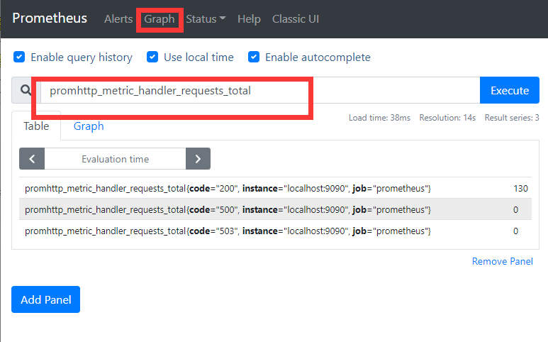
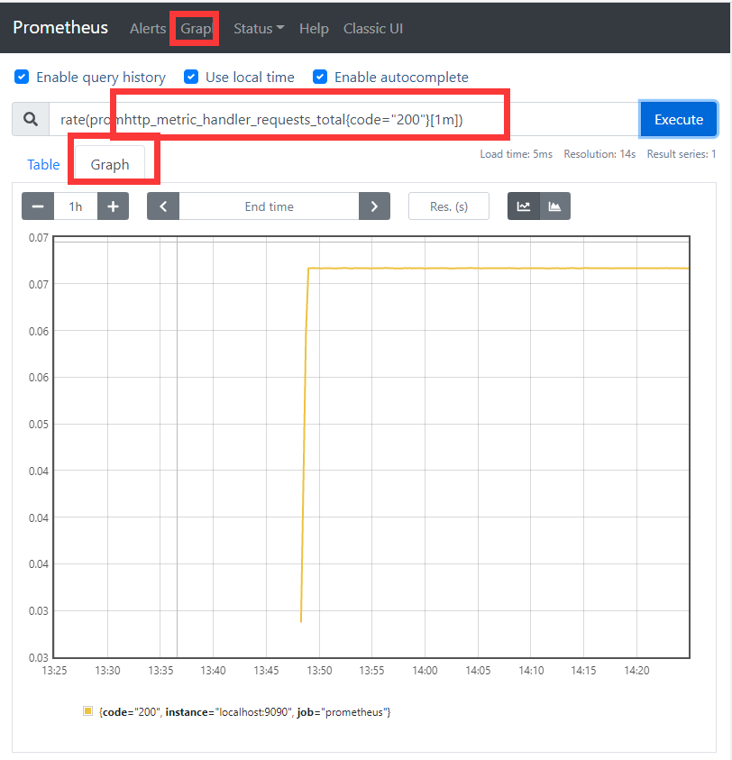
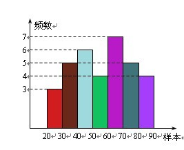

# 概述

开源的系统监控和告警系统。Prometheus 将其指标收集并存储为**时间序列数据**，即**指标信息**与记录它的时间戳一起存储，以及称为**标签**的可选键值对。

特点：

- 一个多维数据模型，具有由指标名称和键值对标识的时间序列数据
- PromQL，一种利灵活的查询语言
- 不依赖分布式存储； 单个服务器节点是自治的
- 时间序列收集通过 HTTP 上的拉模型发生
- 通过中间网关支持推送时间序列
- 通过服务发现或静态配置发现目标
- 多种图形和仪表板支持模式

Prometheus 生态系统由多个组件组成，其中许多是可选的：

* 抓取和存储时间序列数据的 Prometheus 服务器
* 用于检测应用程序代码的客户端库
* 支持短期工作的推送网关
* HAProxy、StatsD、Graphite 等服务的专用出口商。
* 一个警报管理器来处理警报

大多数 Prometheus 组件都是用 Go 编写的，这使得它们易于构建和部署为静态二进制文件。


# 快速入门

## 安装

```sh
tar xvfz prometheus-*.tar.gz
cd prometheus-*
./prometheus --help
```

## 配置

配置文件：安装目录下的prometheus.yml ，下面是个基本的配置文件：

```yaml
global:
  scrape_interval:     15s
  evaluation_interval: 15s

rule_files:
  # - "first.rules"
  # - "second.rules"

scrape_configs:
  - job_name: prometheus
    static_configs:
      - targets: ['localhost:9090']
```

* global控制服务器全局配置。
  * scrape_interval: 抓取的频率
  * evaluation_interval：evaluate 规则的频率。Prometheus 使用规则来创建新的时间序列并生成警报。
* rule_files 块指定了我们希望 Prometheus 服务器加载的任何规则的位置。 目前我们没有规则。
* scrape_configs，控制 Prometheus 监控的资源。 由于 Prometheus 还将有关自身的数据公开为 HTTP 端点，因此它可以抓取和监控自己的健康状况。 在默认配置中，有一个名为 prometheus 的作业，它抓取 Prometheus 服务器公开的时间序列数据。 该作业包含一个静态配置的target，即localhost:9090。 Prometheus 访问 /metrics 路径获取指标信息。 所以这个默认作业是通过 URL 抓取的：http://localhost:9090/metrics。

## 启动

```bash
./prometheus --config.file=prometheus.yml
```

运行再9090端口上。

## 使用表达式

切换到Graph标签，正如您从 http://localhost:9090/metrics 收集到的，Prometheus 导出的关于自身的一个指标称为 promhttp_metric_handler_requests_total（Prometheus 服务器已服务的 /metrics请求总数）。 继续并将其输入到表达式控制台中：



这应该返回许多不同的时间序列（以及为每个序列记录的最新值），所有这些都具有度量名称 promhttp_metric_handler_requests_total，但具有不同的标签。 这些标签指定不同的请求状态。

如果我们只对导致 HTTP 代码 200 的请求感兴趣，我们可以使用此查询来检索该信息：

```
promhttp_metric_handler_requests_total{code="200"}
```

要计算返回的时间序列的数量，您可以编写：

```
count(promhttp_metric_handler_requests_total)
```

绘制图表：



 让我们将所有三个端点分组为一个名为 node 的作业。 我们将想象前两个端点是生产目标，而第三个端点代表测试实例。 为了在 Prometheus 中对此进行建模，我们可以向单个作业添加多组端点，为每组目标添加额外的标签。 在此示例中，我们将 group="production" 标签添加到第一组目标，同时将 group="canary" 添加到第二组。

```
scrape_configs:
  - job_name:       'node'

    # Override the global default and scrape targets from this job every 5 seconds.
    scrape_interval: 5s

    static_configs:
      - targets: ['localhost:8080', 'localhost:8081']
        labels:
          group: 'production'

      - targets: ['localhost:8082']
        labels:
          group: 'canary'
```


临时计算时聚合数千个时间序列的查询可能会很慢。 为了提高效率，Prometheus 可以通过配置的记录规则将表达式预先记录到新的持久化时间序列中。 假设我们有兴趣记录每个实例的所有 cpu 的平均每秒 cpu 时间速率 (node_cpu_seconds_total)（但保留作业、实例和模式维度），如在 5 分钟的窗口内测量的。 我们可以这样写：

```
avg by (job, instance, mode) (rate(node_cpu_seconds_total[5m]))
```

要将由此表达式产生的时间序列记录到名为 job_instance_mode:node_cpu_seconds:avg_rate5m 的新指标中，请使用以下记录规则创建一个文件并将其保存为 prometheus.rules.yml：

```
groups:
- name: cpu-node
  rules:
  - record: job_instance_mode:node_cpu_seconds:avg_rate5m
    expr: avg by (job, instance, mode) (rate(node_cpu_seconds_total[5m]))
```

要让 Prometheus 接受这个新规则，请在 prometheus.yml 中添加 rule_files 语句。 配置现在应如下所示：

```
global:
  scrape_interval:     15s # By default, scrape targets every 15 seconds.
  evaluation_interval: 15s # Evaluate rules every 15 seconds.

  # Attach these extra labels to all timeseries collected by this Prometheus instance.
  external_labels:
    monitor: 'codelab-monitor'

rule_files:
  - 'prometheus.rules.yml'

scrape_configs:
  - job_name: 'prometheus'

    # Override the global default and scrape targets from this job every 5 seconds.
    scrape_interval: 5s

    static_configs:
      - targets: ['localhost:9090']

  - job_name:       'node'

    # Override the global default and scrape targets from this job every 5 seconds.
    scrape_interval: 5s

    static_configs:
      - targets: ['localhost:8080', 'localhost:8081']
        labels:
          group: 'production'

      - targets: ['localhost:8082']
        labels:
          group: 'canary'
```

使用新配置重新启动 Prometheus，并通过表达式浏览器查询或绘制图表来验证指标名称为 job_instance_mode:node_cpu_seconds:avg_rate5m 的新时间序列现在是否可用。


# 指标监控

Prometheus 从根本上将所有数据存储为时间序列：属于同一指标和同一组标记维度的带时间戳的值流。 除了存储的时间序列，Prometheus 可能会生成临时派生的时间序列作为查询的结果。

## 指标名称和标签

每个时间序列都由其度量名称和称为标签的可选键值对唯一标识。

指标名称指定了被测量的系统的一般特征（例如 http_requests_total - 收到的 HTTP 请求总数）。

标签启用 Prometheus 的维度数据模型：相同度量名称的任何给定标签组合标识该度量的特定维度实例（例如：所有使用 POST 方法发送到 /api/tracks 处理程序的 HTTP 请求）。 查询语言允许基于这些维度进行过滤和聚合。

## 样本

样本构成了实际的时间序列数据。 每个样本包括：

* 一个 float64 值
* 毫秒精度的时间戳

## Notation

给定一个度量名称和一组标签，时间序列经常使用以下符号标识：

```
<metric name>{<label name>=<label value>, ...}
```

例如，具有度量名称 api_http_requests_total 和标签 method="POST" 和 handler="/messages" 的时间序列可以这样写：

```
api_http_requests_total{method="POST", handler="/messages"}
```

# 指标类型

Prometheus 客户端库提供四种核心指标类型。

## *counter* 

计数器是一个累积度量，表示单个单调递增的计数器，其值只能在重新启动时增加或重置为零。 例如，您可以使用计数器来表示服务的请求数、完成的任务数或错误数。

## *gauge* 

仪表是表示可以任意上下变化的单个数值的度量。

仪表通常用于测量值，如温度或当前内存使用情况，但也用于可以上下波动的“计数”，如并发请求的数量。

## *histogram* 

直方图对观察进行采样（通常是请求持续时间或响应大小之类的内容）并将它们计算在可配置的桶中。 它还提供所有观测值的总和。

基本指标名称为 <basename> 的直方图在抓取期间公开多个时间序列：

* 观察桶的累积计数器，公开为 <basename>_bucket{le="<upper inclusive bound>"}_
* _所有观测值的总和，公开为 <basename>_sum
* 已观察到的事件计数，公开为 <basename>_count（与上面的 <basename>_bucket{le="+Inf"} 相同）

使用直方图统计某个年龄段的人数，如下图所示




## *summary* 

与直方图类似，摘要样本观察（通常是请求持续时间和响应大小之类的东西）。 虽然它还提供观察的总数和所有观察值的总和，但它计算滑动时间窗口内的可配置分位数。

基本指标名称为 <basename> 的摘要在抓取期间公开多个时间序列：

* 观察事件的流式 φ-分位数 (0 ≤ φ ≤ 1)，暴露为 <basename>{quantile="<φ>"}
* 所有观测值的总和，公开为 <basename>_sum_
* _已观察到的事件计数，公开为 <basename>_count

例如饼图，统计各个分组的占比

# 任务

在 Prometheus 术语中，您可以抓取的端点称为实例，通常对应于单个进程。 具有相同目的的实例集合（例如为了可伸缩性或可靠性而复制的进程），称为job。

例如，具有四个复制实例的 API 服务器作业：

job：api服务器

* 实例 1：1.2.3.4:5670
* 实例 2：1.2.3.4:5671
* 实例 3：5.6.7.8:5670
* 实例 4：5.6.7.8:5671

当 Prometheus 抓取目标时，它会自动将一些标签附加到抓取的时间序列上，用于识别抓取的目标：

* job：目标所属的配置作业名称。
* 实例：被抓取的目标 URL 的 <host>:<port> 部分。

如果这些标签中的任何一个已经存在于抓取的数据中，则行为取决于 Honor_labels 配置选项。 

对于每个实例抓取，Prometheus 在以下时间序列中存储一个样本：

* up{job="<job-name>", instance="<instance-id>"}：如果实例健康，即可达，则为 1，如果抓取失败，则为 0。
* scrape_duration_seconds{job="<job-name>", instance="<instance-id>"}：抓取的持续时间。
* scrape_samples_post_metric_relabeling{job="<job-name>", instance="<instance-id>"}：应用度量重新标记后剩余的样本数。
* scrape_samples_scraped{job="<job-name>", instance="<instance-id>"}：目标暴露的样本数。
* scrape_series_ added{job="<job-name>", instance="<instance-id>"}：此抓取中新系列的大致数量。 v2.10 中的新功能

