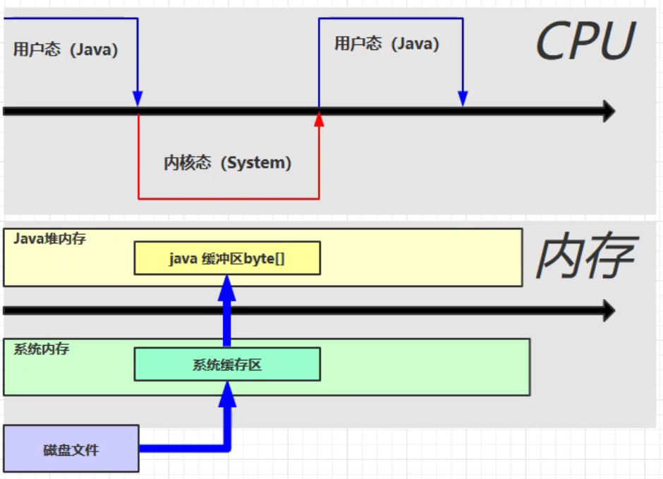
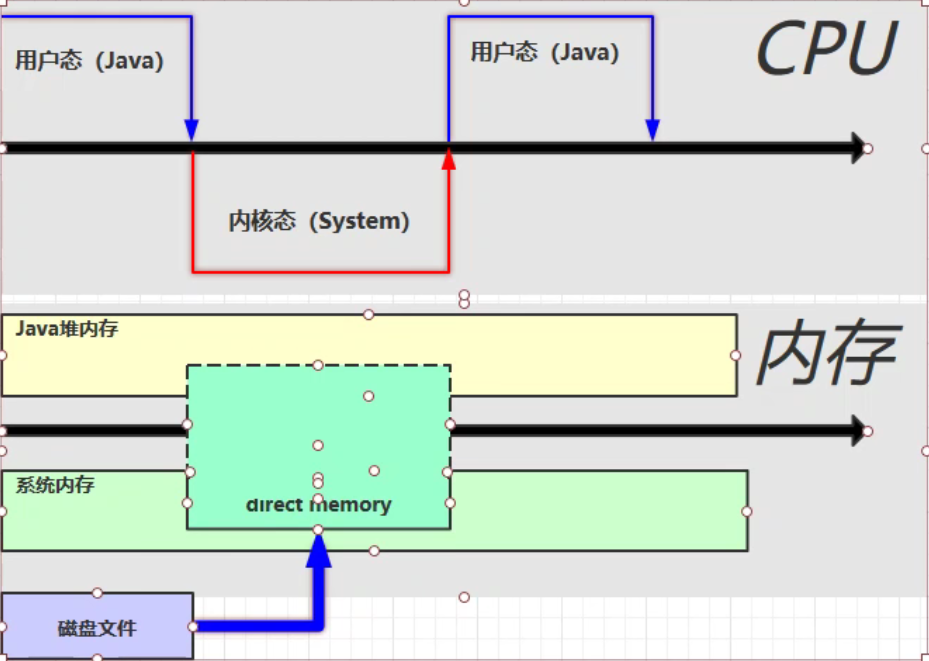
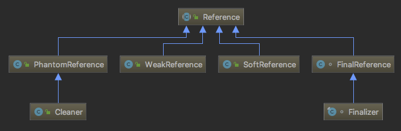
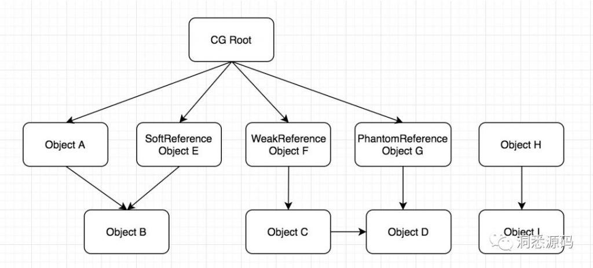
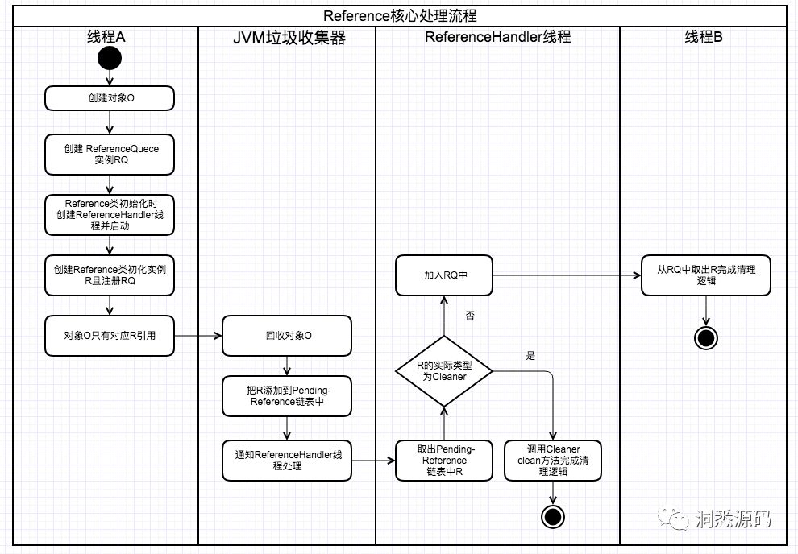
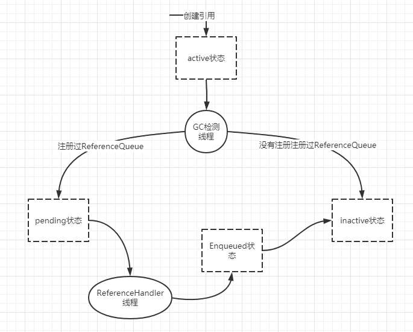
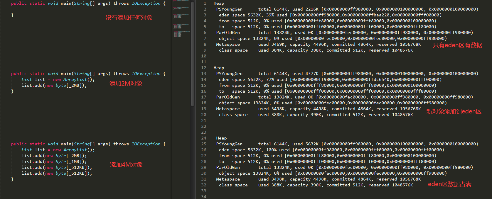
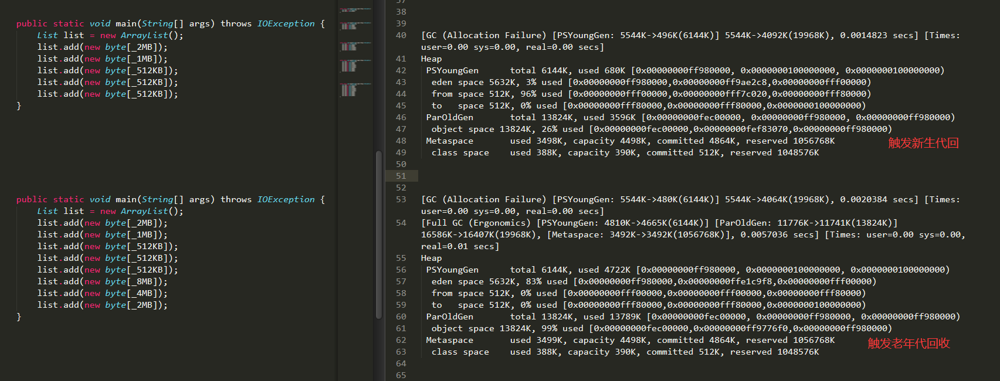
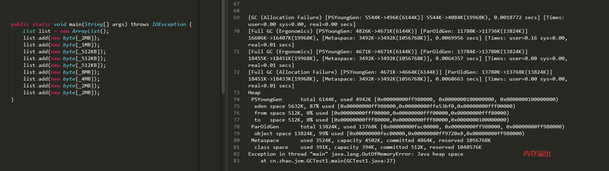

---

title: jvm
date: 2021-09-22 19:01:40
tags:
 - jvm
categories:
 - java
---


## StringTable

### 示例一：内存溢出

```java
    public static void main(String[] args) {
        List<String> list = new ArrayList<>();
        int i = 0;
        while (true) {
            list.add(String.valueOf(i).intern());
            i++;
        }
    }
```

异常信息如下：

```sh
Exception in thread "main" java.lang.OutOfMemoryError: GC overhead limit exceeded
```

这个错误是由于JVM花费太长时间执行GC且只能回收很少的堆内存时抛出的。根据Oracle官方文档，默认情况下，如果Java进程花费98%以上的时间执行GC，并且每次只有不到2%的堆被回收，则JVM抛出此错误。换句话说，这意味着我们的应用程序几乎耗尽了所有可用内存，垃圾收集器花了太长时间试图清理它，并多次失败。

我们可以增加`-XX:-UseGCOverheadLimit`选项来关闭`GC Overhead limit exceeded`，此时抛出异常：

```sh
Exception in thread "main" java.lang.OutOfMemoryError: Java heap space
```

上面的例子说明，字符串常量池是存储在堆中的，jdk1.6之前，是存储在永久代,我们指定永久代最大大小：`-XX:MaxPermSize=10m`,此时抛出异常：

```shell
Exception in thread "main" java.lang.OutOfMemoryError:PermGen space
```


## 直接内存

* 常见于NIO操作，用于数据缓冲区，参考示例1
* 分配回收成本比较高，但读写性能高，参考示例1
* 不受JVM内存回收管理，参考示例2

### 示例1:基本使用

```java
package cn.zhao.jvm;

import java.io.FileInputStream;
import java.io.FileOutputStream;
import java.nio.ByteBuffer;
import java.nio.channels.FileChannel;

public class DirectMemoryTest1 {

    public static final String PATH = "F:\\共享目录\\[电影天堂www.dytt89.com]白蛇2：青蛇劫起-2021_HD国语中字.mp4";
    public static final String OUTFILE = "D:\\aa.mp4";
    public static final int _1MB = 1024 * 1024;

    public static void main(String[] args) {
        long start1 = System.currentTimeMillis();
        testIO();
        long end1 = System.currentTimeMillis();
        System.err.println("io:" + (end1 - start1)); //10730

        long start2 = System.currentTimeMillis();
        testNiIO();

        long end2 = System.currentTimeMillis();
        System.err.println("nio:" + (end2 - start2)); //10054
    }

    public static void testIO() {
        try (FileInputStream fileInputStream = new FileInputStream(PATH);
             FileOutputStream fileOutStream = new FileOutputStream(OUTFILE)) {
            byte[] buffer = new byte[_1MB];
            while (fileInputStream.read(buffer) != -1) {
                fileOutStream.write(buffer, 0, buffer.length);
            }
        } catch (Exception e) {
            e.printStackTrace();
        }
    }

    public static void testNiIO() {
        try (FileChannel inChannel = new FileInputStream(PATH).getChannel();
             FileChannel outChannel = new FileOutputStream("D:\\aa.mp4").getChannel()) {
            ByteBuffer buffer = ByteBuffer.allocateDirect(_1MB);

            while (inChannel.read(buffer) != -1) {
                buffer.flip();
                outChannel.write(buffer);
                buffer.clear();
            }
        } catch (Exception e) {
            e.printStackTrace();
        }
    }
}

```


运行多次，ByteBuffer的方式始终比传统方式快几百毫秒。下面是传统IO和ByteBuffer方式的原理图：








由此可见，直接内存下，省去了系统内存和java堆内存之间的相互copy。

### 示例2:垃圾回收

```java
    public static void main(String[] args) throws IOException {
        ByteBuffer buffer = ByteBuffer.allocateDirect(_1GB);
        System.err.println("分配内存完毕"); // 通过win10任务管理器，看到分配内存1GB
        System.in.read();
        buffer = null;
        System.gc();
        System.err.println("释放内存完毕");  // 通过win10任务管理器，看到释放内存1GB
        System.in.read();
    }
```


不是说，直接内存不归垃圾收集器管理么？这究竟是怎么一回事，我们先来看一段代码：

```java
public class DirectMemoryTest3 {

    static final int _1GB = 1024 * 1024 * 1024;

    public static void main(String[] args) throws IOException {
        Unsafe unsafe = getUnsafe();
        long l = unsafe.allocateMemory(_1GB);
        unsafe.setMemory(l, _1GB, (byte) 0);
        System.in.read();

        unsafe.freeMemory(l);
        System.in.read();

    }

    public static Unsafe getUnsafe() {
        try {
            Field field = Unsafe.class.getDeclaredField("theUnsafe");
            field.setAccessible(true);
            Unsafe unsafe = (Unsafe) field.get(null);
            return unsafe;
        } catch (Exception e) {
            e.printStackTrace();
        }
        return null;
    }
}
```

Unsafe可以操作直接内存，控制内存的分配和释放，基于此，我们来看ByteBuffer的源码：

```java
    DirectByteBuffer(int cap) {                 
        super(-1, 0, cap, cap);
        boolean pa = VM.isDirectMemoryPageAligned();
        int ps = Bits.pageSize();
        long size = Math.max(1L, (long)cap + (pa ? ps : 0));
        Bits.reserveMemory(size, cap);

        long base = 0;
        try {
            base = unsafe.allocateMemory(size); //分配内存
        } catch (OutOfMemoryError x) {
            Bits.unreserveMemory(size, cap);
            throw x;
        }
        unsafe.setMemory(base, size, (byte) 0); //分配内存
        if (pa && (base % ps != 0)) {
            // Round up to page boundary
            address = base + ps - (base & (ps - 1));
        } else {
            address = base;
        }
        cleaner = Cleaner.create(this, new Deallocator(base, size, cap)); //释放内存
        att = null;
    }
```

> 细心的读者，可能注意到了，在DirectByteBuffer实例创建的时候，分配内存之前调用了`Bits.reserveMemory`方法，如果分配失败调用了`Bits.unreserveMemory`，同时在Deallocator释放完直接内存的时候，也调用了`Bits.unreserveMemory`方法。这两个方法，主要是记录jdk已经使用的直接内存的数量，当分配直接内存时，需要进行增加，当释放时，需要减少，源码如下：
>
> ```java
> static void reserveMemory(long size, int cap) {
>     //如果直接有足够多的直接内存可以用，直接增加直接内存引用的计数
>     synchronized (Bits.class) {
>         if (!memoryLimitSet && VM.isBooted()) {
>             maxMemory = VM.maxDirectMemory();
>             memoryLimitSet = true;
>         }
>         // -XX:MaxDirectMemorySize limits the total capacity rather than the
>         // actual memory usage, which will differ when buffers are page
>         // aligned.
>         if (cap <= maxMemory - totalCapacity) {//维护已经使用的直接内存的数量
>             reservedMemory += size;
>             totalCapacity += cap;
>             count++;
>             return;
>         }
>     }
>    //如果没有有足够多的直接内存可以用，先进行垃圾回收
>     System.gc();
>     try {
>         Thread.sleep(100);//休眠100秒，等待垃圾回收完成
>     } catch (InterruptedException x) {
>         // Restore interrupt status
>         Thread.currentThread().interrupt();
>     }
>     synchronized (Bits.class) {//休眠100毫秒后，增加直接内存引用的计数
>         if (totalCapacity + cap > maxMemory)
>             throw new OutOfMemoryError("Direct buffer memory");
>         reservedMemory += size;
>         totalCapacity += cap;
>         count++;
>     } 
> }
> //释放内存时，减少引用直接内存的计数
> static synchronized void unreserveMemory(long size, int cap) {
>     if (reservedMemory > 0) {
>         reservedMemory -= size;
>         totalCapacity -= cap;
>         count--;
>         assert (reservedMemory > -1);
>     }
> }
> ```
>
> 通过上面代码的分析，我们事实上可以认为`Bits`类是直接内存的分配担保，当有足够的直接内存可以用时，增加直接内存应用计数，否则，调用System.gc，进行垃圾回收，需要注意的是，`System.gc`只会回收堆内存中的对象，但是我们前面已经讲过，DirectByteBuffer对象被回收时，那么其引用的直接内存也会被回收，试想现在刚好有其他的DirectByteBuffer可以被回收，那么其被回收的直接内存就可以用于本次DirectByteBuffer直接的内存的分配


DirectByteBuffer本身是一个Java对象，其是位于堆内存中的，JDK的GC机制可以自动帮我们回收，但是其申请的直接内存，不在GC范围之内，无法自动回收。好在JDK提供了一种机制，可以为堆内存对象注册一个钩子函数(其实就是实现Runnable接口的子类)，当堆内存对象被GC回收的时候，会回调run方法，我们可以在这个方法中执行释放DirectByteBuffer引用的直接内存，即在run方法中调用Unsafe 的`freeMemory` 方法。注册是通过sun.misc.Cleaner类来实现的

Cleaner类继承PhantomReference（虚引用），垃圾回收器在回收ByteBuffer的引用时，触发虚引用的clean方法，该方法会调用Deallocator的run方法，执行清理直接内存的操作。

Deallocator实现了Runnable接口，如下面代码

```java
    private static class Deallocator
        implements Runnable
    {

        private static Unsafe unsafe = Unsafe.getUnsafe();

        private long address;
        private long size;
        private int capacity;

        private Deallocator(long address, long size, int capacity) {
            assert (address != 0);
            this.address = address;
            this.size = size;
            this.capacity = capacity;
        }

        public void run() {
            if (address == 0) {
                // Paranoia
                return;
            }
            unsafe.freeMemory(address); //释放内存
            address = 0;
            Bits.unreserveMemory(size, capacity);
        }

    }

```


我们再来看示例2，代码中调用了 `System.gc()` 函数，该函数会告诉jvm进行full gc(只是告诉，jvm决定最终是否执行)，但是生产上，我们通常开启`-XX:+DisableExplicitGC` 参数来禁用这种显示GC。但是这样就会出现直接内存长时间得不到释放的问题，导致系统内存告急的情况，道理很明显，因为直接内存的释放与获取比堆内存更加耗时，每次创建DirectByteBuffer实例分配直接内存的时候，都调用System.gc，可以让已经使用完的DirectByteBuffer得到及时的回收。

虽然System.gc只是建议JVM去垃圾回收，可能JVM并不会立即回收，但是频繁的建议，JVM总不会视而不见。

不过，这并不是绝对的，因为System.gc导致的是FullGC，可能会暂停用户线程，也就是JVM不能继续响应用户的请求，对于一些要求延时比较短的应用，是不希望JVM频繁的进行FullGC的。
所以笔者的建议是：禁用System.gc，调大最大可以使用的直接内存:

```shell
-XX:+DisableExplicitGC -XX:MaxDirectMemorySize=256M
```

### 示例3:直接内存溢出

```
public class DirectMemoryTest4 {
    static final int _1GB = 1024 * 1024 * 1024;

    public static void main(String[] args) {
        List list = new ArrayList();
        while (true) {
            ByteBuffer buffer = ByteBuffer.allocateDirect(_1GB);
            list.add(buffer);
        }
    }
}
```

异常信息如下：

```shell
Exception in thread "main" java.lang.OutOfMemoryError: Direct buffer memory
```

# 垃圾回收

如何判定垃圾：

* 引用计数法

* 可达性分析


## 引用

### 概述




* SoftReference代表软引用对象，垃圾回收器会根据内存需求酌情回收软引用指向的对象。普通的GC并不会回收软引用，只有在即将OOM的时候(也就是最后一次Full GC)如果被引用的对象只有SoftReference指向的引用，才会回收。

* WeakReference代表弱引用对象，当发生GC时，如果被引用的对象只有WeakReference指向的引用，就会被回收。WeakHashMap,ThreadLocalMap

* PhantomReference代表虚引用对象，其是一种特殊的引用类型，不能通过虚引用获取到其关联的对象，但当GC时如果其引用的对象被回收，程序可以感知这个事件，这样我们可以做相应的处理。ByteBuffer

* 最后就是最常见强引用对象，也就是通常我们new出来的对象。

  

在继续介绍Reference相关类的源码前，先来简单的看一下GC如何决定一个对象是否可被回收。其基本思路是从GC Root开始向下搜索，如果对象与GC Root之间存在引用链，则对象是可达的，GC会根据是否可到达与可到达性决定对象是否可以被回收。而对象的可达性与引用类型密切相关，对象的可到达性可分为5种。

- 强可到达，如果从GC Root搜索后，发现对象与GC Root之间存在强引用链则为强可到达。强引用链即有强引用对象，引用了该对象。
- 软可到达，如果从GC Root搜索后，发现对象与GC Root之间不存在强引用链，但存在软引用链，则为软可到达。软引用链即有软引用对象，引用了该对象。
- 弱可到达，如果从GC Root搜索后，发现对象与GC Root之间不存在强引用链与软引用链，但有弱引用链，则为弱可到达。弱引用链即有弱引用对象，引用了该对象。
- 虚可到达，如果从GC Root搜索后，发现对象与GC Root之间只存在虚引用链则为虚可到达。虚引用链即有虚引用对象，引用了该对象。
- 不可达，如果从GC Root搜索后，找不到对象与GC Root之间的引用链，则为不可到达。




* ObjectA为强可到达
* ObjectB也为强可到达，虽然ObjectB对象被SoftReference ObjcetE 引用但由于其还被ObjectA引用所以为强可到达;
* ObjectC和ObjectD为弱引用达到，虽然ObjectD对象被PhantomReference ObjcetG引用但由于其还被ObjectC引用，而ObjectC又为弱引用达到，所以ObjectD为弱引用达到;
* ObjectH与ObjectI是不可到达。

引用链的强弱有关系依次是 强引用 > 软引用 > 弱引用 > 虚引用，如果有更强的引用关系存在，那么引用链可达性，将由更强的引用有关系决定。

### Reference核心处理流程

JVM在GC时如果当前对象只被Reference对象引用，JVM会根据Reference具体类型与堆内存的使用情况决定是否把对应的Reference对象加入到一个由Reference构成的pending链表上。

如果能加入pending链表，JVM同时会通知ReferenceHandler线程进行处理。ReferenceHandler线程是在Reference类被初始化时调用的，其是一个守护进程并且拥有最高的优先级。Reference类静态初始化块代码如下:

```java
static {
   //省略部分代码...
   Thread handler = new ReferenceHandler(tg, "Reference Handler");
   handler.setPriority(Thread.MAX_PRIORITY);
   handler.setDaemon(true);
   handler.start();
   //省略部分代码...
}
```

而ReferenceHandler线程内部的run方法会不断地从Reference构成的pending链表上获取Reference对象。

如果能获取，则根据Reference的具体类型进行不同的处理，不能则调用wait方法等待GC回收对象处理pending链表的通知。ReferenceHandler线程run方法源码:

```java
public void run() {
      while (true) {
          tryHandlePending(true);
      }
  }

static boolean tryHandlePending(boolean waitForNotify) {
    Reference<Object> r;
    Cleaner c;
    try {
        synchronized (lock) {
            if (pending != null) {
                r = pending;
                //instanceof 可能会抛出OOME，所以在将r从pending链上断开前，做这个处理
                c = r instanceof Cleaner ? (Cleaner) r : null;
                //将r从pending链上断开
                pending = r.discovered;
                r.discovered = null;
            } else {
                //等待CG后的通知
                if (waitForNotify) {
                    lock.wait();
                }
                  //重试
                return waitForNotify;
            }
        }
    } catch (OutOfMemoryError x) {
        //当抛出OOME时，放弃CPU的运行时间，这样有希望收回一些存活的引用并且GC能回收部分空间。
      // 同时能避免频繁地自旋重试，导致连续的OOME异常
        Thread.yield();
        //重试
        return true;
    } catch (InterruptedException x) {
        //重试
        return true;
    }
    //如果是Cleaner类型的Reference调用其clean方法并退出。
    if (c != null) {
        c.clean();
        return true;
    }
    ReferenceQueue<? super Object> q = r.queue;
    //如果Reference有注册ReferenceQueue，则处理pending指向的Reference结点将其加入ReferenceQueue中
    if (q != ReferenceQueue.NULL) q.enqueue(r);
    return true;
}
```

上面tryHandlePending方法中比较重要的点是c.clean()与q.enqueue(r)。Cleaner的clean方法用于完成清理工作，而ReferenceQueue是将被回收对象加入到对应的Reference列队中，等待其他线程的后继处理。Reference的核心处理流程可总结如下：



### 引用有四种内部状态




* Active: 新创建Reference的实例其状态为Active。当GC检测到Reference引用的referent达到可变条件时，改变Reference的状态为Pending或Inactive。这个取决于创建Reference实例时是否注册过ReferenceQueue。注册过其状态会转换为Pending，同时GC会将其加入pending-Reference链表中，否则为转换为Inactive状态。

* Pending: 代表Reference是pending-Reference链表的成员，等待ReferenceHandler线程调用Cleaner#clean或ReferenceQueue#enqueue操作。未注册过ReferenceQueue的实例不会达到这个状态

* Enqueued: Reference实例成为其被创建时注册过的ReferenceQueue的成员，代表已入队列。当其从ReferenceQueue

  中移除后，其状态会变为Inactive。

* Inactive: 什么也不会做，一旦处理该状态，就不可再转换。

我们来看Reference类的核心成员：

```java
public abstract class Reference<T> {
    private T referent;
    volatile ReferenceQueue<? super T> queue;
    Reference next;
    private transient Reference<T> discovered;
    private static Reference.Lock lock = new Reference.Lock();
    private static Reference<Object> pending = null;
```

* referent: Reference 引用的对象
* queue: Reference注册的queue用于ReferenceHandler线程入队处理与用户线程取Reference处理
* next: 可理解为注册的queue中的下一个结点的引用
* discovered: 其由VM维护，取值会根据Reference不同状态发生改变
   * 状态为active时，代表由GC维护的discovered-Reference链表的下个节点，如果是尾部则为当前实例本身
   * 状态为pending时，代表pending-Reference的下个节点的引用。
   * 否则为null
* pending: pending-Reference 链表头指针，GC回收referent后会将Reference加pending-Reference链表。同时ReferenceHandler线程会获取pending指针，不为空时Cleaner.clean()或入列queue。pending-Reference会采用discovered引用接链表的下个节点。

不同状态时，Reference对应的queue与成员next变量值(next可理解为ReferenceQueue中的下个结点的引用)如下:
 * Active: queue为Reference实例被创建时注册的ReferenceQueue，如果没注册为Null。此时，next为null，Reference实例与queue真正产生关系。
 * Pending: queue为Reference实例被创建时注册的ReferenceQueue。next为当前实例本身。
 * Enqueued: queue为ReferenceQueue.ENQUEUED代表当前实例已入队列。next为queue中的下一实列结点，如果是queue尾部则为当前实例本身
 * Inactive: queue为ReferenceQueue.NULL，当前实例已从queue中移除与queue无关联。next为当前实例本身。


1. JVM在GC时如果当前对象只被Reference对象引用，JVM会根据Reference具体类型与堆内存的使用情况决定是否把对应的Reference对象加入到一个由Reference构成的pending链表上，如果能加入pending链表JVM同时会通知ReferenceHandler线程进行处理。
2. ReferenceHandler线程收到通知后会调用Cleaner#clean或ReferenceQueue#enqueue方法进行处理。
   * 如果引用当前对象的Reference类型为WeakReference且堆内存不足，那么JMV就会把WeakReference加入到pending-Reference链表上，然后ReferenceHandler线程收到通知后会异步地做入队列操作。而我们的应用程序中的线程便可以不断地去拉取ReferenceQueue中的元素来感知JMV的堆内存是否出现了不足的情况，最终达到根据堆内存的情况来做一些处理的操作。实际上WeakHashMap底层便是过通上述过程实现的，只不过实现细节上有所偏差，这个后面再分析（参考示例1）。
   * 再来看看ReferenceHandler线程收到通知后可能会调用的另外一个类Cleaner的实现。Cleaner实现为PhantomReference类型的引用。当JVM GC时如果发现当前处理的对象只被PhantomReference类型对象引用，同之前说的一样其会将该Reference加pending-Reference链中上，只是ReferenceHandler线程在处理时如果PhantomReference类型实际类型又是Cleaner的话。其就是调用Cleaner.clean方法做清理逻辑处理。Cleaner实际是DirectByteBuffer分配的堆外内存收回的实现。

### WeakHashMap

```java
//Entry继承了WeakReference, WeakReference引用的是Map的key
 private static class Entry<K,V> extends WeakReference<Object> implements Map.Entry<K,V> {
    V value;
    final int hash;
    Entry<K,V> next;
    /**
     * 创建Entry对象，上面分析过的ReferenceQueue，这个queue实际是WeakHashMap的成员变量，
     * 创建WeakHashMap时其便被初始化 final ReferenceQueue<Object> queue = new ReferenceQueue<>()
     */
    Entry(Object key, V value,
          ReferenceQueue<Object> queue,
          int hash, Entry<K,V> next) {
        super(key, queue);
        this.value = value;
        this.hash  = hash;
        this.next  = next;
    }
    //省略部分原码...
}
```

往WeakHashMap添加元素时，实际都会调用Entry的构造方法，也就是会创建一个WeakReference对象，这个对象的引用的是WeakHashMap刚加入的Key,而所有的WeakReference对象关联在同一个ReferenceQueue上。我们上面说过JVM在GC时，如果发现当前对象只有被WeakReference对象引用，那么会把其对应的WeakReference对象加入到pending-reference链表上，并通知ReferenceHandler线程处理。而ReferenceHandler线程收到通知后，对于WeakReference对象会调用ReferenceQueue#enqueue方法把他加入队列里面。现在我们只要关注queue里面的元素在WeakHashMap里面是在哪里被拿出去啦做了什么样的操作,最终能定位到WeakHashMap的expungeStaleEntries方法:

```java
private void expungeStaleEntries() {
    //不断地从ReferenceQueue中取出，那些只有被WeakReference对象引用的对象的Reference
    for (Object x; (x = queue.poll()) != null; ) {
        synchronized (queue) {
            //转为 entry 
            Entry<K,V> e = (Entry<K,V>) x;
            //计算其对应的桶的下标
            int i = indexFor(e.hash, table.length);
            //取出桶中元素
            Entry<K,V> prev = table[i];
            Entry<K,V> p = prev;
            //桶中对应位置有元素，遍历桶链表所有元素
            while (p != null) {
                Entry<K,V> next = p.next;
                //如果当前元素(也就是entry)与queue取出的一致，将entry从链表中去除 
                if (p == e) {
                    if (prev == e)
                        table[i] = next;
                    else
                        prev.next = next;
                    //清空entry对应的value
                    e.value = null; // Help GC
                    size--;
                    break;
                }
                prev = p;
                p = next;
            }
        }
    }
}
```

现在只看一下WeakHashMap哪些地方会调用expungeStaleEntries方法就知道什么时候WeakHashMap里面的Key变得软可达时我们就可以将其对应的Entry从WeakHashMap里面移除。直接调用有三个地方分别是getTable方法、size方法、resize方法。 getTable方法又被很多地方调用如get、containsKey、put、remove、containsValue、replaceAll。最终看下来，只要对WeakHashMap进行操作就行调用expungeStaleEntries方法。所有只要操作了WeakHashMap，没WeakHashMap里面被再用到的Key对应的Entry就会被清除。再来总结一下，为什么WeakHashMap适合作为内存敏感缓存的实现。当JVM 在GC时，如果发现WeakHashMap里面某些Key没地方在被引用啦(WeakReference除外)，JVM会将其对应的WeakReference对象加入到pending-reference链表上，并通知ReferenceHandler线程处理。而ReferenceHandler线程收到通知后将对应引用Key的WeakReference对象加入到 WeakHashMap内部的ReferenceQueue中，下次再对WeakHashMap做操作时，WeakHashMap内部会清除那些没有被引用的Key对应的Entry。这样就达到了每操作WeakHashMap时，自动的检索并清量没有被引用的Key对应的Entry的目地。

### 示例1：弱引用使用

```java
package cn.zhao.jvm;

import java.io.IOException;
import java.lang.ref.Reference;
import java.lang.ref.ReferenceQueue;
import java.lang.ref.WeakReference;
import java.util.ArrayList;
import java.util.List;

/**
 * -Xmx5m
 */
public class WeakRefenceTest {

    static final int _1MB = 1024 * 1024;

    public static void main(String[] args) throws IOException {
        List<WeakReference<byte[]>> list = new ArrayList<>();
        ReferenceQueue<Object> queue = new ReferenceQueue<>();
        for (int i = 0; i < 5; i++) {
            byte[] bytes = new byte[_1MB];
            list.add(new WeakReference<>(bytes, queue));
            System.err.println(list.get(i).get());
        }
        System.err.println("查看引用是否被回收");
        for (WeakReference<byte[]> weakReference : list) {
            System.err.println(weakReference.get());
        }

        System.err.println("过滤被删除的元素");

        Reference<?> item = queue.poll();
        while (item != null) {
            list.remove(item);
            item = queue.poll();
        }

        for (WeakReference<byte[]> weakReference : list) {
            System.err.println(weakReference.get());
        }
    }
}

```

打印结果如下：

```sh
[B@1540e19d
[B@677327b6
[B@14ae5a5
[B@7f31245a
[B@6d6f6e28
查看引用是否被回收
null
null
null
[B@7f31245a
[B@6d6f6e28
过滤被删除的元素
[B@7f31245a
[B@6d6f6e28
```

## JVM相关参数

* -Xms10m:堆初始大小10m
* -Xmx10m:堆最大大小,或者使用 -XX:MaxHeapSize=size
* -Xmn：新生代大小，等于-XX:NewSize=size 和 -XX:MaxNewSize=size
* -XX:SurvivorRatio= ratio：幸存区比例 ，假如新生代10m ,ratio 为8，则 eden区8M ,from和to 分别为1m
* -XX:InitialSurvivorRatio=ratio: 幸存区比例初始设置，叠加-XX:+UseAdaptiveSizePolicy参数，jvm会动态调整新生代各区的比例
* -XX:MaxTenuringThreshold=threshold：晋升阈值，从新生代晋升到老年代需要存活的次数。
* -XX:+PrintTenuringDistribution： 打印晋升详情
* -XX:+PrintGCDetails -verbose:gc： 打印gc详情
* -XX:+ScavengeBeforeFullGC：FullGC前MinorGC

## 垃圾回收算法

* 标记清除

* 标记整理

* 复制


我们知道java对象基本上都是在堆上分配（有特殊情况下，不在我们讨论的范围内）。小对象都是直接在Eden区域中分配。如果此时内存不够，就会发生young gc，如果释放之后还是内存不够，此时jvm会进行full gc。如果发生full gc之后内存还是不够，此时就会抛出“java.lang.OutOfMemoryError: Java heap space”。大对象jvm会直接在old 区域中申请，但是和小对象分配的原理类似。

示例：垃圾回收过程演示

`-Xms20m -Xmx20m -XX:+PrintGCDetails` 









示例2：非main线程内存溢出

```java
// -Xms20m -Xmx20m -XX:+PrintGCDetails    
public static void main(String[] args) throws IOException, InterruptedException {
        new Thread(() -> {
            ArrayList<Object> objects = new ArrayList<>();
            objects.add(new byte[_8MB]);
            objects.add(new byte[_8MB]);
        }).start();

        Thread.sleep(1000);
        System.err.println("子线程内存溢出了，主线程还活着");
     //   Thread.sleep(1000);
    //    System.gc();
    }
```

打印如下：

```sh
[GC (Allocation Failure) [PSYoungGen: 4186K->496K(6144K)] 12378K->9104K(19968K), 0.0013497 secs] [Times: user=0.00 sys=0.00, real=0.00 secs] 
[GC (Allocation Failure) [PSYoungGen: 496K->512K(6144K)] 9104K->9216K(19968K), 0.0008869 secs] [Times: user=0.16 sys=0.00, real=0.00 secs] 
[Full GC (Allocation Failure) [PSYoungGen: 512K->0K(6144K)] [ParOldGen: 8704K->9056K(13824K)] 9216K->9056K(19968K), [Metaspace: 4377K->4377K(1056768K)], 0.0061404 secs] [Times: user=0.00 sys=0.00, real=0.01 secs] 
[GC (Allocation Failure) [PSYoungGen: 0K->0K(6144K)] 9056K->9056K(19968K), 0.0007777 secs] [Times: user=0.00 sys=0.00, real=0.00 secs] 
[Full GC (Allocation Failure) [PSYoungGen: 0K->0K(6144K)] [ParOldGen: 9056K->9000K(13824K)] 9056K->9000K(19968K), [Metaspace: 4377K->4371K(1056768K)], 0.0081402 secs] [Times: user=0.00 sys=0.00, real=0.01 secs] 
Exception in thread "Thread-0" java.lang.OutOfMemoryError: Java heap space
	at cn.zhao.jvm.GCTest2.lambda$main$0(GCTest2.java:24)
	at cn.zhao.jvm.GCTest2$$Lambda$1/990368553.run(Unknown Source)
	at java.lang.Thread.run(Thread.java:745)
子线程内存溢出了，主线程还活着
Heap
 PSYoungGen      total 6144K, used 253K [0x00000000ff980000, 0x0000000100000000, 0x0000000100000000)
  eden space 5632K, 4% used [0x00000000ff980000,0x00000000ff9bf758,0x00000000fff00000)
  from space 512K, 0% used [0x00000000fff00000,0x00000000fff00000,0x00000000fff80000)
  to   space 512K, 0% used [0x00000000fff80000,0x00000000fff80000,0x0000000100000000)
 ParOldGen       total 13824K, used 9000K [0x00000000fec00000, 0x00000000ff980000, 0x00000000ff980000)
  object space 13824K, 65% used [0x00000000fec00000,0x00000000ff4ca3b8,0x00000000ff980000)
 Metaspace       used 4403K, capacity 4738K, committed 4992K, reserved 1056768K
  class space    used 495K, capacity 559K, committed 640K, reserved 1048576K
```

old区8M,正好是list add的第一个8m，后面那个8m add的时候，发现内存不够，就抛出了内存溢出异常。

打开上面的注释行，打印日志如下：

```sh
[GC (Allocation Failure) [PSYoungGen: 4186K->512K(6144K)] 12378K->9104K(19968K), 0.0010147 secs] [Times: user=0.00 sys=0.00, real=0.00 secs] 
[GC (Allocation Failure) [PSYoungGen: 512K->512K(6144K)] 9104K->9176K(19968K), 0.0010400 secs] [Times: user=0.00 sys=0.00, real=0.00 secs] 
[Full GC (Allocation Failure) [PSYoungGen: 512K->0K(6144K)] [ParOldGen: 8664K->9056K(13824K)] 9176K->9056K(19968K), [Metaspace: 4380K->4380K(1056768K)], 0.0073424 secs] [Times: user=0.00 sys=0.00, real=0.01 secs] 
[GC (Allocation Failure) [PSYoungGen: 0K->0K(6144K)] 9056K->9056K(19968K), 0.0004508 secs] [Times: user=0.00 sys=0.00, real=0.00 secs] 
[Full GC (Allocation Failure) [PSYoungGen: 0K->0K(6144K)] [ParOldGen: 9056K->9000K(13824K)] 9056K->9000K(19968K), [Metaspace: 4380K->4374K(1056768K)], 0.0088532 secs] [Times: user=0.02 sys=0.00, real=0.01 secs] 
Exception in thread "Thread-0" java.lang.OutOfMemoryError: Java heap space
	at cn.zhao.jvm.GCTest2.lambda$main$0(GCTest2.java:24)
	at cn.zhao.jvm.GCTest2$$Lambda$1/990368553.run(Unknown Source)
	at java.lang.Thread.run(Thread.java:745)
子线程内存溢出了，主线程还活着
[GC (System.gc()) [PSYoungGen: 215K->160K(6144K)] 9216K->9160K(19968K), 0.0017696 secs] [Times: user=0.00 sys=0.00, real=0.00 secs] 
[Full GC (System.gc()) [PSYoungGen: 160K->0K(6144K)] [ParOldGen: 9000K->804K(13824K)] 9160K->804K(19968K), [Metaspace: 4399K->4399K(1056768K)], 0.0150618 secs] [Times: user=0.16 sys=0.00, real=0.02 secs] 
Heap
 PSYoungGen      total 6144K, used 169K [0x00000000ff980000, 0x0000000100000000, 0x0000000100000000)
  eden space 5632K, 3% used [0x00000000ff980000,0x00000000ff9aa558,0x00000000fff00000)
  from space 512K, 0% used [0x00000000fff80000,0x00000000fff80000,0x0000000100000000)
  to   space 512K, 0% used [0x00000000fff00000,0x00000000fff00000,0x00000000fff80000)
 ParOldGen       total 13824K, used 804K [0x00000000fec00000, 0x00000000ff980000, 0x00000000ff980000)
  object space 13824K, 5% used [0x00000000fec00000,0x00000000fecc93c0,0x00000000ff980000)
 Metaspace       used 4406K, capacity 4738K, committed 4992K, reserved 1056768K
  class space    used 495K, capacity 559K, committed 640K, reserved 1048576K
```

发现内存溢出的线程之前占用的内存也释放了。


## 垃圾回收器

