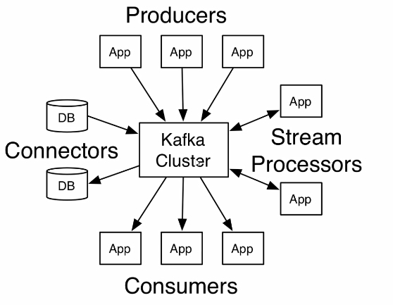

# 概述

* 分布式流处理平台，不仅仅是消息中间件。

* 基于zookeeper的分布式消息系统。

* 高吞吐量、高性能、实时及高可靠性。

topic

虚拟概念，由一到多个分区组成

分区

实际存储消息的地方

# 安装

1. 安装jdk
2. 安装zookeeper
3. 安装kafaka

# API操作

* AdminClient API:允许管理和检测Topic、broker以及 其它Kafka对象
* Producer API:发布消息到1个或多个topic
* Consumer API:订阅一个或多个topic,并处理产生的消息
* Streams API:高效地将输入流转换到输出流
* Connector API:从一些源系统或应用程序中拉取数据到kafka

## AdminClient 

创建topic

查看topic列表

删除topic

查询topic详情

查询topic配置

增加分区信息

## producer

api，配置，负载均衡

