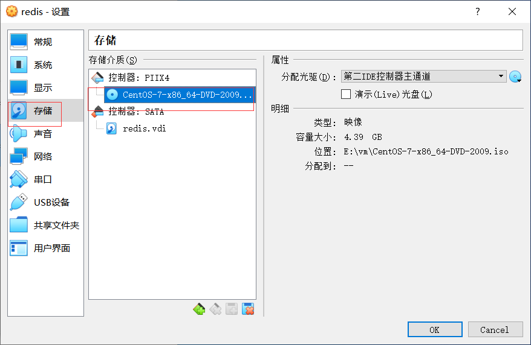

# 网络问题

## 新系统网卡没有开启的问题

使用vbox安装centos7，首次进入的时候，使用 `ip a`命令查看IP信息:

```bash
[root@redhat2]# ip addr
1: lo: <LOOPBACK,UP,LOWER_UP> mtu 16436 qdisc noqueue state UNKNOWN
    link/loopback 00:00:00:00:00:00 brd 00:00:00:00:00:00
    inet 127.0.0.1/8 scope host lo
    inet6 ::1/128 scope host
       valid_lft forever preferred_lft forever
2: enp0s3: <BROADCAST,MULTICAST,UP,LOWER_UP> mtu 1500 qdisc pfifo_fast state UP qlen 1000
    link/ether 00:0c:29:85:58:f1 brd ff:ff:ff:ff:ff:ff
    inet6 fe80::20c:29ff:fe85:58f1/64 scope link
       valid_lft forever preferred_lft forever
```

此时，网卡enp0s3并没有启动。有两种方式开启

- 临时开启：` ifup enp0s3`
- 永久开启：配置 `/etc/sysconfig/network-scripts/ifcfg-enp0s3`文件，修改 `ONBOOT=yes`,然后重启网络 ` systemctl restart network `


#  安装软件问题

## 挂载本地镜像

1.  vbox挂载光盘



2. vbox设置启动顺序，光盘不能优先启动，否则会进入安装系统界面


3. 挂载光驱到linux指定目录

   ```shell
   [root@localhost ~]# mount /dev/cdrom /mnt/cdrom
   mount: /dev/sr0 is write-protected, mounting read-only
   
   [root@localhost ~]# ls /mnt/cdrom/
   CentOS_BuildTag  GPL       LiveOS    RPM-GPG-KEY-CentOS-7
   EFI              images    Packages  RPM-GPG-KEY-CentOS-Testing-7
   EULA             isolinux  repodata  TRANS.TBL
   ```

4. 配置镜像源

   ```shell
   cd /etc/yum.repos.d
   mv * backup
   touch centos.repo 
   ```

   `centos.repo` 内容如下：

   ```shell
   [CDROM]
   name=localyum
   baseurl=file:///mnt/cdrom
   enabled=1
   gpgcheck=1
   gpgkey=file:///mnt/cdrom/RPM-GPG-KEY-CentOS-7
   ```

5. 刷新yum缓存

   ```shell
   yum clean all
   yum makecache
   ```

   

# VboX网络

## NAT

网络地址转换[Network Address Translation ](NAT)是从虚拟机访问外部网络的最简单方法。通常，它 **不需要在主机网络和来宾系统上进行任何配置** 。因此，它是Vbox中的默认联网模式。

启用了NAT的虚拟机的行为就像是一台通过路由器连接到Internet的真实计算机。在这种情况下，路由器是Vbox网络引擎，该引擎透明地映射来往虚拟机的流量。在Vbox中，此路由器放置在每个虚拟机和主机之间。由于默认情况下虚拟机无法相互通信，因此这种隔离可最大程度地提高安全性。

> 虚拟机之间不能相互通信，现实中同一个路由器连接下的机器可以相互通信。

NAT模式的缺点是，就像路由器后面的专用网络一样，虚拟机是不可见的，外部Internet上的主机不能访问该虚拟机。除非设置端口转发。

虚拟机发出的网络帧由Vbox的NAT引擎接收，该引擎提取TCP/IP数据并使用主机操作系统发送出去。对于主机上的应用程序，或与主机相同网络上的另一台计算机，数据就好像是由主机上的Vbox发送出来的，使用的是主机的IP地址。Vbox监听已发送数据包的回复数据，然后重新打包并将它们重新发送到其专用网络上的虚拟机.

> VM也可以访问主机的环回接口和在其上运行的网络服务。主机的环回接口可通过IP地址10.0.2.2访问。

虚拟机从集成到Vbox的DHCP服务器接收专用网络上的网络地址和配置。这样分配给虚拟机的IP地址通常与主机位于完全不同的网络上。由于可以将虚拟机的多个卡设置为使用NAT，因此第一张卡连接到专用网络10.0.2.0，第二张卡连接到网络10.0.3.0，依此类推。如果您需要更改来宾分配的IP范围,参考 Section 9.8, “Fine Tuning the Vbox NAT Engine”.

### 配置端口转发

由于虚拟机连接到Vbox内部的专用网络并且对主机不可见，因此主机或同一网络上的其他计算机将无法访问客户机上的网络服务。但是，就像物理路由器一样，Vbox可以通过端口转发使选定的服务对来宾外部的世界可用。这意味着Vbox侦听主机上的某些端口，并在相同或不同端口上将到达主机的所有数据包重新发送给来宾。对于主机上的应用程序或网络上的其他物理或虚拟机，看起来好像代理的服务实际上在主机上运行。

要配置端口转发，可以使用图形化的端口转发编辑器，该编辑器可在网络设置对话框中找到，用于配置为使用NAT的网络适配器。在这里，您可以将主机端口映射到来宾端口，以将网络流量路由到来宾中的特定端口。

> 转发低于1024的主机端口。在基于UNIX的主机(例如Linux，Oracle Solaris和Mac OS X)上，无法从非root用户运行的应用程序绑定到低于1024的端口。因此，如果您尝试配置此类端口转发，则VM将拒绝启动。

## NAT网络

网络地址转换(NAT)服务的工作方式与家用路由器类似，将使用该服务的系统分组到网络中，并防止该网络外部的系统直接访问其内部的系统，但允许内部的系统相互通信并与之通信。外部系统在IPv4和IPv6上使用TCP和UDP。

>   网络需要设置成静态IP。

## 桥接网络

通过桥接网络，Vbox使用主机系统上的设备驱动程序来过滤来自物理网络适配器的数据。这使Vbox可以拦截来自物理网络的数据并将注入一些其他信息，从而有效地在软件中创建新的网络接口。当来宾使用这种新的软件接口时，它看起来像是使用网络电缆将来宾物理连接到主机系统的主机系统。主机可以通过该接口向来宾发送数据，并从中接收数据。这意味着您可以在客户机与网络的其余部分之间设置路由或桥接。

要启用桥接网络，请打开虚拟机的“设置”对话框，转到“网络”页面，然后在“附加到”字段的下拉列表中选择“桥接网络”。从页面底部的列表中选择一个主机接口，其中包含系统的物理网络接口。

## 内部网络

内部网络类似于桥接网络，因为VM可以直接与外界通信。但是，外部世界仅限于同一主机上连接到同一内部网络的其他VM。

即使从技术上讲，使用内部网络可以完成的所有操作也可以使用桥接网络来完成，但是内部网络具有安全性优势。在桥接网络模式下，所有流量都通过主机系统的物理接口。因此，可以将诸如Wireshark的数据包嗅探器附加到主机接口，并记录通过它的所有流量。如果出于某种原因，如果您希望同一台计算机上的两个或多个VM进行私下通信，同时对主机系统和用户隐藏其数据，则桥接网络不是一种选择。

内部网络会根据需要自动创建。没有中央配置。每个内部网络都简单地通过其名称进行标识。一旦有一个以上具有相同内部网络ID的活动虚拟网卡，Vbox支持驱动程序将自动将这些网卡连接起来并充当网络交换机。Vbox支持驱动程序实现了完整的以太网交换机，并支持广播/多播帧和混杂模式。

为了将VM的网卡连接到内部网络，请将其网络连接模式设置为Internal Networking。在Vbox图形用户界面中使用VM的“设置”对话框。在设置对话框的“网络”类别中，从网络模式的下拉列表中选择“内部网络”。从下面的下拉列表中选择一个现有内部网络的名称，或在“名称”字段中输入一个新名称。

> 网络需要设置成静态IP。

## Host-Only网络

可以将仅主机的网络视为桥接和内部网络模式之间的混合。与桥接网络一样，虚拟机可以彼此通信，也可以与主机进行通信，就像它们通过物理以太网交换机连接一样。与内部网络一样，不需要存在物理网络接口，并且由于虚拟机未连接到物理网络接口，因此它们无法与主机外部的世界进行通信

使用仅主机网络时，Vbox在主机上创建一个新的软件接口，该接口随后出现在现有网络接口旁边。换句话说，尽管使用桥接网络，但现有物理接口用于将虚拟机连接到其中，而仅主机网络则在主机上创建新的回送接口。而且，尽管使用内部网络，但无法看到虚拟机之间的流量，但是可以拦截主机上环回接口上的流量。

仅主机网络对于预配置的虚拟设备特别有用，在预配置的虚拟设备中，多个虚拟机一起运送并旨在进行协作。例如，一个虚拟机可能包含一个Web服务器，第二个虚拟机可能包含一个数据库，并且由于它们打算互相通信，因此该设备可以指示Vbox为这两个虚拟机建立仅主机的网络。然后，第二个桥接网络会将Web服务器连接到外部，以向其提供数据，但是外部无法连接到数据库。

根据上面的概述,采用NAT和Host-only来构建虚拟机,这样虚拟机既可以上外网又可以和主机互通.构建过程如下:

1.在网络选项卡中设置网卡1为NAT 2.在网络选项卡中设置网卡2为Host-only

虚拟机网络信息

```shell
1: lo: <LOOPBACK,UP,LOWER_UP> mtu 65536 qdisc noqueue state UNKNOWN group default qlen 1000
    link/loopback 00:00:00:00:00:00 brd 00:00:00:00:00:00
    inet 127.0.0.1/8 scope host lo
       valid_lft forever preferred_lft forever
    inet6 ::1/128 scope host
       valid_lft forever preferred_lft forever
2: enp0s3: <BROADCAST,MULTICAST,UP,LOWER_UP> mtu 1500 qdisc pfifo_fast state UP group default qlen 1000
    link/ether 08:00:27:18:fd:f6 brd ff:ff:ff:ff:ff:ff
    inet 10.0.2.15/24 brd 10.0.2.255 scope global noprefixroute dynamic enp0s3
       valid_lft 85269sec preferred_lft 85269sec
    inet6 fe80::e87a:c37c:8cb7:d544/64 scope link noprefixroute
       valid_lft forever preferred_lft forever
3: enp0s8: <BROADCAST,MULTICAST,UP,LOWER_UP> mtu 1500 qdisc pfifo_fast state UP group default qlen 1000
    link/ether 08:00:27:d3:83:40 brd ff:ff:ff:ff:ff:ff
    inet 192.168.56.101/24 brd 192.168.56.255 scope global noprefixroute dynamic enp0s8
       valid_lft 1129sec preferred_lft 1129sec
    inet6 fe80::4b78:f1fd:3288:4e78/64 scope link noprefixroute
       valid_lft forever preferred_lft forever
```

主机的网络信息

```shell
以太网适配器 VirtualBox Host-Only Network:

   连接特定的 DNS 后缀 . . . . . . . :
   本地链接 IPv6 地址. . . . . . . . : fe80::d8da:f22f:6843:9cf7%19
   IPv4 地址 . . . . . . . . . . . . : 192.168.56.1
   子网掩码  . . . . . . . . . . . . : 255.255.255.0
   默认网关. . . . . . . . . . . . . :

无线局域网适配器 WLAN:

   连接特定的 DNS 后缀 . . . . . . . :
   本地链接 IPv6 地址. . . . . . . . : fe80::81d9:c2b4:1bd5:4d09%10
   IPv4 地址 . . . . . . . . . . . . : 192.168.0.105
   子网掩码  . . . . . . . . . . . . : 255.255.255.0
   默认网关. . . . . . . . . . . . . : 192.168.0.1
```

主机通过192.168.56.101访问虚拟机. 虚拟机通过192.168.0.105访问主机.

