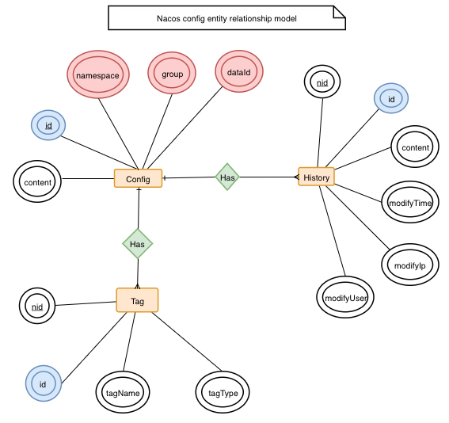
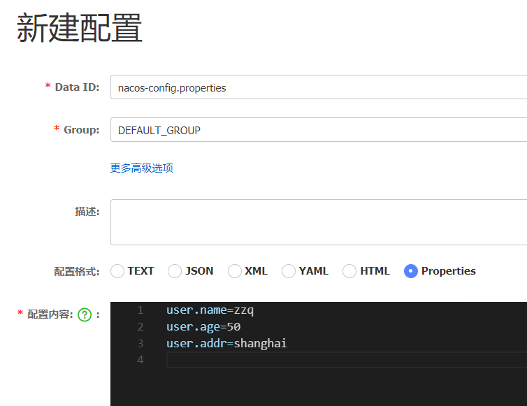

# 安装nacos server

[下载地址](https://github.com/alibaba/nacos/releases)

解压安装包之后，运行下面的命令：

```bash
startup.cmd -m standalone #默认nacos是以集群方式启动的
```

nacos默认数据存储在内嵌数据库中，我们需要修改配置文件`config\application.properties`,指定使用的数据库，如下：

```properties
spring.datasource.platform=mysql
db.url.0=jdbc:mysql://127.0.0.1:3306/nacos?characterEncoding=utf8&connectTimeout=1000&socketTimeout=3000&autoReconnect=true&useUnicode=true&useSSL=false&serverTimezone=UTC
db.user.0=root
db.password.0=Zhao=1991
db.num=1
```

此外，我们需要在数据库中创建相应表，相应sql在conf目录的nacos-mysql.sql中。


# 配置管理

## 数据模型


* 配置项: key=value就是一个配置项
* 配置集：多个配置项组成配置集，每个配置集都有一个id,称为DataId
* Group: 多个配置集组合到一起形成配置分组
* 命名空间：多个group组成命名空间，不同的命名空间下，可以存在相同的 Group 或 Data ID 的配置

> 公司的开发环境可以对应命名空间，例如dev,test,prod。公司的项目组可以对应于group,每个项目可能包含多个app，每个app分配一个DataId


### 配置领域模型

围绕配置，主要有两个关联的实体，一个是配置变更历史，一个是服务标签（用于打标分类，方便索引），由 ID 关联。





## 开发应用

### 引入依赖

```xml
           <dependency>
                <groupId>org.springframework.boot</groupId>
                <artifactId>spring-boot-dependencies</artifactId>
                <version>${spring-boot.versoin}</version>
                <type>pom</type>
                <scope>import</scope>
            </dependency>

            <!--Spring Cloud-->
            <dependency>
                <groupId>org.springframework.cloud</groupId>
                <artifactId>spring-cloud-dependencies</artifactId>
                <version>${spring-cloud.version}</version>
                <type>pom</type>
                <scope>import</scope>
            </dependency>
            <!--Spring Cloud Alibaba-->
            <dependency>
                <groupId>com.alibaba.cloud</groupId>
                <artifactId>spring-cloud-alibaba-dependencies</artifactId>
                <version>${spring-cloud-alibaba.version}</version>
                <type>pom</type>
                <scope>import</scope>
            </dependency>
        <dependency>
            <groupId>org.springframework.boot</groupId>
            <artifactId>spring-boot-starter-web</artifactId>
        </dependency>
        <dependency>
            <groupId>com.alibaba.cloud</groupId>
            <artifactId>spring-cloud-starter-alibaba-nacos-config</artifactId>
        </dependency>
        <!--Spring Cloud 新版本支持bootstrap.yaml需要引入该依赖-->
        <dependency>
            <groupId>org.springframework.cloud</groupId>
            <artifactId>spring-cloud-starter-bootstrap</artifactId>
        </dependency>
```

### 配置项目

**bootstrap.yaml**

```yaml
server:
  port: 10010
spring:
  application:
    name: nacos-config
  cloud:
    nacos:
      config:
        server-addr: localhost:8848
```

### 测试代码

```java
    @Value("${user.name}")
    private String value;
    
    @GetMapping("value")
    public String getValue(){
        return value;
    }
```

### nacos写入配置文件



### 测试

运行项目，访问：[localhost:10010/config/value](http://localhost:10010/config/value)，可以正确返回zzq。

nacos默认会读取public 命名空间下 DEFAULT_GRPUP下的 ${spring.application.name}.properties（Data ID）配置项。可以通过以下配置来修改默认：

```yaml
server:
  port: 10010
spring:
  application:
    name: nacos-config
  cloud:
    nacos:
      config:
        server-addr: localhost:8848
        group: DEFAULT_GROUP
        file-extension: yaml
        namespace: public
```

### 支持profile

 dataid 支持 `${spring.application.name}.${file-extension:properties}` 为前缀的基础配置，还支持dataid `${spring.application.name}-${profile}.${file-extension:properties}` 

除了根据spring.application.name的dataid，还支持自定义dataid:

```yaml
server:
  port: 10010
spring:
  application:
    name: nacos-config
  cloud:
    nacos:
      config: # 默认
        server-addr: localhost:8848
        group: DEFAULT_GROUP
        file-extension: yaml
        namespace: public
        extension-configs:  #自定义
          -
            data-id: ext-config.yaml
            group: DEFAULT_GROUP
            refresh: true
        shared-configs:  #共享
          - data-id: shared-config.yaml
            group: DEFAULT_GROUP
            refresh: true
```

如果存在相同属性，默认优先加载，自定义次之，最后是共享

### 动态刷新配置

只需要添加@RefreshScope即可

```java
@RequestMapping("/config/")
@RestController
@RefreshScope
public class ConfigController {

    @Value("${user.name}")
    private String value;

    @Value("${user.wife}")
    private String wife;

    @GetMapping("value")
    public String getValue(){
        return value;
    }
```

# 服务发现

