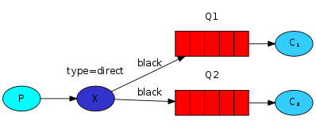

RabbitMQ 是部署最广泛的开源消息代理

rabbitMQ底层使用Erlang语言实现，天生具有高性能特性。使用AMQP协议

# 安装

rabbit同时支持linux、windows和mac版本，安装之前需要支持erlang环境。下面的安装教程erlang版本：24.1  rabbitMQ版本：3.9.7。

## window安装

安装erlang：双击exe，按照提示安装即可

安装rabbitMQ：双击exe，按照提示安装即可

网页管理控制台：默认不开启，需要以插件的方式开启：`rabbitmq-plugins.bat enable rabbitmq_management`,  访问：http://localhost:15672/ ,默认用户 guest/guest。

## 快速入门

java客户端为例，添加下面的依赖：

```groovy
implementation 'com.rabbitmq:amqp-client:5.7.1'
```

消息发送者：

```java
public class Sender {
    public static final String QUEUE_NAME = "zhao.test.basic";

    public static void main(String[] args) {
        ConnectionFactory factory = new ConnectionFactory();
        factory.setHost("127.0.0.1");
        factory.setUsername("guest");
        factory.setPassword("guest");
        factory.setPort(5672);

        // Connection和Channel实现了Closeable
        try (Connection conn = factory.newConnection();
             Channel channel = conn.createChannel()) {
            // 声明队列的操作是幂等的
            channel.queueDeclare(QUEUE_NAME, false, false, false, null);
            String exchange = "";
            AMQP.BasicProperties prop = new AMQP.BasicProperties();
            String message = "hello world";
            channel.basicPublish(exchange, QUEUE_NAME, prop, message.getBytes());
            System.err.println("send msg:" + message);
        } catch (Exception e) {

        }
    }
}

```

消息接收者：

```java
public class Recevier {
    public static final String QUEUE_NAME = "zhao.test.basic";

    public static void main(String[] args) throws IOException, TimeoutException {
        ConnectionFactory factory = new ConnectionFactory();
        factory.setHost("127.0.0.1");
        factory.setUsername("guest");
        factory.setPassword("guest");
        factory.setPort(5672);

        // Connection和Channel实现了Closeable
        Connection conn = factory.newConnection();
        Channel channel = conn.createChannel();

        // DeliverCallback 缓冲服务器推送过来的消息
        DeliverCallback callback = (consumerTag, delivery) -> {
            System.err.println("rev msg:" + new String(delivery.getBody()));
        };
        // 阻塞当前线程
        channel.basicConsume(QUEUE_NAME, true, callback, consumerTag -> {
            System.err.println("consumerTag:" + consumerTag);
        });
    }
}
```


# 基本架构

消息被发布到交换机，通常被比作邮局或邮箱。 交换机然后使用称为绑定的规则将消息副本分发到队列。 然后代理要么将消息传递给订阅队列的消费者，要么消费者按需从队列中获取/拉取消息。如下：


发布消息时，发布者可以指定各种消息属性（消息元数据）。 其中一些元数据可能由broker使用，但是，其余的元数据对broker是完全不透明的，并且仅由接收消息的应用程序使用。

网络不可靠，应用程序可能无法处理消息，因此 AMQP 0-9-1 模型有一个消息确认的概念：当消息传递给消费者时，消费者会自动或在开发人员手动回复确认消息。 当使用消息确认时，代理只会在收到该消息（或消息组）的通知时从队列中完全删除该消息。

在某些情况下，例如，当消息无法路由时，消息可能会返回给发布者、丢弃，或者将其放入所谓的“死信队列”。 发布者通过使用某些参数发布消息来选择如何处理此类情况。

队列、交换和绑定统称为 AMQP 实体。


**队列**： 尽管消息流经 RabbitMQ 和您的应用程序，但它们只能存储在队列中。 队列仅受主机内存和磁盘限制的约束，它本质上是一个大型消息缓冲区。 许多生产者可以将消息发送到一个队列，许多消费者可以尝试从一个队列接收数据。 

## **connection(连接)**

AMQP 0-9-1 连接通常是长期存在的。 AMQP 0-9-1 是一种应用级协议，它使用 TCP 进行可靠传输。 连接使用身份验证并且可以使用 TLS 进行保护。 当应用程序不再需要连接到服务器时，它应该优雅地关闭其 AMQP 0-9-1 连接，而不是突然关闭底层 TCP 连接。

## **channel(通道)**：

某些应用程序需要多个连接到代理。 但是，同时保持许多 TCP 连接打开是不可取的，因为这样做会消耗系统资源并且使配置防火墙更加困难。 AMQP 0-9-1 连接与可以被认为是“共享单个 TCP 连接的轻量级连接”的通道复用。

客户端执行的每个协议操作都发生在通道上。 特定通道上的通信与另一个通道上的通信完全分开，因此每个协议方法还携带一个通道 ID（也称为通道号），这是一个整数，代理和客户端都使用它来确定该方法适用于哪个通道。

通道仅存在于连接的上下文中，而不会单独存在。 当连接关闭时，其上的所有通道也关闭。

对于使用多个线程/进程进行处理的应用程序，为每个线程/进程打开一个新通道而不在它们之间共享通道。

## 虚拟主机

为了让单个代理可以托管多个隔离的“环境”（用户组、交换器、队列等），AMQP 0-9-1 包含了虚拟主机（vhosts）的概念。 它们类似于许多流行的 Web 服务器使用的虚拟主机，并提供 AMQP 实体所在的完全隔离的环境。


## exchange(交换机)

RabbitMQ 消息传递模型的核心思想是生产者从不直接向队列发送任何消息。 实际上，生产者经常甚至根本不知道消息是否会被传送到任何队列。相反，生产者只能向exchange发送消息。 

exchange 一方面接收来自生产者的消息，另一方面将它们推送到队列中。 交易所必须确切地知道如何处理它收到的消息。 它应该推送到特定队列吗？ 它应该推送到许多队列中吗？ 或者它应该被丢弃。 其规则由交换类型定义。

| Exchange type    | Default pre-declared names              |
| :--------------- | :-------------------------------------- |
| Direct exchange  | (Empty string) and amq.direct           |
| Fanout exchange  | amq.fanout                              |
| Topic exchange   | amq.topic                               |
| Headers exchange | amq.match (and amq.headers in RabbitMQ) |

除了交换机类型之外，还声明了许多属性，其中最重要的是：

- Name
- Durability (重启后仍然存在)
- Auto-delete (当最后一个队列解除绑定时，交换机被删除)
- Arguments (可选，由插件和特定于broker的功能使用)

### 默认exchange

空字符串表示默认或无名exchange ：消息将路由到 routingKey 同名的队列（如果存在）。例如，当您声明一个名为“search-indexing-online”的队列时，AMQP 0-9-1 代理将使用“search-indexing-online”作为绑定键。 因此，使用路由键“search-indexing-online”发布到默认交换机的消息将被路由到队列“search-indexing-online”。 换句话说，默认交换使得看起来可以将消息直接传递到队列。


### direct

消息进入 绑定key与路由key 完全匹配 的队列。例如下面的exchange,routing key=orange的消息路由到队列C1 ,routing key=black或routing key=green的消息路由到C2


我们再看下面的例子，使用相同的绑定键绑定多个队列是完全合法的。 在这种情况下，直接交换的行为类似于扇出，并将消息广播到所有匹配的队列。 路由键为 black 的消息将同时发送到 Q1 和 Q2。：

### topic

发送到主题交换的消息不能具有任意的 routing_key - 它必须是一个单词列表，由点分隔。 这些词可以是任何东西，但通常它们会指定一些与消息相关的特征。 一些有效的路由键示例：“stock.usd.nyse”、“nyse.vmw”、“quick.orange.rabbit”。 路由键中可以有任意多个字，最多 255 个字节。

绑定key也必须采用相同的形式。 主题交换背后的逻辑类似于直接交换 - 使用特定路由键发送的消息将被传递到使用匹配绑定key绑定的所有队列。 然而，绑定键有两个重要的特殊情况：

* `*`（星号）可以正好代替一个词。

* `#` 可以代替零个或多个单词


路由键设置为“quick.orange.rabbit”的消息将被传送到两个队列。 消息“lazy.orange.elephant”也会发给他们两个。 另一方面，“quick.orange.fox”只会进入第一个队列，而“lazy.brown.fox”只会进入第二个队列。 “lazy.pink.rabbit”只会被传送到第二个队列一次，即使它匹配两个绑定。 “quick.brown.fox”不匹配任何绑定，因此将被丢弃。

如果我们违反合同并发送一到四个词的消息，例如“orange”或“quick.orange.male.rabbit”，会发生什么？ 好吧，这些消息不会匹配任何绑定并且会丢失。

另一方面，“lazy.orange.male.rabbit”，即使它有四个单词，也会匹配最后一个绑定，并将被传递到第二个队列。

### fanout

扇出交换将消息路由到绑定到它的所有队列，并且忽略路由键。 如果 N 个队列绑定到一个扇出交换器，当新消息发布到该交换器时，该消息的副本将传递到所有 N 个队列。 扇出交换是消息广播路由的理想选择。 声明的方式如下：

```java
channel.exchangeDeclare("logs", "fanout");
```

### headers 

标头交换设计用于在多个属性上进行路由，这些属性比路由键更容易表示为消息标头。 头交换忽略路由键属性。 相反，用于路由的属性取自 headers 属性。 如果头的值等于绑定时指定的值，则认为消息匹配。

可以使用多个标头进行匹配，将队列绑定到标头交换。 在这种情况下，代理需要来自应用程序开发人员的另一条信息，即它应该考虑与任一标头匹配的消息，还是所有标头？ 这就是“x-match”绑定参数的用途。 当“x-match”参数设置为“any”时，只有一个匹配的标头值就足够了。 或者，将“x-match”设置为“all”要求所有值都必须匹配。

> 请注意，以字符串 x- 开头的标头不会用于评估匹配项。

## Bindings（绑定）

将exchange 和queue 关联在一起，绑定语法：

```java
    channel.queueBind(queueName, EXCHANGE_NAME, "");
```

绑定可以指定binding key(fanout exchange忽略该参数)，exchange会根据发送消息的routing key跟该bingding key对比，将消息正确路由到队列:

```java
channel.queueBind(queueName, EXCHANGE_NAME, "black");
```


## queue 

AMQP 0-9-1 模型中的队列与其他消息和任务队列系统中的队列非常相似：它们存储应用程序使用的消息。 队列与交换共享一些属性，但也有一些额外的属性：

- Name
- Durable (broker重启之后是否仍然存在)
- Exclusive (仅由一个连接使用，当该连接关闭时队列将被删除)
- Auto-delete (当最后一个消费者取消订阅时，删除队列)
- Arguments (可选的; 由插件和特定于代理的功能使用，例如消息 TTL、队列长度限制等)

在使用队列之前，必须先声明它。 如果队列不存在，则声明队列将导致它被创建。 如果队列已经存在并且其属性与声明中的属性相同，则声明将不起作用。 当现有队列属性与声明中的属性不同时，将引发代码为 406 (PRECONDITION_FAILED) 的通道级异常。

> 以“amq”开头的队列名称。 保留broker内部使用。 尝试使用违反此规则的名称声明队列将导致通道级异常，回复代码为 403 (ACCESS_REFUSED)。

**临时队列**

连接断开时，队列被删除，语法（创建一个非持久的、独占的、自动删除的队列，并使用生成的名称：）：

```java
String queueName = channel.queueDeclare().getQueue(); //amq.gen-JzTY20BRgKO-HjmUJj0wLg
```

## 消费者

每个消费者（订阅）都有一个称为消费者标签的标识符。 它可用于取消订阅消息。 消费者标签只是字符串。

消费者应用程序（即接收和处理消息的应用程序）可能偶尔无法处理单个消息或有时会崩溃。 网络问题也有可能导致问题。 这就提出了一个问题：代理何时应该从队列中删除消息？ AMQP 0-9-1 规范让消费者对此进行控制。 有两种确认模式：

* 在代理向应用程序发送消息之后（使用 basic.deliver 或 basic.get-ok 方法）。
* 在应用程序发回确认之后（使用 basic.ack 方法）。

前者称为自动确认模型，后者称为显式确认模型。 使用显式模型，应用程序选择何时发送确认。 它可以是在接收到消息之后，或者在处理之前将它持久化到数据存储之后，或者在完全处理消息之后。如果消费者在没有发送确认的情况下死亡，则代理将其重新交付给另一个消费者，或者，如果当时没有可用的消费者，则代理将等到至少有一个消费者注册到同一队列，然后再尝试重新交付。

当消费者应用程序收到一条消息时，对该消息的处理可能会成功，也可能不会。 应用程序可以通过拒绝消息向代理指示消息处理失败（或当时无法完成）。 拒绝消息时，应用程序可以要求代理丢弃或重新排队。 当队列中只有一个消费者时，请确保您不会通过一遍又一遍地拒绝和重新排队来自同一消费者的消息来创建无限的消息传递循环。

使用 basic.reject 方法拒绝消息。 basic.reject 有一个限制：无法像使用确认那样拒绝多条消息。 但是，如果您使用的是 RabbitMQ，则有一个解决方案。 RabbitMQ 提供了一个 AMQP 0-9-1 扩展，称为否定确认或 nacks。 有关更多信息，请参阅确认和 basic.nack 扩展指南。

**预取消息**

对于多个消费者共享一个队列的情况，能够指定每个消费者在发送下一个确认之前可以一次发送多少消息。 这可以用作简单的负载平衡技术，或者如果消息倾向于批量发布，则可以提高吞吐量。 例如，如果生产应用程序由于其正在执行的工作的性质而每分钟发送一次消息。

请注意，RabbitMQ 仅支持通道级预取计数，不支持基于连接或大小的预取。

## 消息

常见的消息属性：

- Content type
- Content encoding
- Routing key
- Delivery mode (persistent or not)
- Message priority
- Message publishing timestamp
- Expiration period
- Publisher application id

AMQP 代理使用某些属性，但大多数属性都可以由接收它们的应用程序解释。 一些属性是可选的，称为标题。 它们类似于 HTTP 中的 X-Header。 消息属性是在发布消息时设置的。


# 消息分发

生产者生产消息到队列的过程


消息怎么路由到对应的队列。

direct:

fanout:

topic:


## 发布者确认

消息的可靠投递，保证发送者将消息投递到broker。默认消息确认机制并没有开启，需要手动开启:

```java
Channel channel = connection.createChannel();
channel.confirmSelect();
```

有两种消息确认策略

### 同步确认

```java
while (thereAreMessagesToPublish()) {
    byte[] body = ...;
    BasicProperties properties = ...;
    channel.basicPublish(exchange, queue, properties, body);
    // uses a 5 second timeout
    channel.waitForConfirmsOrDie(5_000); //阻塞方法，消息确认后返回
}
```

waitForConfirmsOrDie是阻塞方法，如果消息在超时内没有得到确认或者它被 nack-ed（意味着代理由于某种原因无法处理它），该方法将抛出异常。 异常的处理通常包括记录错误消息和/或重试发送消息。

> 代理异步确认已发布的消息，但在上面示例中，代码同步等待直到消息被确认。 客户端实际上异步接收确认并相应地解除对 waitForConfirmsOrDie 的调用。 将 waitForConfirmsOrDie 视为一个同步助手，它依赖于幕后的异步通知。

这种技术非常简单，但也有一个主要缺点：它显着减慢了发布速度，因为消息的确认会阻止所有后续消息的发布。 这种方法不会提供超过每秒数百条已发布消息的吞吐量。 

## 批量同步确认

```java
int batchSize = 100;
int outstandingMessageCount = 0;
while (thereAreMessagesToPublish()) {
    byte[] body = ...;
    BasicProperties properties = ...;
    channel.basicPublish(exchange, queue, properties, body);
    outstandingMessageCount++;
    if (outstandingMessageCount == batchSize) {
        ch.waitForConfirmsOrDie(5_000);
        outstandingMessageCount = 0;
    }
}
if (outstandingMessageCount > 0) {
    ch.waitForConfirmsOrDie(5_000);
}
```

与等待单个消息的确认相比，等待一批消息得到确认大大提高了吞吐量。 一个缺点是我们不知道在失败的情况下到底出了什么问题，所以我们可能不得不在内存中保留一整批来记录一些有意义的东西或重新发布消息。

## 异步确认

代理异步确认已发布的消息，只需要在客户端注册一个回调即可收到这些确认的通知：

```java
Channel channel = connection.createChannel();
channel.confirmSelect();
channel.addConfirmListener((sequenceNumber, multiple) -> {
    // code when message is confirmed
}, (sequenceNumber, multiple) -> {
    // code when message is nack-ed
});
```

有 2 个回调：一个用于确认消息，一个用于 nack-ed 消息（可以被代理视为丢失的消息）。 每个回调有2个参数：

* sequenceNumber：标识已确认消息的编号。

* multiple：这是一个布尔值。 如果为 false，则仅确认/nack-ed 一条消息，如果为 true，则确认/nack-ed 所有具有较小或相等序列号的消息。

  

发布前可以通过Channel#getNextPublishSeqNo()获取序列号：

```java
int sequenceNumber = channel.getNextPublishSeqNo());
ch.basicPublish(exchange, queue, properties, body);
```

下面是一个代码示例，它使用map将发布序列号与消息的字符串正文相关联：

```java
ConcurrentNavigableMap<Long, String> outstandingConfirms = new ConcurrentSkipListMap<>();
// ... code for confirm callbacks will come later
String body = "...";
outstandingConfirms.put(channel.getNextPublishSeqNo(), body);
channel.basicPublish(exchange, queue, properties, body.getBytes());

ConfirmCallback cleanOutstandingConfirms = (sequenceNumber, multiple) -> {
    if (multiple) {
        // 方法返回小于给定键的键的映射视图
        ConcurrentNavigableMap<Long, String> confirmed = outstandingConfirms.headMap(
          sequenceNumber, true
        );
        confirmed.clear();
    } else {
        outstandingConfirms.remove(sequenceNumber);
    }
};

channel.addConfirmListener(cleanOutstandingConfirms, (sequenceNumber, multiple) -> {
    String body = outstandingConfirms.get(sequenceNumber);
    System.err.format(
      "Message with body %s has been nack-ed. Sequence number: %d, multiple: %b%n",
      body, sequenceNumber, multiple
    );
    cleanOutstandingConfirms.handle(sequenceNumber, multiple);
});
// ... publishing code
```


# 消息消费机制

消费者消费队列中消息的过程。

## 消息负载均衡机制

默认情况下，RabbitMQ 将按顺序将每条消息发送给下一个消费者。 平均而言，每个消费者将获得相同数量的消息。 这种分发消息的方式称为轮询。

如何根据消费者的负载情况分发消息呢？

使用basicQos 方法设置 prefetchCount =1。 这告诉 RabbitMQ 一次不要给消费者多个消息。 或者，换句话说，在处理并确认前一条消息之前，不要向工作人员发送新消息。 相反，它会将它分派给下一个不忙的消费者。

```java
int prefetchCount = 1;
channel.basicQos(prefetchCount);
```

## 消费者确认机制

```java
public class ConsumeAck {
    public static final String QUEUE_NAME = "zhao.test.basic";

    public static void main(String[] args) throws IOException, TimeoutException {
        ConnectionFactory factory = new ConnectionFactory();
        factory.setHost("127.0.0.1");
        factory.setUsername("guest");
        factory.setPassword("guest");
        factory.setPort(5672);
        // Connection和Channel实现了Closeable
        Connection conn = factory.newConnection();
        Channel channel = conn.createChannel();

        // DeliverCallback 缓冲服务器推送过来的消息
        DeliverCallback callback = (consumerTag, delivery) -> {
            System.err.println("rev msg:" + new String(delivery.getBody()));
            // 手动消息确认， false表示单条消息确认
            channel.basicAck(delivery.getEnvelope().getDeliveryTag(), false);

        };
        // 阻塞当前线程, false表示手动消息确认
        channel.basicConsume(QUEUE_NAME, false, callback, consumerTag -> {
            System.err.println("consumerTag:" + consumerTag);
        });
    }
}

```


broker将消息投递给消费者，如果消费者此时发生了故障：

* autoAck=true: 一旦 RabbitMQ 将消息传递给消费者，它会立即将其标记为删除。 在这种情况下，如果你杀死一个消费者，我们将丢失它刚刚处理的消息。 我们还将丢失所有已分派给该消费者但尚未处理的消息
* autoAck=false: 如果消费者在没有发送 ack 的情况下死亡（其通道关闭、连接关闭或 TCP 连接丢失），RabbitMQ 将理解消息未完全处理并将重新入队。 如果有其他消费者同时在线，它会迅速将其重新交付给另一个消费者。 这样您就可以确保不会丢失任何消息。**注意：必须在同一通道上手动ack，尝试使用不同的通道进行确认将导致通道级协议异常**

什么情况下broker认定某消息处理失败了，需要重新投递给其他消费者呢？

* 消费者的通道关闭、连接关闭或 TCP 连接丢失，则在这个消费者上所有未ack的消息将重新入队。
* 发送消息给某个消费者，30分钟（默认）还没有收到ack消息。

## 消息持久化机制

我们已经学会了如何确保即使消费者死亡，消息也不会丢失。 但是如果RabbitMQ服务器停止，我们的消息仍然会丢失。这是因为我们声明的队列是非持久化的，一旦rabbit重启，该队列就不存在了。为了保证消息的持久性，我们需要做到两点：

* 声明持久队列
* 声明持久性消息

```java

boolean durable = true; // 队列持久性
channel.queueDeclare("task_queue", durable, false, false, null);

channel.basicPublish("", "task_queue",
            MessageProperties.PERSISTENT_TEXT_PLAIN, //消息持久性
            message.getBytes());
```

即使这样也不能保证消息完全不丢失，假如broker在接受到一条消息后，还未将其保存到磁盘，broker坏掉了，那么这条消息也就丢失了。除此之外，broker接受到消息之后不是马上就保存到磁盘的，它可能只是先保存到缓存中，中间什么机制？？？然后再执行 fsync(2)保存到磁盘。这部分的缓存数据也可能会发生丢失。如果您需要更强的保证，那么您可以使用发布者确认。


# 注意事项

**无法正常发送消息？**

也许代理启动时没有足够的可用磁盘空间（默认需要 200 MB ），因此拒绝接受消息。 检查代理日志文件以确认并在必要时减少限制。 配置文件文档将向您展示如何设置 disk_free_limit。


## 官方文档阅读顺序

1. [AMQP协议](https://www.rabbitmq.com/tutorials/amqp-concepts.html)：讲述了基本的MQ组件以及相关概念。
2. [快速入门](https://www.rabbitmq.com/getstarted.html)：api调用快速入门
3. 

