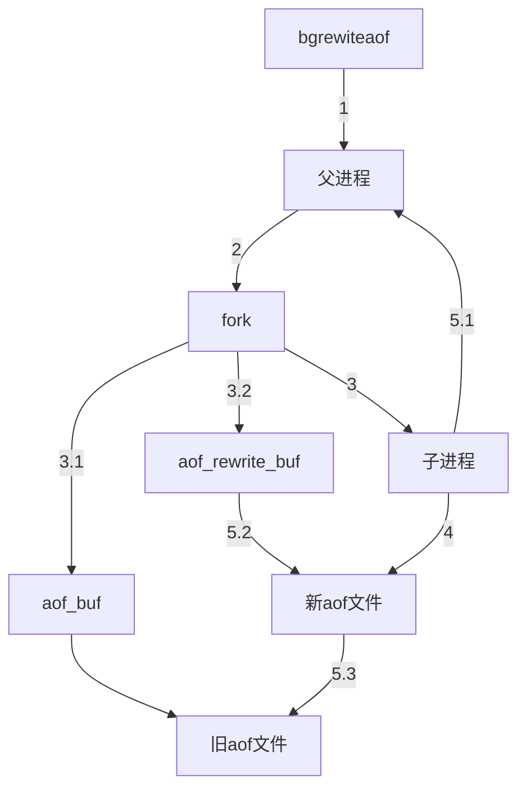
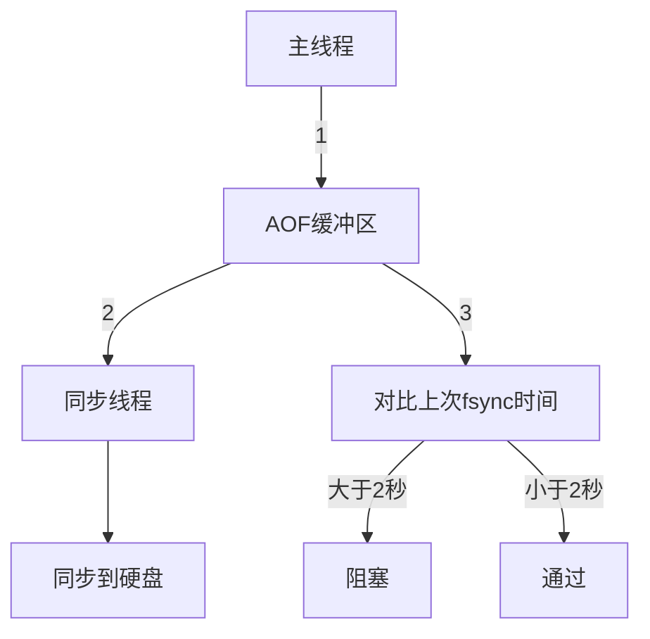

# key过期

Redis keys过期有两种方式：被动和主动方式。

当一些客户端尝试访问它时，这些key会被发现并主动的过期。但是有些过期的keys，可能永远不会被访问。 无论如何，这些keys应该过期，所以redis采用定时随机测试过期key的机制。具体就是Redis每秒10次：

1. 测试随机的20个设置过期属性的keys进行检测。
2. 删除所有已经过期的keys。
3. 如果有多于25%的keys过期，重复步骤1。

这是一个简单的概率算法，基本上的假设是，我们的样本可以代表整个key空间，并且我们不断重复过期检测，直到过期的keys的百分比低于25%。这意味着，在任何给定的时刻，内存中过期key的数量不会超过总数量的四分之一。

`maxmemory`用来配置redis的最大内存，当redis达到最大使用内存时，可以采用以下策略：

- **noeviction**：当达到内存限制并且客户端尝试执行可能导致使用更多内存的命令时，将返回错误（大多数写入命令，但DEL和一些其他例外）。
- **allkeys-lru**：通过尝试先删除最近很少使用（LRU）的key，以便为添加的新数据腾出空间。
- **volatile-lru**:通过尝试先删除最近很少使用（LRU）的key，以便为添加的新数据腾出空间。但是这些删除键必须设置了过期时间。
- **allkeys-random**：随机删除，以便为添加的新数据腾出空间。
- **volatile-random**：随机删除，以便为添加的新数据腾出空间。但是这些删除键必须设置了过期时间。
- **volatile-ttl**：逐出设置了到期时间的key，并尝试首先逐出具有较短生存时间（TTL）的key，以便为添加的新数据腾出空间。
- volatile-lfu：使用近似LFU删除任何设置过期特性的key。 
- allkeys-lfu：使用近似的LFU删除任何key。

如果没有删除条件匹配的键，则volatile-lru，volatile-random和volatile-ttl策略的行为类似于noeviction。

> LRU（Least recently used 最近最少使用），redis中根据key的访问时间，访问越早被淘汰
>
> lfu： 根据访问频率，频率越小，被淘汰

一般的经验规则:

- 如果访问系统的请求分布稳定（例如，用户每天访问系统就关注几个特定的模块，大部分的请求都是集中这里），建议使用**allkeys-lru**
- 如果您具有对所有key进行连续扫描的周期性访问，或者当您期望分布是统一的（所有元素以相同的概率被访问）时，请使用allkeys-random。
- 如果您希望能够在创建缓存对象时通过使用不同的TTL值向Redis提供有关哪些是到期的最佳候选者的提示，请使用volatile-ttl。
- 当您要使用单个实例进行缓存并拥有一组持久key时，可以选择volatile-lru或volatile-random策略。 但是，通常最好运行两个Redis实例来解决此问题。

> Redis的LRU算法（最近最少使用）并非完整的实现。它运行一个近似LRU的算法，通过对少量keys进行取样，回收其中一个最好的key（被访问时间较早的）。


# redis源码数据结构


一个单机的 Redis 服务器默认情况下有 16 个数据库（0-15 号），数据库的个数是可配置的。Redis 默认使用的是 0 号数据库，可以使用 SELECT 命令切换数据库。


Redis 中的每个数据库都由一个 redis.h/redisDb 结构表示，它记录了单个 Redis 数据库的键空间、所有键的过期时间、处于阻塞状态和就绪状态的键、数据库编号等等。

```c
typedef struct redisDb {
    // 数据库键空间，保存着数据库中的所有键值对
    dict *dict;
    // 键的过期时间，字典的键为键，字典的值为过期事件 UNIX 时间戳
    dict *expires;
    // 正处于阻塞状态的键
    dict *blocking_keys;
    // 可以解除阻塞的键
    dict *ready_keys;
    // 正在被 WATCH 命令监视的键
    dict *watched_keys;
    struct evictionPoolEntry *eviction_pool;
    // 数据库编号
    int id;
    // 数据库的键的平均 TTL，统计信息
    long long avg_ttl;
} redisDb;
```

由于 Redis 是一个键值对数据库（key-value pairs database）， 所以它的数据库本身也是一个字典，对应的结构正是 redisDb。其中，dict 指向的是一个记录键值对数据的字典，它的键是一个字符串对象，它的值则可以是字符串、列表、哈希表、集合和有序集合在内的任意一种 Redis 类型对象。 expires 指向的是一个用于记录键的过期时间的字典，它的键为 dict 中的数据库键，它的值为这个数据库键的过期时间戳，这个值以 long 类型表示。


# 持久化机制

参考：[一文深度揭秘Redis的磁盘持久化机制 - 掘金 (juejin.cn)](https://juejin.cn/post/6844903962005471239)

redis提供了两种持久化方式：RDF和AOF。

- RDB持久化方式能够在指定的时间间隔对你的数据进行快照存储.
- AOF持久化方式记录每次对服务器的写操作,当服务器重启的时候会重新执行这些命令来恢复原始的数据。AOF记录的命令和redis协议格式相同，每次的写操作追加到文件末尾。Redis还能对AOF文件进行后台重写,使得AOF文件的体积不至于过大。

如果你只希望你的数据在服务器运行的时候存在,你也可以不使用任何持久化方式.你也可以同时开启两种持久化方式, 在这种情况下, 当redis重启的时候会优先载入AOF文件来恢复原始的数据。因为在通常情况下，AOF文件保存的数据集要比RDB文件保存的数据集要完整。

## RDB

### RDB优点

* RDB是一个非常紧凑的文件,它保存了某个时间点的数据集,非常适用于数据集的备份,比如你可以在每个小时报保存一下过去24小时内的数据,同时每天保存过去30天的数据,这样即使出了问题你也可以根据需求恢复到不同版本的数据集.
* RDB是紧凑的单一文件,可以传送到另一个远端数据中心，非常适用于灾难恢复.
* RDB在保存RDB文件时父进程唯一需要做的就是fork出一个子进程,接下来的工作全部由子进程来做，父进程不需要再做其他IO操作，所以RDB持久化方式可以最大化redis的性能.
* 与AOF相比,在恢复大的数据集的时候，RDB方式会更快一些，通常 1G 的快照文件载入内存只需 20s 左右.
* 在主从复制时，重启副本或故障转移后新节点上，RDF支持部分重新同步（全量复制）。

### **RDB的缺点**

- 如果你希望在redis意外停止工作（例如电源中断）时，丢失的数据最少的话，那么RDB不适合你。虽然你可以配置不同的save时间点(例如每隔5分钟并且对数据集有100个写的操作),但是Redis生成rdb是一个比较繁重的工作,你通常会每隔5分钟或者更久做一次完整的保存,万一在Redis意外宕机,你可能会丢失几分钟的数据.
- RDB 需要经常fork子进程来保存数据集到硬盘上,当数据集比较大的时候,fork的过程是非常耗时的,可能会导致Redis在毫秒级内不能响应客户端的请求.如果数据集巨大并且CPU性能不是很好的情况下,这种情况会持续1秒,AOF也会fork,但是你可以调节重写日志文件的频率来提高数据集的耐久度。

### 细节

在默认情况下， Redis 将数据库快照保存在名字为 dump.rdb的二进制文件中。你可以对 Redis 进行设置， 让它在“ N 秒内数据集至少有 M 个改动”这一条件被满足时， 自动保存一次数据集。你也可以通过调用 SAVE或者 BGSAVE ， 手动让 Redis 进行数据集保存操作。

 Redis 配置文件 redis.conf 默认配置了以下 3 个保存条件：

```shell
save 900 1
save 300 10
save 60 10000
```

那么只要满足以下 3 个条件中的任意一个，BGSAVE 命令就会被自动执行：

- 服务器在 900 秒之内，对数据库进行了至少 1 次修改。
- 服务器在 300 秒之内，对数据库进行了至少 10 次修改。
- 服务器在 60 秒之内，对数据库进行了至少 10000 次修改


BGSAVE 是触发 RDB 持久化的主流方式，下面给出 BGSAVE 命令生成快照的流程：


1. 客户端发起 BGSAVE 命令，Redis 主进程判断当前是否存在正在执行备份的子进程，如果存在则直接返回
2. 父进程 fork 一个子进程 （fork 的过程中会造成阻塞的情况），这个过程可以使用 info stats 命令查看 latest_fork_usec 选项，查看最近一次 fork 操作消耗的时间，单位是微秒
3. 父进程 fork 完成之后，则会返回 Background saving started 的信息提示，此时 fork 阻塞解除
4. fork 创建的子进程开始根据父进程的内存数据生成临时的快照文件，然后替换原文件
5. 子进程备份完毕后向父进程发送完成信息，父进程更新统计信息

当你关闭所有持久化方式，为什么还会生成rdb：

* 全量复制：主从复制时，如果发生全量复制，master会生成rdb，然后传递给slave同步数据。
* debug reload：save当前数据到rdb文件，并清空当前数据库，重新加载rdb，加载与启动时加载类似，加载过程中只能服务部分只读请求（比如info、ping等）
* shutdown：在客户端执行：`SHUTDOWN SAVE` 会生成rdb文件。

### 相关配置

```sh
save 60 10000 #60s内执行10000次写入，执行rdb操作
stop-writes-on-bgsave-error #bgsvae过程中发生错误，不再接受客户端的写入
rdbcompression yes #rbd时是否开启LZF压缩字符串对象
rdbchecksum yes #加载rdb时，是否检验rdb文件的完整性
dir ./
dbfilename dump.rdb
rdb-del-sync-files no #是否异步删除用于主从同步时产生的rdb文件，只有aof和rdb都禁用时，该配置才有效。
```

## AOF

### **AOF 优点**

- 使用AOF 会让你的Redis更加耐久: 你可以使用不同的fsync策略：无fsync,每秒fsync,每次写的时候fsync.使用默认的每秒fsync策略,Redis的性能依然很好(fsync是由后台线程进行处理的,主线程会尽力处理客户端请求),一旦出现故障，你最多丢失1秒的数据.
- AOF文件是一个只进行追加的日志文件,所以不需要写入seek,即使由于某些原因(磁盘空间已满，写的过程中宕机等等)未执行完整的写入命令,你也也可使用redis-check-aof工具修复这些问题.
- Redis 可以在 AOF 文件体积变得过大时，自动地在后台对 AOF 进行重写： 重写后的新 AOF 文件包含了恢复当前数据集所需的最小命令集合。 整个重写操作是绝对安全的，因为 Redis 在创建新 AOF 文件的过程中，会继续将命令追加到现有的 AOF 文件里面，即使重写过程中发生停机，现有的 AOF 文件也不会丢失。 而一旦新 AOF 文件创建完毕，Redis 就会从旧 AOF 文件切换到新 AOF 文件，并开始对新 AOF 文件进行追加操作。
- AOF 文件有序地保存了对数据库执行的所有写入操作， 这些写入操作以 Redis 协议的格式保存， 因此 AOF 文件的内容非常容易被人读懂， 对文件进行分析（parse）也很轻松。 导出（export） AOF 文件也非常简单： 举个例子， 如果你不小心执行了 FLUSHALL 命令， 但只要 AOF 文件未被重写， 那么只要停止服务器， 移除 AOF 文件末尾的 FLUSHALL 命令， 并重启 Redis ， 就可以将数据集恢复到 FLUSHALL 执行之前的状态。

### **AOF 缺点**

- 对于相同的数据集来说，AOF 文件的体积通常要大于 RDB 文件的体积。

- AOF 可能比 RDB 慢，具体取决于确切的 fsync 策略。 一般来说，将 fsync 设置为每秒,性能仍然非常高。 写入负载巨大的情况下，RDB 能够提供更多关于最大延迟的保证。


### **底层原理**

#### aof写入的流程


AOF 文件的写入流程可以分为以下 3 个步骤：

1. 命令追加（append）：将 Redis 执行的写命令追加到 AOF 的缓冲区 aof_buf
2. 文件写入（write）和文件同步（fsync）：AOF 根据对应的策略将 aof_buf 的数据同步到硬盘
3. 文件重写（rewrite）：定期对 AOF 进行重写，从而实现对写命令的压缩。

##### 命令追加

Redis 使用单线程处理客户端命令，为了避免每次有写命令就直接写入磁盘，导致磁盘 IO 成为 Redis 的性能瓶颈，Redis 会先把执行的写命令追加（append）到一个 aof_buf 缓冲区，而不是直接写入文件。

命令追加的格式是 Redis 命令请求的协议格式，它是一种纯文本格式，具有兼容性好、可读性强、容易处理、操作简单避免二次开销等优点。在 AOF 文件中，除了用于指定数据库的 select 命令（比如：select 0 为选中 0 号数据库）是由 Redis 添加的，其他都是客户端发送来的写命令。

##### 文件写入和文件同步

Redis 提供了多种 AOF 缓存区的文件同步策略，相关策略涉及到操作系统的 write() 函数和 fsync() 函数，说明如下：

###### write()

为了提高文件的写入效率，当用户调用 write 函数将数据写入文件时，操作系统会先把数据写入到一个内存缓冲区里，当缓冲区被填满或超过了指定时限后，才真正将缓冲区的数据写入到磁盘里。

######  fsync()

虽然操作系统底层对 write() 函数进行了优化 ，但也带来了安全问题。如果宕机内存缓冲区中的数据会丢失，因此系统同时提供了同步函数 fsync() ，强制操作系统立刻将缓冲区中的数据写入到磁盘中，从而保证了数据持久化。

Redis 提供了 appendfsync 配置项来控制 AOF 缓存区的文件同步策略，appendfsync 可配置以下三种策略：

- **appendfsync always**：每执行一次命令保存一次

命令写入 aof_buf 缓冲区后立即调用系统 fsync 函数同步到 AOF 文件，fsync 操作完成后线程返回，整个过程是阻塞的。这种情况下，每次有写命令都要同步到 AOF 文件，硬盘 IO 成为性能瓶颈，Redis 只能支持大约几百 TPS 写入，严重降低了 Redis 的性能。

- **appendfsync no**：不保存

命令写入 aof_buf 缓冲区后调用系统 write 操作，不对 AOF 文件做 fsync 同步；同步由操作系统负责，通常同步周期为 30 秒。这种情况下，文件同步的时间不可控，且缓冲区中堆积的数据会很多，数据安全性无法保证。

- **appendfsync everysec**：每秒钟保存一次

命令写入 aof_buf 缓冲区后调用系统 write 操作，write 完成后线程立刻返回，fsync 同步文件操作由单独的进程每秒调用一次。everysec 是前述两种策略的折中，是性能和数据安全性的平衡，因此也是 Redis 的默认配置，也是比较推崇的配置选项。

#### AOF重写

因为 AOF 的运作方式是不断地将命令追加到文件的末尾， 所以随着写入命令的不断增加， AOF 文件的体积也会变得越来越大。举个例子， 如果你对一个计数器调用了 100 次 INCR ， 那么仅仅是为了保存这个计数器的当前值， AOF 文件就需要使用 100 条记录（entry）。然而在实际上， 只使用一条 SET 命令已经足以保存计数器的当前值了， 其余 99 条记录实际上都是多余的。

为了处理这种情况， Redis 支持一种有趣的特性： 可以在不打断服务客户端的情况下， 对 AOF 文件进行重建（rebuild）。执行 BGREWRITEAOF 命令， Redis 将生成一个新的 AOF 文件， 这个文件包含重建当前数据集所需的最少命令。Redis 2.2 需要自己手动执行 BGREWRITEAOF 命令； Redis 2.4 则可以自动触发 AOF 重写。


AOF 重写和 RDB 创建快照一样，都巧妙地利用了写时复制机制:

- Redis 执行 fork子进程。
- 子进程开始将新 AOF 文件的内容写入到临时文件。
- 对于所有新执行的写入命令，父进程一边将它们累积到一个内存缓存中，一边将这些改动追加到现有 AOF 文件的末尾,这样样即使在重写的中途发生停机，现有的 AOF 文件也还是安全的。
- 当子进程完成重写工作时，它给父进程发送一个信号，父进程在接收到信号之后，将内存缓存中的所有数据追加到新 AOF 文件的末尾。
- 搞定！现在 Redis 原子地用新文件替换旧文件，之后所有命令都会直接追加到新 AOF 文件的末尾。




aof追加的过程，可能发生阻塞：



当发现超过2秒的时间没有刷出到aof文件时，redis认为磁盘发生了问题，开始阻塞客户端的写命令，此时异常日志信息如下：


#### aof文件损坏

写入AOF文件时服务器可能崩溃，或者写入时存储AOF文件的卷已满。 发生这种情况时，AOF仍包含表示数据集给定时间点版本的一致数据（使用默认的AOF fsync策略，该数据可能已过期达一秒钟），但是AOF中的最后一条命令可能会被截断。 Redis的最新主要版本仍将能够加载AOF，只需丢弃文件中最后一个格式不正确的命令即可。 在这种情况下，服务器将发出如下日志：

```shell
* Reading RDB preamble from AOF file...
* Reading the remaining AOF tail...
# !!! Warning: short read while loading the AOF file !!!
# !!! Truncating the AOF at offset 439 !!!
# AOF loaded anyway because aof-load-truncated is enabled
```

如果需要，您可以更改默认配置以强制Redis在这种情况下停止，但是无论文件中的最后一个命令格式是否正确，默认配置都是继续执行。

> 旧版本的Redis可能无法恢复，并且可能需要执行以下步骤：
>
> - 为现有的 AOF 文件创建一个备份。
> - 使用 Redis 附带的 redis-check-aof 程序，对原来的 AOF 文件进行修复:
>   $ redis-check-aof –fix
> - （可选）使用 diff -u 对比修复后的 AOF 文件和原始 AOF 文件的备份，查看两个文件之间的不同之处。
> - 重启 Redis 服务器，等待服务器载入修复后的 AOF 文件，并进行数据恢复。

如果AOF文件不仅被截断，而且在中间被无效字节序列破坏，那么情况将会更加复杂。 Redis在启动时会抱怨并中止：

```shell
* Reading the remaining AOF tail...
# Bad file format reading the append only file: make a backup of your AOF file, then use ./redis-check-aof --fix <filename>
```

最好的办法是运行 redis-check-aof 实用程序，没有 --fix 选项，然后了解问题，跳转到文件中给定的偏移量，看看是否可以手动修复文件： AOF 使用与 Redis 协议相同的格式，手动修复非常简单。 也可以让实用程序为我们修复文件，但在这种情况下，从无效部分到文件末尾的所有 AOF 部分可能会被丢弃，如果损坏发生，将导致大量数据丢失 。


### 相关配置

```sh
appendonly no #开启aof
appendfilename "appendonly.aof" 
appendfsync everysec # 调用fsync系统调用，扇出输出缓存到文件中，everysec：每秒，always:每条写命令都马上写入文件，no：操作系统决定
no-appendfsync-on-rewrite no# 执行aof重写期间，不要求输出缓存扇出到文件
auto-aof-rewrite-percentage 100 # aof文件重写需要的尺寸
auto-aof-rewrite-min-size 64mb# aof文件增长率
aof-load-truncated yes #控制aof文件损坏时，加载aof的行为
aof-use-rdb-preamble yes # 先加载aof文件中指定的rdb，然后加载aof剩余内容
```

* aof_current_size: AOF当前尺寸（字节）

* aof_base_size: aof上次重写后的尺寸（字节）

* aof重写触发只有同时满足下面两个条件：
  * ` aof_current_size  > auto-aof-rewrite-min-size ​`
  * `(aof_ current size - aof_ base_ size)/aof_ base_ size > auto-
    aof-rewrite-percentage`


> redis不仅消耗内存，对IO要求也高，例如同步，aof重写，rdb等，都是io操作。
>
> 避免在aof重写和rdb同时执行。

## 如何选择使用哪种持久化方式？


如果你非常关心你的数据， 但仍然可以承受数分钟以内的数据丢失， 那么你可以只使用 RDB 持久化。

有很多用户都只使用 AOF 持久化， 但我们并不推荐这种方式： 因为定时生成 RDB 快照（snapshot）非常便于进行数据库备份， 并且 RDB 恢复数据集的速度也要比 AOF 恢复的速度要快 。

## 启动时载入


在重启 Redis 服务器时，一般很少使用 RDB 快照文件来恢复内存状态，因为会丢失大量数据。更多的是使用 AOF 文件进行命令重放，但是执行 AOF 命令性能相对 RDB 来说要慢很多。这样在 Redis 数据很大的情况下，启动需要消耗大量的时间。

鉴于 RDB 快照可能会造成数据丢失，AOF 指令恢复数据慢，Redis 4.0 版本提供了一套基于 AOF-RDB 的混合持久化机制，保留了两种持久化机制的优点。这样重写的 AOF 文件由两部份组成，一部分是 RDB 格式的头部数据，另一部分是 AOF 格式的尾部指令。

Redis 4.0 版本的混合持久化功能默认是关闭的，通过配置 aof-use-rdb-preamble 为 yes 开启此功能：

```shell
# 开启AOF-RDB混合持久化机制
aof-use-rdb-preamble yes
```

查看 Redis 服务器是否开启混合持久化功能：

```shell
127.0.0.1:6379> CONFIG GET aof-use-rdb-preamble
1) "aof-use-rdb-preamble"
2) "yes"
```

如图所示，将 RDB 数据文件的内容和增量的 AOF 命令文件存在一起。这里的 AOF 命令不再是全量的命令，而是自持久化开始到持久化结束的这段时间服务器进程执行的增量 AOF 命令，通常这部分 AOF 命令很小。


# 主从复制

参考文档：[深入学习Redis（3）：主从复制 - 编程迷思 - 博客园 (cnblogs.com)](https://www.cnblogs.com/kismetv/p/9236731.html)

## 原理

下面讲述的是复制的大概流程：

* 当一个 master 实例和一个 slave 实例连接正常时， master 会发送一连串的命令流来保持对 slave 的更新，以便于将自身数据集的改变复制给 slave ，包括客户端的写入、key 的过期等。

- 当master和slave之间的链接断开时（由于网络问题或master和slave连接超时），slave将重新连接master并尝试进行**部分重新同步**：这意味着它将尝试仅获取断开期间错过的命令流。
- 当无法进行**部分重同步**时， slave 会请求进行**全量重同步**。这将涉及一个更复杂的过程，在该过程中，master需要创建其所有数据的快照，将其发送到slave，然后在数据集更改时继续发送命令流。

下面我们来细化一下复制的流程

### 复制ID

> 每个节点都有一个run_id。master节点的run_id用作复制ID

每个master都会有一个`复制ID`(随机字符串)标识一个给定的数据集，当发生故障转移提升新的master或master重启时都会生产新的`复制ID`，连接master的slave将在握手后继承其复制 ID

每个 master 也持有一个偏移量，master 将自己产生的复制流发送给 slave 时，发送多少个字节的数据，自身的偏移量就会增加多少，目的是当有新的操作修改自己的数据集时，它可以以此更新 slave 的状态。复制偏移量即使在没有一个 slave 连接到 master 时，也会自增。

`复制ID`和`偏移量`标识master 数据集的一个确切版本。例如，如果主节点的offset是1000，而从节点的offset是500，那么部分复制就需要将offset为501-1000的数据传递给从节点。而offset为501-1000的数据存储的位置，就是下面要介绍的复制积压缓冲区。

### 复制积压缓冲区

复制积压缓冲区是由主节点维护的、固定长度的、先进先出(FIFO)队列，默认大小1MB；当主节点开始有从节点时创建，其作用是备份主节点最近发送给从节点的数据。注意，无论主节点有一个还是多个从节点，都只需要一个复制积压缓冲区。

在复制阶段，主节点除了将写命令发送给从节点，还会发送一份给复制积压缓冲区，作为写命令的备份；除了存储写命令，复制积压缓冲区中还存储了其中的每个字节对应的复制偏移量（offset）。由于复制积压缓冲区定长且是先进先出，所以它保存的是主节点最近执行的写命令；时间较早的写命令会被挤出缓冲区。

由于该缓冲区长度固定且有限，因此可以备份的写命令也有限，当主从节点offset的差距过大超过缓冲区长度时，将无法执行部分复制，只能执行全量复制。反过来说，为了提高网络中断时部分复制执行的概率，可以根据需要增大复制积压缓冲区的大小(通过配置repl-backlog-size)。

从节点将offset发送给主节点后，主节点根据offset和缓冲区大小决定能否执行部分复制：

- 如果offset偏移量之后的数据，仍然都在复制积压缓冲区里，则执行部分复制；
- 如果offset偏移量之后的数据已不在复制积压缓冲区中（数据已被挤出），则执行全量复制。


Redis 实例之所以有两个复制ID，是因为slave被提升为master生成了新的复制ID。 故障转移后，提升的副本需要仍然记住它过去的复制 ID 是什么，当其他slave将与新master同步时，它们将尝试使用旧主复制 ID 执行部分重新同步。 这将按预期工作，因为当 slave 被提升为 master 时，它将其辅助(secondary ) ID 设置为主(main) ID，并记住发生此 ID 切换时的偏移量。 稍后它将选择一个新的随机复制 ID，因为新的历史记录开始了。 在其他的slave连接这个新的master时，master会将它们的 ID 和偏移量与当前 ID 和辅助 ID 匹配。 简而言之，这意味着在故障转移后，连接到新提升的 master 的 slave 不必执行完全同步。

> 升级的 slave 的新 replication ID 将不同，它构成了数据集的不同历史记录。下线的master 可能会恢复正常，并且可以在一段时间内继续接受写入命令，因此在被提升的 slave 中使用相同的 replication ID 将违反唯一原则。
>
> 另外，正常关闭slave，能够在 RDB 文件中存储所需信息，以便与 master 进行重同步。所以，最好使用 SHUTDOWN 命令来执行 slave 的保存和退出操作。

### 复制流程

1. 当 slave 连接到 master 时，slave发送 `PSYNC 命令`给master,`PSYNC`命令携带**复制ID和偏移量**。

2. master根据slave发送过来复制ID和偏移量,检查自己的命令积压缓冲区，如果缓冲区命令在偏移量范围内则发送同步命令流。否则开启全量同步。

   > 如果网络中断时间过长，导致master没有能够完整地缓存中断期间执行的写命令，则无法进行部分复制，使用全量复制。
   >
   > 初次复制使用全量复制。

3. 全量同步过程：master fork后台进程生产rdb文件，同时缓存所有从客户端接收到的新的写入命令。当后台进程保存完成时， master 将rdb文件传输给 slave。需要注意的时，如果在这个过程中，复制缓存区满了，此时主节点会断开与从节点之间的连接，然后又从头开始。

   > 全量重同步要求master在磁盘上创建一个 RDB 文件，然后再将它从磁盘加载进内存发送给slave。如果磁盘性能很低的话，这对 master 是一个压力很大的操作。redis支持子进程直接发送 RDB 文件给 slave，无需使用磁盘作为中间储存介质。

4. slave将rdb保存在磁盘上。slave首先清除自己的旧数据，然后载入rdb文件。这段期间无法响应客户端的命令

5. master 会发送全量同步期间所有缓存的命令发给 slave

下面是全量复制的一段日志信息：

主节点：


从节点：


下面是模拟网络断开部分复制的情况：

网络断开主节点：


网络断开从节点：


网络恢复主节点：


网络恢复从节点：


### 异步和同步

默认，Redis使用**异步复制**，其特点是低延迟和高性能。mater接受到写命令或键过期时，异步发送命`令流A`给slave，所谓异步就是不必等待slave响应，也就不知道slave是否同步成功，但是，master会异步确认发出去的命令流：

- Redis slave 每秒钟都会 ping master，确认已处理的复制流的数量。
- Redis master 会记得上一次从每个 slave 都收到 ping 的时间

客户端可以使用 `WAIT`命令请求`同步复制`某些数据。此命令会阻塞当前客户端，直到先前所有的写入命令成功传输给指定数量的slave。即使尚未达到指定的副本数，该命令也会返回，返回值是成功写入的slave数量。但是`WAIT`只能保证其他Redis实例中有指定数量的确认副本，并不能将一组Redis实例变成一个强一致性的CP系统。这是因为redis的持久化机制。

### Redis 复制如何处理 key 的过期

Redis 的过期机制可以限制 key 的生存时间。此功能取决于 Redis 实例计算时间的能力。即使使用 Lua 脚本更改了这些 key，Redis slaves 也能正确地复制具有过期时间的 key。

为了实现这样的功能，Redis 不能依靠主从使用同步时钟，因为这是一个无法解决的并且会导致 race condition 和数据集不一致的问题，所以 Redis 使用三种主要的技术使过期的 key 的复制能够正确工作:

* slave 不会让 key 过期，而是等待 master 让 key 过期。当一个 master 让一个 key 到期（或由于 LRU 算法将之驱逐）时，它会合成一个 DEL 命令并传输到所有的 slave。
* 由于是master驱动的过期，那么必然存在slave键已过期，但是master还没有发送DEL命令的情况（键过期说明了原因）。此时slave就会使用逻辑时钟报告这个键不存在。
* 在 Lua 脚本执行期间，不会执行密钥到期。 当 Lua 脚本运行时，从概念上讲，master 中的时间是冻结的，因此在脚本运行的所有时间里，给定的键要么存在，要么不存在。 这可以防止密钥在脚本中间过期，并且需要以保证在数据集中具有相同效果的方式将相同的脚本发送到副本。

### 复制集群中的隐患

当我们关闭了master的持久化机制并配置成自动重启，这是一种很危险的行为，我们来举例说明这种情况：

1. 我们设置节点 A 为 master 并关闭它的持久化设置，节点 B 和 C 从 节点 A 复制数据。
2. 节点 A 崩溃，但是他有一些自动重启特性可以重启进程。但是由于持久化被关闭了，节点重启后其数据集合为空。
3. 节点 B 和 节点 C 会从节点 A 复制数据，但是节点 A 的数据集是空的，因此复制的结果是它们会销毁自身之前的数据副本。

当 Redis Sentinel 被用于高可用并且 master 关闭持久化，这时如果允许自动重启进程也是很危险的。例如， master 可以重启的足够快以致于 Sentinel 没有探测到故障，因此上述的故障模式也会发生

主从复制集群时，如果数据量过大，全量复制阶段主节点fork+保存RDB文件耗时过大，从节点长时间接收不到数据触发超时，主从节点的数据同步同样可能陷入全量复制->超时导致复制中断->重连->全量复制->超时导致复制中断……的循环。

## 如何操作主从复制

配置基本的 Redis 复制功能是很简单的：只需要将以下内容加进 slave 的配置文件：

```sh
 slaveof 192.168.1.1 6379
```

你也可以在slave节点上直接使用 [SLAVEOF](https://redis.io/commands/slaveof) 命令 开启。

跟主从复制相关的重要配置：

```sh
# 两个参数配合使用，表示M秒内至少有N个slave确认收到了同步消息。
# 如果违背上述条件，master 将会回复一个 error 并且写入将不被接受。
min-slaves-to-write <slave 数量>
min-slaves-max-lag <秒数>

#配置master的密码
masterauth 密码

#无磁盘复制
repl-diskless-sync

#默认情况，slave不支持maxmemory，下面的选项是开启支持
#slave可能会使用比master更多的内存
#因为副本上的某些缓冲区可能更大，或者数据结构有时可能会占用更多内存等等
replica-ignore-maxmemory no

# 设置复制缓冲区的大小
repl-backlog-size 1mb

# slave ping master的事件
repl-ping-slave-period 秒数

# 从节点失去与主节点的连接时
# 如果为yes（默认值），则从节点仍能够响应客户端的命令，
# 如果为no，则从节点只能响应info、slaveof等少数命令
slave-serve-stale-data yes

# 主从连接超时事件，主节点认为超时则释放连接，从节点则重连
repl-timeout 60s

# 复制缓冲区的大小
# 默认值为client-output-buffer-limit slave 256MB 64MB 60，
# 其含义是：如果buffer大于256MB，或者连续60s大于64MB，则主节点会断开与该从节点的连接
client-output-buffer-limit slave {hard limit} {soft limit} {soft seconds}

# 当主节点没有从节点时，复制积压缓冲区保留的时间，
# 这样当断开的从节点重新连进来时，可以进行部分复制；默认3600s。
# 如果设置为0，则永远不会释放复制积压缓冲区。
repl-backlog-ttl 3600

# 主节点向从节点发送之前停顿的时间，单位是秒
# 之所以设置停顿时间，是基于以下两个考虑：
# (1)向slave的socket的传输一旦开始，新连接的slave只能等待当前数据传输结束，才能开始新的数据传输 
# (2)多个从节点有较大的概率在短时间内建立主从复制
repl-diskless-sync-delay 5
```

### 其他命令

* slaveof no one：断开主从复制。

* info Replication: 查看主从复制情况

  

  


# 哨兵

Redis Sentinel 为Redis 提供高可用。下面是Sentinel 的主要功能：

* **Monitoring**：Sentinel 会不断检查您的master和slave是否按预期工作。
* **Notification**：Sentinel 可以通过 API 通知系统管理员或其他计算机程序，其中一个受监控的 Redis 实例出现问题。
* **Automatic failover**：如果 master 没有按预期工作，Sentinel 可以启动一个故障转移过程，其中一个 `slave` 被提升为 `master`，其他的slave被重新配置为使用新的master，并且使用 Redis 服务器的应用程序会在连接时被告知要使用的新地址
* **Configuration provider**：Sentinel 充当客户端服务发现的权威来源：客户端连接到 Sentinel 以请求 Redis 主节点的地址。 如果发生故障转移，Sentinels 将报告新地址。

多个 Sentinel 进程协同工作，优势如下：

* 当多个 Sentinel 同意某个给定的 master 不再可用时，就会执行故障检测。 这降低了误报的可能性。
* 即使并非所有 Sentinel 进程都在工作，Sentinel 也能正常工作，从而使系统能够抵御故障。 毕竟，拥有一个本身存在单点故障的故障转移系统并没有什么乐趣。

哨兵系统由一个或多个哨兵节点组成，哨兵节点是特殊的redis节点，不存储数据。


## 配置Sentinel集群

> Sentinel 默认运行 26379 端口

核心配置：

```sh
# 指定要监控的主节点, mymaster是为master配置的名称
# 不需要指定slave节点，会自动发现
# quorum表示仲裁数，超过quorum的sentinel认定master发生了故障，就会开启故障转移
# sentinel monitor <master-group-name> <ip> <port> <quorum>
sentinel monitor mymaster 127.0.0.1 6379 2
# 超过该时间，认为实例下线
sentinel down-after-milliseconds mymaster 60000

sentinel failover-timeout mymaster 180000
# 提升新节点后，从节点需要与新节点建立同步，该值就是设定同时建立同步的数量
sentinel parallel-syncs mymaster 1
```


启动sentinel：

```sh
# 方式一
redis-sentinel /path/to/sentinel.conf
# 方式二
redis-server /path/to/sentinel.conf --sentinel
```


查看Sentinel 状态（在Sentinel节点上运行）：`sentinel master mymaster`，打印结果：

```sh
 1) "name"
 2) "mymaster"
 3) "ip"
 4) "127.0.0.1"
 5) "port"
 6) "6379"
 7) "runid"
 8) "953ae6a589449c13ddefaee3538d356d287f509b"
 9) "flags"
10) "master"
11) "link-pending-commands"
12) "0"
13) "link-refcount"
14) "1"
15) "last-ping-sent"
16) "0"
17) "last-ok-ping-reply"
18) "735"
19) "last-ping-reply"
20) "735"
21) "down-after-milliseconds"
22) "5000"
23) "info-refresh"
24) "126"
25) "role-reported"
26) "master"
27) "role-reported-time"
28) "532439"
29) "config-epoch"
30) "1"
31) "num-slaves"
32) "1"
33) "num-other-sentinels"
34) "2"
35) "quorum"
36) "2"
37) "failover-timeout"
38) "60000"
39) "parallel-syncs"
40) "1"
```

* num-other-sentinels 是 2， Sentinel 已经为这个 master 检测到了另外两个 Sentinel。 如果您检查日志，您将看到生成的 +sentinel 事件。
* flags是master。 如果 master 宕机了，我们也可以在这里看到 s_down 或 o_down 标志。
* num-slaves 正确设置为 1，因此 Sentinel 也检测到我们的 master 有一个副本。

其他命令：

```sh
SENTINEL replicas mymaster
SENTINEL sentinels mymaster
```

### 添加新的SENTINEL


### 移除SENTINEL


## 集群的几种部署方式

* Master称作M1，M2,M3..
* 副本称为R1,R2,R3...
* Sentinels称为S1，S2,S3...
* 客户端称为C1，C2,....
* 当实例由于Sentinel动作而更改角色时，我们将其放在方括号中，因此[M1]表示由于Sentinel干预而成为主实例。

**示例1：仅两个Sentinels，不要这样做**

```shell
+----+         +----+
| M1 |---------| R1 |
| S1 |         | S2 |
+----+         +----+

Configuration: quorum = 1
```

在这个设置中，如果主 M1 发生故障，R1 将被提升，因为两个 Sentinel 可以就故障达成一致（显然quorum设置为 1）并且还可以授权故障转移，因为多数是二。 

如果M1的box停止工作，M1也会停止。运行在另外一个box中的S2将不会被授权进行故障转移，所以系统将不可用。

下面的发生网络分区情况：

```
+----+           +------+
| M1 |----//-----| [M1] |
| S1 |           | S2   |
+----+           +------+
```

在上面的配置中，我们完美对称地创建了两个主节点（假设S2在没有授权的情况下可以进行故障转移），此时客户端会向两边写入，因为此无法识别那边是正确的（网络分区恢复之后也没有办法恢复到正确的主从）。所以请至少部署三个Sentinels在三个不同的box当中。

**示例2：三个box的基本设置：建议**

```
       +----+
       | M1 |
       | S1 |
       +----+
          |
+----+    |    +----+
| R2 |----+----| R3 |
| S2 |         | S3 |
+----+         +----+

Configuration: quorum = 2
```

如果M1挂掉，S2和S3将认同这次失败，并且能授权开始一次故障转移，这样使客户端可以继续使用。

在每个 Sentinel 设置中，由于 Redis 使用异步复制，总是存在丢失一些写入的风险，因为给定的确认写入可能无法到达提升为主节点的副本。 然而，在上面的设置中，由于客户端被旧主机分区，因此存在更高的风险，如下图所示：

```
         +----+
         | M1 |
         | S1 | <- C1 (writes will be lost)
         +----+
            |
            /
            /
+------+    |    +----+
| [M2] |----+----| R3 |
| S2   |         | S3 |
+------+         +----+
```

在这种情况下，网络分区把旧的主节点[M1]给孤立了，所以从节点R2被提升为主节点。然而，像客户端C1，和旧的主节点在同一个网络分区中，或许继续向旧的主节点写入数据。当分区治愈，这些数据将永久丢失，这个旧得主节点将会被重新配置，作为新的主节点下的一个从节点，并丢弃它自己的数据。

可以使用下面的Redis复制特性减轻这个问题，如果一个主节点发现它不再能够在指定时间内把写请求发送给指定数量的从节点，它就停止接受写入请求。

```
min-slaves-to-write 1
min-slaves-max-lag 10
```

但是，如果两个从节点挂掉了，主节点将会停止接收写入请求，这就是一个权衡。


**示例3：Sentinel在客户端所在的box中**

有时我们只有两个服务器可用，一个用于主，一个用于从。 就不能按照示例 2 那样配置，因此我们可以采用以下方法，其中 Sentinel 放置在客户端的位置：

```
            +----+         +----+
            | M1 |----+----| R1 |
            |    |    |    |    |
            +----+    |    +----+
                      |
         +------------+------------+
         |            |            |
         |            |            |
      +----+        +----+      +----+
      | C1 |        | C2 |      | C3 |
      | S1 |        | S2 |      | S3 |
      +----+        +----+      +----+

      Configuration: quorum = 2
```

在这种设置下，Sentinels的视角和客户端是 一样的：如果大部分的客户端认为一个主节点是可用的，它就是可用的。这里的C1，C2，C3是一般的客户端， 并不意味着C1是连接到Redis的单个客户端，它更像一个应用服务器，一个Redis app，或者类似的东西。

如果运行 M1 和 S1 的机器出现故障，故障转移将毫无问题地发生，但是很容易看出不同的网络分区会导致不同的行为。 例如，如果客户端和 Redis 服务器之间的网络断开，Sentinel 将无法设置，因为 Redis 主节点和副本都将不可用。

请注意，如果 C3 被 M1 分区（使用上述网络几乎不可能，但更可能使用不同的布局，或者由于软件层的故障），我们会遇到与示例 2 中所述类似的问题，不同之处在于 这里我们没有办法打破对称性，因为只有一个副本和主节点，所以主节点在与副本断开连接时不能停止接受查询，否则在副本故障期间，系统将不可用。

所以这是一个有效的设置，但示例 2 中的设置具有优势，例如 Redis 的 HA 系统与 Redis 本身在相同的盒子中运行，这可能更易于管理，并且能够限制少数分区中的 master 接收写入。


**示例4：Sentinel 客户端 这一边少于三个客户端**

示例3描述的设置中，如果客户端这一边的box少于不够三个，这个 设置就不能使用。在这种情况下，我们需要借助混合设置，像下面这样：

```
            +----+         +----+
            | M1 |----+----| R1 |
            | S1 |    |    | S2 |
            +----+    |    +----+
                      |
               +------+-----+
               |            |
               |            |
            +----+        +----+
            | C1 |        | C2 |
            | S3 |        | S4 |
            +----+        +----+

      Configuration: quorum = 3
```

这和示例3中的设置非常相似，但是这里我们在可用的四个box中运行了四个Sentinel。如果主节点M1变成不可用节点，其他三个Sentinel将执行故障转移。

理论上，当移除S2和S4正在运行的box，这个设置可以工作，把quorum设置为2。然而，在应用层没有高可用的系统，想在Redis这一边得到高可用是不太可能的。

## 故障转移过程

默认情况下，**每个** `Sentinel` 节点会以 **每秒一次** 的频率对 `Redis` 节点和 **其它** 的 `Sentinel` 节点发送 `PING` 命令，并通过节点的 **回复** 来判断节点是否在线。

- **主观下线**：适用于所有 **主节点** 和 **从节点**。如果在 `down-after-milliseconds` 毫秒内，`Sentinel` 没有收到 **目标节点** 的有效回复，则会判定 **该节点** 为 **主观下线**。
- **客观下线**：只适用于 **主节点**。如果 **主节点** 出现故障，`Sentinel` 节点会通过 `sentinel is-master-down-by-addr` 命令，向其它 `Sentinel` 节点询问对该节点的 **状态判断**。如果超过 `<quorum>` 个数的节点判定 **主节点** 不可达，则该 `Sentinel` 节点会判断 **主节点** 为 **客观下线**。

`Sentinel` 节点连接一个 `Redis` 实例的时候，会创建 `cmd` 和 `pub/sub` 两个 **连接**。`Sentinel` 通过 `cmd` 连接给 `Redis` 发送命令，通过 `pub/sub` 连接到 `Redis` 实例上的其他 `Sentinel` 实例。

`Sentinel` 与 `Redis` **主节点** 和 **从节点** 交互的命令，主要包括：

| 命令      | 作 用                                                        |
| --------- | ------------------------------------------------------------ |
| PING      | `Sentinel` 向 `Redis` 节点发送 `PING` 命令，检查节点的状态   |
| INFO      | `Sentinel` 向 `Redis` 节点发送 `INFO` 命令，获取它的 **从节点信息** |
| PUBLISH   | `Sentinel` 向其监控的 `Redis` 节点 `__sentinel__:hello` 这个 `channel` 发布 **自己的信息** 及 **主节点** 相关的配置 |
| SUBSCRIBE | `Sentinel` 通过订阅 `Redis` **主节点** 和 **从节点** 的 `__sentinel__:hello` 这个 `channnel`，获取正在监控相同服务的其他 `Sentinel` 节点 |

`Sentinel` 与 `Sentinel` 交互的命令，主要包括：

| 命令                            | 作 用                                                        |
| ------------------------------- | ------------------------------------------------------------ |
| PING                            | `Sentinel` 向其他 `Sentinel` 节点发送 `PING` 命令，检查节点的状态 |
| SENTINEL:is-master-down-by-addr | 和其他 `Sentinel` 协商 **主节点** 的状态，如果 **主节点** 处于 `SDOWN` 状态，则投票自动选出新的 **主节点** |


每个 `Sentinel` 节点都需要 **定期执行** 以下任务：

1. 每个 `Sentinel` 以 **每秒钟** 一次的频率，向它所知的 **主服务器**、**从服务器** 以及其他 `Sentinel` **实例** 发送一个 `PING` 命令。

2. 如果一个 **实例**（`instance`）距离 **最后一次** 有效回复 `PING` 命令的时间超过 `down-after-milliseconds` 所指定的值，那么这个实例会被 `Sentinel` 标记为 **主观下线**。

3. 如果一个 **主服务器** 被标记为 **主观下线**，就会给其他 Sentinel 实例发送 is-master-down-by-addr 命令，接着，其他 Sentinel 实例会根据自己和主库的连接情况，做出赞成和反对决定。

4. 有 **足够数量** 的 `Sentinel`（至少要达到 **配置文件** 指定的数量）在指定的 **时间范围** 内同意这一判断，那么这个 **主服务器** 被标记为 **客观下线**。

5. 然后，Sentinel 使用Raft算法 会发起投票流程选举某个Sentinel 来进行故障转移。

6. 选择新master过程也是有优先级的，在多个slave的场景下，优先级按照：slave-priority配置 > 数据完整性 > runid较小者进行选择

   > 主库会用 master_repl_offset 记录当前的最新写操作在 repl_backlog_buffer 中的位置，而从库会用 slave_repl_offset 这个值记录当前的复制进度。此时，哪个从库的 slave_repl_offset 最接近 master_repl_offset。那么谁就可以作为新主库。

7. 选择出新主库，哨兵 Leader 会给该节点发送`slaveof no one`命令，让该节点成为 Master。之后，哨兵 Leader会给故障节点的所有 Slave 发送`slaveof $newmaster`命令，让这些 Slave 成为新 Master 的从节点，开始从新的Master 上同步数据（这里会进行全量复制）。

8. 最后哨兵 Leader 把故障节点降级为 Slave，并写入到自己的配置文件中，待这个故障节点恢复后，则自动成为新 Master 节点的 Slave。至此，整个故障切换完成。

# 集群

集群中每个redis节点暴漏两个端口：

* 6379：用于客户端连接访问
* 加上10000的数据端口：用于集群之间通信，节点使用该通道进行故障检测、配置更新、故障转移授权等


节点使用 gossip 协议来传播有关集群的信息以发现新节点，发送 ping 数据包以确保所有其他节点都正常工作。


## 分布式模型


键空间被分割为 16384 槽（slot）。将键映射到散列槽的基本算法如下：

```sh
HASH_SLOT = CRC16(key) mod 16384
```

该算法随机均匀的分布key到不同的slot,但是有些时候，我们想让多个key放在同一个slot中，此时可以使用hash标签。比如这两个键 {user1000}.following 和 {user1000}.followers 会被放到到同一个哈希槽里。

**槽** 是集群内 **数据管理** 和 **迁移** 的 **基本单位**。采用 **大范围槽** 的主要目的是为了方便 **数据拆分** 和 **集群扩展**。每个节点会负责 **一定数量的槽**，如图所示：


这种结构很容易 **添加** 或者 **删除** 节点。如果 **增加** 一个节点 `6`，就需要从节点 `1 ~ 5` 获得部分 **槽** 分配到节点 `6` 上。如果想 **移除** 节点 `1`，需要将节点 `1` 中的 **槽** 移到节点 `2 ~ 5` 上，然后将 **没有任何槽** 的节点 `1` 从集群中 **移除** 即可。

> 由于从一个节点将 **哈希槽** 移动到另一个节点并不会 **停止服务**，所以无论 **添加删除** 或者 **改变** 某个节点的 **哈希槽的数量** 都不会造成 **集群不可用** 的状态.
> 

每个节点都有唯一的名字，是一个十六进制表示的160 bit 随机数。节点会把它保存在配置文件中，只要这个节点配置文件没有被系统管理员删除掉,，或者通过 `CLUSTER RESET` 命令请求硬复位，节点的名称就不会发生变化。

集群中每个节点都会连接到其他节点。


MOVED 重定向：客户端一般会在首次启动时，缓存slot和节点信息。当发生slot移动后，客户端发送请求到发生slot变动的节点时，会受到MOVED 重定向响应。


集群丢失数据的情况：

1. 写入到达主节点，但是还没有复制到从节点的情况下，主机点发生故障。在一定的时间内如果主节点无法恢复正常，将启动故障转移，提升其从节点成为新的主节点。这种情况下，数据发生丢失。
2. 主节点由于网络分区，集群认为发生故障，开始了故障转移过程。客户端因为过期的路由表信息仍然向主节点发送请求，这部分请求发生丢失。发生概率较小，一般发生网络分区后，分区少数方将拒绝写入。

## 集群使用中的问题

* 不支持多个数据库，只有数据库0；
*  执行复杂的多键操作的命令，如集合类型并集或交集，可能无法正常使用。相关的键必须在同一个槽才可以。
* `key` **事务操作** 支持有限。只支持 **多** `key` 在 **同一节点上** 的 **事务操作**，当多个 `key` 分布在 **不同** 的节点上时 **无法** 使用事务功能。
* **复制结构** 只支持一层。**从节点** 只能复制 **主节点**，不支持 **嵌套树状复制** 结构


## 集群搭建过程


# 杂记

## fork进程与写时复制

写入时复制（英语：Copy-on-write，简称COW）是一种计算机程序设计领域的优化策略。其核心思想是，如果有多个调用者（callers）同时请求相同资源（如内存或磁盘上的数据存储），他们会共同获取相同的指针指向相同的资源，直到某个调用者试图修改资源的内容时，系统才会真正复制一份专用副本（private copy）给该调用者，而其他调用者所见到的最初的资源仍然保持不变。

我们知道应用程序通常是不会直接和物理内存打交道的，所谓的内存寻址只是针对虚拟内存空间而言，而从虚拟内存到物理内存的映射则需要借助 MMU （存储管理单元）实现。

以 linux 为例，当通过系统调用（syscall）从一个已经存在的进程 P1 中 fork 出一个子进程 P2，OS会为 P2 创建一套与 P1 保持一致映射关系的虚拟内存空间，从而实现了 P1 和 P2 对物理空间的共享，这样做的目的是为了减少对物理内存的消耗，毕竟两份完全一样的数据没必要额外占用多一倍物理内存空间。此后，如果 P1 或 P2 需要更改某段内存，则须为其按需分配额外物理内存，将共享数据拷贝出来，供其修改，这里注意，无论父还是子进程，只要有修改，就会涉及到内存拷贝，这里的影响粒度范围是内存页，linux 内存页大小为 4KB。

java中的CopyOnWriteArrayList就是写时复制的实现：

```java
    public boolean add(E e) {
        final ReentrantLock lock = this.lock;
        lock.lock();
        try {
            Object[] elements = getArray();
            int len = elements.length;
            Object[] newElements = Arrays.copyOf(elements, len + 1);
            newElements[len] = e;
            setArray(newElements);
            return true;
        } finally {
            lock.unlock();
        }
    }

    public E remove(int index) {
        final ReentrantLock lock = this.lock;
        lock.lock();
        try {
            Object[] elements = getArray();
            int len = elements.length;
            E oldValue = get(elements, index);
            int numMoved = len - index - 1;
            if (numMoved == 0)
                setArray(Arrays.copyOf(elements, len - 1));
            else {
                Object[] newElements = new Object[len - 1];
                // 此处时浅拷贝，两个数组中的引用对象都是同一个，修改任何一个，另外一个都会发生变化
                System.arraycopy(elements, 0, newElements, 0, index);
                System.arraycopy(elements, index + 1, newElements, index,
                                 numMoved);
                setArray(newElements);
            }
            return oldValue;
        } finally {
            lock.unlock();
        }
    }

    // 读取数据的时候并没有枷锁，如果读的时候正好有其他线程在修改CopyOnWriteArrayList的话，读到的还是旧的数据，因为这时候并不会锁住
    public E get(int index) {
        return get(getArray(), index);
    }
    private E get(Object[] a, int index) {
        return (E) a[index];
    }

    public Iterator<E> iterator() {
        return new COWIterator<E>(getArray(), 0);
    }
```

