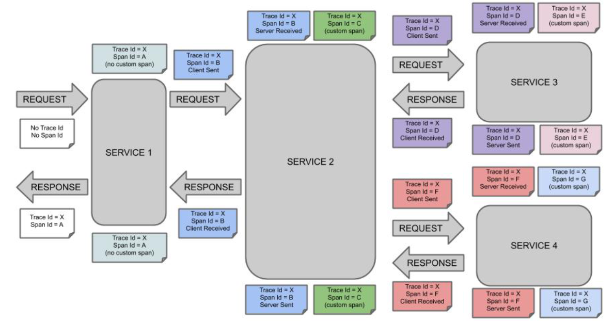
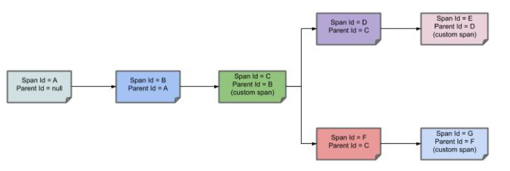
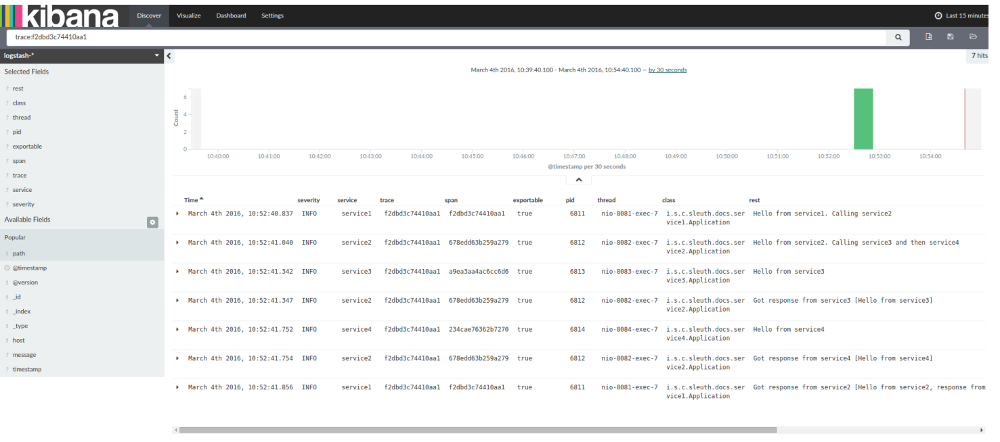

# 概述

Spring Cloud Sleuth 能够跟踪您的请求和消息，以便您可以将该通信与相应的日志条目相关联。 您还可以将跟踪信息导出到外部系统以可视化。

**Span**：工作的基本单位。 例如一次RPC调用就是一个新的span。 Span 还有其他数据，例如描述、时间戳事件、键值注释（标签）、span 的 ID 和进程 ID（通常是 IP 地址）。Span 可以启动和停止，并且会记录它们的时间信息。 一旦你创建了一个span，你必须在未来的某个时间点停止它。

**Trace**：一组形成树状结构的span。 例如，如果您运行分布式大数据存储，则 PUT 请求可能会形成trace。

**Annotation/Event**：用于及时记录事件的存在。从概念上讲，在典型的 RPC 场景中，我们标记这些事件以突出显示发生了什么类型的操作（这并不意味着在物理上将此类事件设置在span上）。

* **cs**: Client Sent，客户发出了请求。 此注释表示span的开始。
* **sr**：Server Received，服务器端收到请求并开始处理它。 从此时间戳中减去 cs 时间戳可显示网络延迟。
* **ss**：Server Sent.在请求处理完成时进行注释（当响应被发送回客户端时）。 从这个时间戳中减去 sr 时间戳显示服务器端处理请求所需的时间。
* **cr**：Client Received.表示span的结束。 客户端已成功收到服务器端的响应。 从此时间戳中减去 cs 时间戳可显示客户端从服务器接收响应所需的全部时间。

下图显示了 Span 和 Trace 在系统中的外观:



note的每种颜色表示一个跨度（有七个跨度 - 从 A 到 G）。 请考虑以下note：

```
Trace Id = X
Span Id = D
Client Sent
```

此注释表明当前 span 将 Trace Id 设置为 X，并将 Span Id 设置为 D。此外，从 RPC 的角度来看，发生了 Client Sent 事件。我们再看下面的note:

```
Trace Id = X
Span Id = A
(no custom span)

Trace Id = X
Span Id = C
(custom span)
```

您可以继续使用创建的span（不创建上面示例中的自定义span的示例），也可以手动创建子span（例如上面的示例）。

下图显示了span的父子关系：



## 快速入门

**核心依赖**

```xml
    <dependency>
        <groupId>org.springframework.cloud</groupId>
        <artifactId>spring-cloud-starter-sleuth</artifactId>
    </dependency>
```

# 使用 sleuth

## span的生命周期

最常用的接口：

* org.springframework.cloud.sleuth.Tracer：使用跟踪器，您可以创建一个根sspan来跟踪请求的关键路径。
* org.springframework.cloud.sleuth.Span：Span 是一个需要启动和停止的工作单元。 包含计时信息以及事件和标签。

Span的生命周期action:

* start: 当您开始一个span时，它的名称被分配并记录开始时间戳。

* end: span完成（记录跨度的结束时间）

* continue: span 继续，例如 在另一个线程中。

* [create with explicit parent](https://docs.spring.io/spring-cloud-sleuth/docs/current/reference/html/using.html#using-creating-spans-with-explicit-parent): 您可以创建一个新的span并为其设置显式父级。

> Spring Cloud Sleuth 为您创建了一个 Tracer 实例。 为了使用它，您可以自动装配它。

### 创建和结束span

您可以使用 Tracer 手动创建span，如以下示例所示：

```java
// 开始一个跨度。 如果此线程中存在span，它将变为newSpan的父级。
Span newSpan = this.tracer.nextSpan().name("calculateTax");
try (Tracer.SpanInScope ws = this.tracer.withSpan(newSpan.start())) {
    // ...
    // 对span打标签
    newSpan.tag("taxValue", taxValue);
    // ...
    // 在span中设置事件
    newSpan.event("taxCalculated");
}
finally {
    // 最后需要结束span,这允许span被发送到zipkin中
    newSpan.end();
}
```

> 如果您的span包含超过 50 个字符的名称，则该名称将被截断为 50 个字符。 你的名字必须明确而具体。 名称过长会导致延迟问题，有时甚至会导致异常。

### 继续span

有时，您不想创建一个新的span，而是想继续一个。 这种情况的一个例子可能如AOP: 如果在达到方面之前已经创建了一个跨度，您可能不想创建一个新的跨度。

要继续span，您可以将span存储在一个线程中并将其传递给另一个线程，如下例所示:

```java
Span spanFromThreadX = this.tracer.nextSpan().name("calculateTax");
try (Tracer.SpanInScope ws = this.tracer.withSpan(spanFromThreadX.start())) {
    executorService.submit(() -> {
        // Pass the span from thread X
        Span continuedSpan = spanFromThreadX;
        // ...
        // You can tag a span
        continuedSpan.tag("taxValue", taxValue);
        // ...
        // You can log an event on a span
        continuedSpan.event("taxCalculated");
    }).get();
}
finally {
    spanFromThreadX.end();
}
```

### 使用显式父级创建span

您可能想要开始一个新的span并提供该span的显式父代。 假设 span 的父级在一个线程中，而您想在另一个线程中开始一个新的 span。Tracer.nextSpan()如下例所示：

```java
//假设线程 Y 中,并且收到来自线程 X 的 initialSpan。initialSpan 将是`newSpan` 的父级

Span newSpan = null;
try (Tracer.SpanInScope ws = this.tracer.withSpan(initialSpan)) {
    newSpan = this.tracer.nextSpan().name("calculateCommission");
    // ...
    // You can tag a span
    newSpan.tag("commissionValue", commissionValue);
    // ...
    // You can log an event on a span
    newSpan.event("commissionCalculated");
}
finally {
    if (newSpan != null) {
        newSpan.end();
    }
}
```

您还可以使用 Tracer.nextSpan(Span parentSpan) 版本明确提供父span。

## 命名span

命名规范：

* controller-method-name： controller中的方法上
* async 用于封装的 Callable 和 Runnable 接口完成的异步操作。
* 用@Scheduled 注释的方法返回类的简单名称。

### @SpanName

```java
@SpanName("calculateTax")
class TaxCountingRunnable implements Runnable {

    @Override
    public void run() {
        // perform logic
    }

}
```

在这种情况下，按以下方式处理时，span将命名为 calculateTax：

```java
Runnable runnable = new TraceRunnable(this.tracer, spanNamer, new TaxCountingRunnable());
Future<?> future = executorService.submit(runnable);
// ... some additional logic ...
future.get();
```

### toString()

为 Runnable 或 Callable 创建单独的类是非常罕见的。 通常，创建这些类的匿名实例。 为了克服这个限制，如果不存在 @SpanName 注释，我们会检查该类是否具有 toString() 方法的自定义实现。

运行这样的代码会导致创建一个名为 calculateTax 的跨度，如以下示例所示：

```java
Runnable runnable = new TraceRunnable(this.tracer, spanNamer, new Runnable() {
    @Override
    public void run() {
        // perform logic
    }

    @Override
    public String toString() {
        return "calculateTax";
    }
});
Future<?> future = executorService.submit(runnable);
// ... some additional logic ...
future.get();
```

## 使用注解管理span

### 创建新的span

如果您不想手动创建span，可以使用 @NewSpan 注释。 此外，我们提供@SpanTag 注释以自动方式添加标签。

```java
@NewSpan
void testMethod();
```

注释不带任何参数的方法会导致创建一个新的span，其名称等于注释的方法名称。

```java
@NewSpan("customNameOnTestMethod4")
void testMethod4();
```

您可以组合名称和标签。 让我们关注后者。 在这种情况下，注释方法的参数运行时值的值成为标记的值。 在我们的示例中，标签键是 testTag，标签值是 test。

```java
// method declaration
@NewSpan(name = "customNameOnTestMethod5")
void testMethod5(@SpanTag("testTag") String param);

// and method execution
this.testBean.testMethod5("test");
```


您可以在类和接口上放置 @NewSpan 注释。 如果您覆盖接口的方法并为 @NewSpan 注释提供不同的值，则最具体的方法将获胜（在本例中设置了 customNameOnTestMethod3）。

```java
@NewSpan(name = "customNameOnTestMethod3")
@Override
public void testMethod3() {
}
```

### 继续span

如果要向现有span添加标签和注释，可以使用 @ContinueSpan 注释，如下例所示：

```java
// method declaration
@ContinueSpan(log = "testMethod11")
void testMethod11(@SpanTag("testTag11") String param);

// method execution
this.testBean.testMethod11("test");
this.testBean.testMethod13();
```

（请注意，与 @NewSpan 注释相反，您还可以使用 log 参数添加日志。）

这样，跨度会继续，并且：

* 创建名为 testMethod11.before 和 testMethod11.after 的日志条目。

* 如果抛出异常，还会创建一个名为 testMethod11.afterFailure 的日志条目。

* 创建了一个键为 testTag11 且值为 test 的标签。

### 高级标签设置

有 3 种不同的方法可以将标签添加到 span。 所有这些都由 SpanTag 注释控制。 优先级如下：

* 使用 TagValueResolver 类型的 bean并提供bean的名称。

* 如果尚未提供 bean 名称，请尝试评估表达式。 我们搜索 TagValueExpressionResolver bean。 默认实现使用 SPEL 表达式解析。您只能从 SPEL 表达式中引用属性。 由于安全限制，不允许方法执行。

* 如果我们没有找到任何要计算的表达式，则返回参数的 toString() 值。

#### 自定义解析器

以下方法的标签值由 TagValueResolver 接口的实现计算。 它的类名必须填充resolver属性。

```java
@NewSpan
public void getAnnotationForTagValueResolver(
        @SpanTag(key = "test", resolver = TagValueResolver.class) String test) {
}
```


```java
@Bean(name = "myCustomTagValueResolver")
public TagValueResolver tagValueResolver() {
    return parameter -> "Value from myCustomTagValueResolver";
}
```

设定的tag值是`Value from myCustomTagValueResolver`

#### 解析表达式

```java
@NewSpan
public void getAnnotationForTagValueExpression(
        @SpanTag(key = "test", expression = "'hello' + ' characters'") String test) {
}
```

TagValueExpressionResolver 的自定义实现不会导致对 SPEL 表达式的评估，并且在span上设置了一个值为 4 个字符的tag。 如果您想使用其他一些表达式解析机制，您可以创建自己的 bean 实现。

### toString 方式

```java
@NewSpan
public void getAnnotationForArgumentToString(@SpanTag("test") Long param) {
}
```

假如传入的参数为15，则设置的tag值就为15

# Sleuth 特点

## 上下文传播

跟踪服务之间的调用使用header传播，默认的格式是[B3](https://github.com/openzipkin/b3-propagation)。你也可以配置其他的header格式，但必须和trace和span id的格式兼容。这意味着 trace id和span id必须是小写的十六进制，而不是UUID。除了trace标识符，其他属性（Baggage）也可以与请求一起传递，远程的Baggage必须预先定义，否则是灵活的。？？？

要使用提供的默认值，您可以设置 spring.sleuth.propagation.type 属性。 该值可以是一个列表，在这种情况下，您将传播更多trace header。

对于 Brave，我们支持 AWS、B3、W3C 传播类型。

## 采样

Spring Cloud Sleuth 将采样决策下推到tracer 实现。 但是，在某些情况下，您可以在运行时更改采样决策。

其中一种情况是跳过某些客户端span的报告。 为此，您可以使用要跳过的路径模式设置 `spring.sleuth.web.client.skip-pattern`。 另一种选择是提供自定义 `org.springframework.cloud.sleuth.SamplerFunction<org.springframework.cloud.sleuth.http.HttpRequest>` 实现并定义何时不应对给定的 HttpRequest 进行采样。

## [ Baggage](https://docs.spring.io/spring-cloud-sleuth/docs/current/reference/html/project-features.html#features-baggage)

分布式追踪在服务之间传递字段，尤其是traceId和spanId,保存这些字段的上下文还可以传递其他非跟踪功能的字段，这些字段称为Baggage。

Sleuth 允许您定义跟踪上下文中允许存在哪些Baggage，包括使用哪些header名称。

以下示例显示使用 Spring Cloud Sleuth 的 API 设置Baggage：

```java
try (Tracer.SpanInScope ws = this.tracer.withSpan(initialSpan)) {
    BaggageInScope businessProcess = this.tracer.createBaggage(BUSINESS_PROCESS).set("ALM");
    BaggageInScope countryCode = this.tracer.createBaggage(COUNTRY_CODE).set("FO");
    try {
```

> 目前对Baggage的数量或大小没有限制。 请记住，太多会降低系统吞吐量或增加 RPC 延迟。 在极端情况下，由于超出传输级消息或标头容量，过多的Baggage可能会导致应用程序崩溃。

您可以使用属性来定义没有特殊配置（例如名称映射）的字段：

* spring.sleuth.baggage.remote-fields: 要接受并传播到远程服务的标头名称列表。

* spring.sleuth.baggage.local-fields:要在本地传播的名称列表

这些键没有前缀。 您设置的实际上就是使用的内容。

在这些属性中的任何一个中设置的名称都会产生同名的Baggage。

为了自动将Baggage设置为 Slf4j 的 MDC，您必须使用允许的本地或远程密钥列表设置 spring.sleuth.baggage.correlation-fields 属性。 例如。 spring.sleuth.baggage.correlation-fields=country-code 将country-code Baggage的值设置为 MDC。

请注意，从下一个下游trace上下文开始，额外字段被传播并添加到 MDC。 要立即将额外字段添加到当前跟踪上下文中的 MDC，请将字段配置为在更新时刷新：

```
// configuration
@Bean
BaggageField countryCodeField() {
    return BaggageField.create("country-code");
}

@Bean
ScopeDecorator mdcScopeDecorator() {
    return MDCScopeDecorator.newBuilder()
            .clear()
            .add(SingleCorrelationField.newBuilder(countryCodeField())
                    .flushOnUpdate()
                    .build())
            .build();
}

// service
@Autowired
BaggageField countryCodeField;

countryCodeField.updateValue("new-value");
```

如果要将baggage条目添加为标签，以便可以通过baggage条目搜索跨度，您可以使用允许的baggage键列表设置 spring.sleuth.baggage.tag-fields 的值。 要禁用该功能，您必须传递 spring.sleuth.propagation.tag.enabled=false 属性。

### Baggage 对比 tags

与跟踪 ID 一样，Baggage 附加到消息或请求，通常作为标头。 标签是在 Span 中发送到 Zipkin 的键值对。 默认情况下不会添加 Baggage 值，这意味着您无法根据 Baggage 进行搜索，除非您选择加入。

要使Baggage 也标记，请使用属性 spring.sleuth.baggage.tag-fields ，如下所示：

```yml
spring:
  sleuth:
    baggage:
      foo: bar
      remoteFields:
        - country-code
        - x-vcap-request-id
      tagFields:
        - country-code
```

## OpenZipkin Brave Tracer 集成

Spring Cloud Sleuth 通过 spring-cloud-sleuth-brave 模块中提供的桥接器与 OpenZipkin Brave 跟踪器集成。 您可以选择直接在代码中使用 Sleuth 的 API 或 Brave API（例如 Sleuth 的 Tracer 或 Brave 的 Tracer）。

### Brave基础

以下是您可能使用的最核心类型：

* brave.SpanCustomizer：更改当前正在进行的span
* brave.Tracer: 开始新的span ad-hoc

以下是 OpenZipkin Brave 项目中最相关的链接：

- [Brave’s core library](https://github.com/openzipkin/brave/tree/master/brave)
- [Baggage (propagated fields)](https://github.com/openzipkin/brave/tree/master/brave#baggage)
- [HTTP tracing](https://github.com/openzipkin/brave/tree/master/instrumentation/http)

### Brave采样

采样仅适用于跟踪后端，例如 Zipkin。 无论采样率如何，trace ID 都会出现在日志中。 采样是一种防止系统过载的方法，它通过持续跟踪一些请求，但不是所有请求。

每秒 10 次跟踪的默认速率由 spring.sleuth.sampler.rate 属性控制。 使用高于每秒 100 条跟踪的速率时要格外小心，因为这可能会使您的跟踪系统过载。

采样器也可以通过 Java Config 设置，如以下示例所示：

```java
@Bean
public Sampler defaultSampler() {
    return Sampler.ALWAYS_SAMPLE;
}
```

> 您可以将 HTTP 标头 b3 设置为 1，或者，在执行消息传递时，您可以将 spanFlags 标头设置为 1。这样做会强制对当前请求进行采样，而不管配置如何。

默认情况下，采样器将使用刷新范围机制。 这意味着您可以在运行时更改采样属性，刷新应用程序。 但是，有时在采样器周围创建代理并过早调用它（来自@PostConstruct 注释方法）的事实可能会导致死锁。 在这种情况下，要么显式创建采样器 bean，要么将属性 spring.sleuth.sampler.refresh.enabled 设置为 false 以禁用刷新范围支持。

### Brave Baggage java配置

如果您需要执行比上述更高级的操作，请不要定义属性，而是对您使用的Baggage字段使用 @Bean 配置。

* BaggagePropagationCustomizer 设置Baggage字段

* 添加 SingleBaggageField 以控制Baggage的标头名称。

* CorrelationScopeCustomizer 设置 MDC 字段

* 添加 SingleCorrelationField 以更改行李的 MDC 名称或更新是否刷新。

### Brave自定义

如果需要客户端/服务器采样，只需注册一个类型为 bave.sampler.SamplerFunction<HttpRequest> 的 bean，并将 bean 命名为 sleuthHttpClientSampler 用于客户端采样器，将 sleuthHttpServerSampler 命名为服务器采样器。

为方便起见，@HttpClientSampler 和 @HttpServerSampler 注释可用于注入正确的 bean 或通过它们的静态 String NAME 字段引用 bean 名称。

查看 Brave 的代码以查看如何制作基于路径的采样器的示例 github.com/openzipkin/brave/tree/master/instrumentation/http#sampling-policy

如果您想完全重写 HttpTracing bean，您可以使用 SkipPatternProvider 接口来检索不应采样的span的 URL 模式。 下面您可以看到在服务器端 Sampler<HttpRequest> 中使用 SkipPatternProvider 的示例。

```java
@Configuration(proxyBeanMethods = false)
    class Config {
  @Bean(name = HttpServerSampler.NAME)
  SamplerFunction<HttpRequest> myHttpSampler(SkipPatternProvider provider) {
      Pattern pattern = provider.skipPattern();
      return request -> {
          String url = request.path();
          boolean shouldSkip = pattern.matcher(url).matches();
          if (shouldSkip) {
              return false;
          }
          return null;
      };
  }
}
```

### Brave消息

Sleuth 会自动配置 MessagingTracing bean，该 bean 作为 Messaging 工具（如 Kafka 或 JMS）的基础。

如果需要定制消息跟踪的生产者/消费者采样，只需注册一个类型为 brave.sampler.SamplerFunction<MessagingRequest> 的 bean，并将 bean 命名为 sleuthProducerSampler 为生产者采样器，sleuthConsumerSampler 为消费者采样器。

为方便起见，@ProducerSampler 和@ConsumerSampler 注释可用于注入适当的bean 或通过其静态字符串名称字段引用bean 名称。

 这是一个每秒跟踪 100 个消费者请求的采样器，“警报”通道除外。 其他请求将使用跟踪组件提供的全局速率。

```java
@Configuration(proxyBeanMethods = false)
    class Config {
  @Bean(name = ConsumerSampler.NAME)
  SamplerFunction<MessagingRequest> myMessagingSampler() {
      return MessagingRuleSampler.newBuilder().putRule(channelNameEquals("alerts"), Sampler.NEVER_SAMPLE)
              .putRule(Matchers.alwaysMatch(), RateLimitingSampler.create(100)).build();
  }
}
```

### Brave开放追踪

您可以通过 io.opentracing.brave:brave-opentracing 桥与 Brave 和 OpenTracing 集成。 只需将它添加到类路径，OpenTracing Tracer 就会自动设置。

## 发送span到zipkin

Spring Cloud Sleuth 提供了与 OpenZipkin 分布式跟踪系统的各种集成。 无论选择何种跟踪器实现，将 spring-cloud-sleuth-zipkin 添加到类路径就足以开始向 Zipkin 发送跨度。 您可以选择是通过 HTTP 还是消息传递来执行此操作。 

当 span 关闭时，它会通过 HTTP 发送到 Zipkin。 通信是异步的。 您可以通过设置 spring.zipkin.baseUrl 属性来配置 URL，如下所示：

```yaml
spring.zipkin.baseUrl: https://192.168.99.100:9411/
```

如果你想通过服务发现找到Zipkin，你可以在URL中传递Zipkin的服务ID，如下面的zipkinserver服务ID示例所示：

```yaml
spring.zipkin.baseUrl: https://zipkinserver/
```

要禁用此功能，只需将 spring.zipkin.discovery-client-enabled 设置为 false。

启用 Discovery Client 功能后，Sleuth 使用 LoadBalancerClient 查找 Zipkin 服务器的 URL。 这意味着您可以设置负载平衡配置。

如果您在类路径上有 web、rabbit、activemq 或 kafka，您可能需要选择您希望将span发送到 zipkin 的方式。 为此，请将 web、rabbit、activemq 或 kafka 设置为 spring.zipkin.sender.type 属性。 以下示例显示了为 Web 设置发件人类型：

```yaml
spring.zipkin.sender.type: web
```

要自定义通过 HTTP 将跨度发送到 Zipkin 的 RestTemplate，您可以注册 ZipkinRestTemplateCustomizer bean。

```java
@Configuration(proxyBeanMethods = false)
    class MyConfig {
    @Bean ZipkinRestTemplateCustomizer myCustomizer() {
        return new ZipkinRestTemplateCustomizer() {
            @Override
            void customize(RestTemplate restTemplate) {
                // customize the RestTemplate
            }
        };
    }
}
```

但是，如果您想控制创建 RestTemplate 对象的整个过程，则必须创建一个 zipkin2.reporter.Sender 类型的 bean。

```java
@Bean Sender myRestTemplateSender(ZipkinProperties zipkin,
        ZipkinRestTemplateCustomizer zipkinRestTemplateCustomizer) {
    RestTemplate restTemplate = mySuperCustomRestTemplate();
    zipkinRestTemplateCustomizer.customize(restTemplate);
    return myCustomSender(zipkin, restTemplate);
}
```

默认情况下，api 路径将根据编码器版本设置为 api/v2/spans 或 api/v1/spans。 如果要使用自定义 api 路径，可以使用以下属性进行配置（空大小写，设置“”）：

```yaml
spring.zipkin.api-path: v2/path2
```

### 自定义service名称

默认情况下，Sleuth 假设，当您向 Zipkin 发送 span 时，您希望 span 的服务名称等于 spring.application.name 属性的值。 然而，情况并非总是如此。 在某些情况下，您希望为来自应用程序的所有跨度显式提供不同的服务名称。 为此，您可以将以下属性传递给您的应用程序以覆盖该值（该示例针对名为 myService 的服务）：

```yaml
spring.zipkin.service.name: myService
```

### [Host Locator](https://docs.spring.io/spring-cloud-sleuth/docs/current/reference/html/project-features.html#features-zipkin-host-locator)

要定义对应于特定span的主机，我们需要解析主机名和端口。 默认方法是从服务器属性中获取这些值。 如果没有设置，我们尝试从网络接口检索主机名。

如果您启用了发现客户端并希望从服务注册表中的注册实例检索主机地址，则必须设置 spring.zipkin.locator.discovery.enabled 属性（它适用于基于 HTTP 和 Stream- 基于span报告），如下：

```yaml
spring.zipkin.locator.discovery.enabled: true
```

### 自定义报告span

在 Sleuth 中，我们生成具有固定名称的span。 一些用户希望根据标签的值修改名称。

Sleuth 注册了一个 SpanFilter bean，它可以自动跳过给定名称模式的报告span。 属性 spring.sleuth.span-filter.span-name-patterns-to-skip 包含span名称的默认跳过模式。 属性 spring.sleuth.span-filter.additional-span-name-patterns-to-skip 将提供的span名称模式附加到现有的模式。 为了禁用此功能，只需将 spring.sleuth.span-filter.enabled 设置为 false。

在报告span(例如，到 Zipkin）之前，您可能希望以某种方式修改该跨度。 您可以通过实现 SpanHandler 来实现。

下面的例子展示了如何注册两个实现了 SpanHandler 的 bean

```java
@Bean
SpanHandler handlerOne() {
    return new SpanHandler() {
        @Override
        public boolean end(TraceContext traceContext, MutableSpan span, Cause cause) {
            span.name("foo");
            return true; // keep this span
        }
    };
}

@Bean
SpanHandler handlerTwo() {
    return new SpanHandler() {
        @Override
        public boolean end(TraceContext traceContext, MutableSpan span, Cause cause) {
            span.name(span.name() + " bar");
            return true; // keep this span
        }
    };
}
```

前面的示例导致将报告的span的名称更改为 foo bar，就在它被报告之前（例如，更改为 Zipkin）。

### 覆盖 Zipkin 的自动配置

Spring Cloud Sleuth 从 version 2.1.0 开始支持将跟踪发送到多个跟踪系统。 为了让它起作用，每个跟踪系统都需要有一个 Reporter<Span> 和 Sender。 如果你想覆盖提供的 bean，你需要给它们一个特定的名称。 为此，您可以分别使用 ZipkinAutoConfiguration.REPORTER_BEAN_NAME 和 ZipkinAutoConfiguration.SENDER_BEAN_NAME。

```java
@Configuration(proxyBeanMethods = false)
protected static class MyConfig {

    @Bean(ZipkinAutoConfiguration.REPORTER_BEAN_NAME)
    Reporter<zipkin2.Span> myReporter(@Qualifier(ZipkinAutoConfiguration.SENDER_BEAN_NAME) MySender mySender) {
        return AsyncReporter.create(mySender);
    }

    @Bean(ZipkinAutoConfiguration.SENDER_BEAN_NAME)
    MySender mySender() {
        return new MySender();
    }

    static class MySender extends Sender {

        private boolean spanSent = false;

        boolean isSpanSent() {
            return this.spanSent;
        }

        @Override
        public Encoding encoding() {
            return Encoding.JSON;
        }

        @Override
        public int messageMaxBytes() {
            return Integer.MAX_VALUE;
        }

        @Override
        public int messageSizeInBytes(List<byte[]> encodedSpans) {
            return encoding().listSizeInBytes(encodedSpans);
        }

        @Override
        public Call<Void> sendSpans(List<byte[]> encodedSpans) {
            this.spanSent = true;
            return Call.create(null);
        }

    }

}
```

## 日志集成

Sleuth 使用变量配置日志上下文，包括服务名称（%{spring.zipkin.service.name} 或 %{spring.application.name} 如果前一个未设置）、span ID (%{spanId}) 和 跟踪 ID (%{traceId})。 这些可帮助您将日志与分布式跟踪连接起来，并允许您选择用于对服务进行故障排除的工具。

一旦发现任何有错误的日志，您就可以在消息中查找跟踪 ID。 将其粘贴到您的分布式跟踪系统中以可视化整个跟踪，无论第一个请求最终命中了多少服务。

```
backend.log:  2020-04-09 17:45:40.516 ERROR [backend,5e8eeec48b08e26882aba313eb08f0a4,dcc1df555b5777b3] 97203 --- [nio-9000-exec-1] o.s.c.s.i.web.ExceptionLoggingFilter     : Uncaught exception thrown
frontend.log:2020-04-09 17:45:40.574 ERROR [frontend,5e8eeec48b08e26882aba313eb08f0a4,82aba313eb08f0a4] 97192 --- [nio-8081-exec-2] o.s.c.s.i.web.ExceptionLoggingFilter     : Uncaught exception thrown
```

例如，您会注意到跟踪 ID 为 5e8eeec48b08e26882aba313eb08f0a4。 此日志配置由 Sleuth 自动设置。 您可以通过 spring.sleuth.enabled=false 属性禁用 Sleuth 或放置自己的 logging.pattern.level 属性来禁用它。

如果您使用日志聚合工具（例如 Kibana、Splunk 等），您可以对发生的事件进行排序。 Kibana 中的示例类似于下图：



如果要使用 Logstash，以下清单显示了 Logstash 的 Grok 模式：

```
filter {
  # pattern matching logback pattern
  grok {
    match => { "message" => "%{TIMESTAMP_ISO8601:timestamp}\s+%{LOGLEVEL:severity}\s+\[%{DATA:service},%{DATA:trace},%{DATA:span}\]\s+%{DATA:pid}\s+---\s+\[%{DATA:thread}\]\s+%{DATA:class}\s+:\s+%{GREEDYDATA:rest}" }
  }
  date {
    match => ["timestamp", "ISO8601"]
  }
  mutate {
    remove_field => ["timestamp"]
  }
}
```

如果要将 Grok 与来自 Cloud Foundry 的日志一起使用，则必须使用以下模式：

```
filter {
  # pattern matching logback pattern
  grok {
    match => { "message" => "(?m)OUT\s+%{TIMESTAMP_ISO8601:timestamp}\s+%{LOGLEVEL:severity}\s+\[%{DATA:service},%{DATA:trace},%{DATA:span}\]\s+%{DATA:pid}\s+---\s+\[%{DATA:thread}\]\s+%{DATA:class}\s+:\s+%{GREEDYDATA:rest}" }
  }
  date {
    match => ["timestamp", "ISO8601"]
  }
  mutate {
    remove_field => ["timestamp"]
  }
}
```

### 使用 Logstash 进行 JSON 回溯

通常，您不想将日志存储在文本文件中，而是存储在 Logstash 可以立即选择的 JSON 文件中。 为此，您必须执行以下操作（为了可读性，我们在 groupId:artifactId:version 表示法中传递依赖项）。

1. 确保 Logback 在类路径 (ch.qos.logback:logback-core) 上。

2. 添加 Logstash Logback 编码。 例如，要使用 4.6 版，请添加 net.logstash.logback:logstash-logback-encoder:4.6。

考虑以下 Logback 配置文件 (logback-spring.xml) 的示例。

```xml
<?xml version="1.0" encoding="UTF-8"?>
<configuration>
    <include resource="org/springframework/boot/logging/logback/defaults.xml"/>
    <springProperty scope="context" name="springAppName" source="spring.application.name"/>
    <!-- Example for logging into the build folder of your project -->
    <property name="LOG_FILE" value="${BUILD_FOLDER:-build}/${springAppName}"/>

    <!-- You can override this to have a custom pattern -->
    <property name="CONSOLE_LOG_PATTERN"
              value="%clr(%d{yyyy-MM-dd HH:mm:ss.SSS}){faint} %clr(${LOG_LEVEL_PATTERN:-%5p}) %clr(${PID:- }){magenta} %clr(---){faint} %clr([%15.15t]){faint} %clr(%-40.40logger{39}){cyan} %clr(:){faint} %m%n${LOG_EXCEPTION_CONVERSION_WORD:-%wEx}"/>

    <!-- Appender to log to console -->
    <appender name="console" class="ch.qos.logback.core.ConsoleAppender">
        <filter class="ch.qos.logback.classic.filter.ThresholdFilter">
            <!-- Minimum logging level to be presented in the console logs-->
            <level>DEBUG</level>
        </filter>
        <encoder>
            <pattern>${CONSOLE_LOG_PATTERN}</pattern>
            <charset>utf8</charset>
        </encoder>
    </appender>

    <!-- Appender to log to file -->
    <appender name="flatfile" class="ch.qos.logback.core.rolling.RollingFileAppender">
        <file>${LOG_FILE}</file>
        <rollingPolicy class="ch.qos.logback.core.rolling.TimeBasedRollingPolicy">
            <fileNamePattern>${LOG_FILE}.%d{yyyy-MM-dd}.gz</fileNamePattern>
            <maxHistory>7</maxHistory>
        </rollingPolicy>
        <encoder>
            <pattern>${CONSOLE_LOG_PATTERN}</pattern>
            <charset>utf8</charset>
        </encoder>
    </appender>
    <!-- Appender to log to file in a JSON format -->
    <appender name="logstash" class="ch.qos.logback.core.rolling.RollingFileAppender">
        <file>${LOG_FILE}.json</file>
        <rollingPolicy class="ch.qos.logback.core.rolling.TimeBasedRollingPolicy">
            <fileNamePattern>${LOG_FILE}.json.%d{yyyy-MM-dd}.gz</fileNamePattern>
            <maxHistory>7</maxHistory>
        </rollingPolicy>
        <encoder class="net.logstash.logback.encoder.LoggingEventCompositeJsonEncoder">
            <providers>
                <timestamp>
                    <timeZone>UTC</timeZone>
                </timestamp>
                <pattern>
                    <pattern>
                        {
                        "timestamp": "@timestamp",
                        "severity": "%level",
                        "service": "${springAppName:-}",
                        "trace": "%X{traceId:-}",
                        "span": "%X{spanId:-}",
                        "pid": "${PID:-}",
                        "thread": "%thread",
                        "class": "%logger{40}",
                        "rest": "%message"
                        }
                    </pattern>
                </pattern>
            </providers>
        </encoder>
    </appender>
    <root level="INFO">
        <appender-ref ref="console"/>
        <!-- uncomment this to have also JSON logs -->
        <!--<appender-ref ref="logstash"/>-->
        <!--<appender-ref ref="flatfile"/>-->
    </root>
</configuration>
```

* 将应用程序中的信息以 JSON 格式记录到 build/${spring.application.name}.json 文件中。

* 已注释掉两个附加程序：控制台和标准日志文件。

* 具有与上一节中介绍的日志模式相同的日志记录模式。

> 如果使用自定义 logback-spring.xml，则必须在bootstrap 中传递 spring.application.name 而不是application属性文件。 否则，您的自定义 logback 文件无法正确读取该属性。


# 用例

## 集成到消息系统

如果要使用 RabbitMQ、Kafka 或 ActiveMQ 代替 HTTP，请添加 spring-rabbit、spring-kafka 或 org.apache.activemq:activemq-client 依赖项。 默认目标名称是 Zipkin。

如果使用 Kafka，则必须添加 Kafka 依赖项：

```xml
<dependency>
    <groupId>org.springframework.cloud</groupId>
    <artifactId>spring-cloud-starter-sleuth</artifactId>
</dependency>
<dependency>
    <groupId>org.springframework.cloud</groupId>
    <artifactId>spring-cloud-sleuth-zipkin</artifactId>
</dependency>
<dependency>
    <groupId>org.springframework.kafka</groupId>
    <artifactId>spring-kafka</artifactId>
</dependency>
```

此外，您需要相应地设置属性 spring.zipkin.sender.type 属性：

```yaml
spring.zipkin.sender.type: kafka
```

如果您希望通过 RabbitMQ 使用 Sleuth，请添加 spring-cloud-starter-sleuth、spring-cloud-sleuth-zipkin 和 spring-rabbit 依赖项：

```xml
<dependency>
    <groupId>org.springframework.cloud</groupId>
    <artifactId>spring-cloud-starter-sleuth</artifactId>
</dependency>
<dependency>
    <groupId>org.springframework.cloud</groupId>
    <artifactId>spring-cloud-sleuth-zipkin</artifactId>
</dependency>
<dependency>
    <groupId>org.springframework.amqp</groupId>
    <artifactId>spring-rabbit</artifactId>
</dependency>
```

如果您希望通过 ActiveMQ 使用 Sleuth，请添加 spring-cloud-starter-sleuth、spring-cloud-sleuth-zipkin 和 activemq-client 依赖项：

```xml
<dependency>
    <groupId>org.springframework.cloud</groupId>
    <artifactId>spring-cloud-starter-sleuth</artifactId>
</dependency>
<dependency>
    <groupId>org.springframework.cloud</groupId>
    <artifactId>spring-cloud-sleuth-zipkin</artifactId>
</dependency>
<dependency>
    <groupId>org.apache.activemq</groupId>
    <artifactId>activemq-client</artifactId>
</dependency>
```

此外，您需要相应地设置属性 spring.zipkin.sender.type 属性：

```yaml
spring.zipkin.sender.type: activemq
```

## 如何在外部系统中查看span？

如果您看不到span被报告给外部系统（例如 Zipkin），则很可能是由于以下原因：

* 您的span未被采样

* 您忘记添加要向外部系统报告的依赖项（例如 spring-cloud-sleuth-zipkin）

* 您错误地配置了与外部系统的连接

为了检查span是否没有被采样，只要查看是否设置了可导出标志就足够了。 让我们看看下面的例子：

```
2020-10-21 12:01:16.285  INFO [backend,0b6aaf642574edd3,0b6aaf642574edd3,true] 289589 --- [nio-9000-exec-1] Example              : Hello world!
```

如果 [backend,0b6aaf642574edd3,0b6aaf642574edd3,true] 部分中的布尔值为true，则表示正在对跨度进行采样并应报告。


直到 Sleuth 3.0.0，依赖 spring-cloud-starter-zipkin 包括 spring-cloud-starter-sleuth 依赖和 spring-cloud-sleuth-zipkin 依赖。 3.0.0 spring-cloud-starter-zipkin 被移除了，所以你需要把它改成 spring-cloud-sleuth-zipkin。


仔细检查远程系统地址是否正确（例如 spring.zipkin.baseUrl），并且如果尝试通过代理进行通信，则您的代理连接设置正确。

### 如何让 RestTemplate、WebClient 等工作？

如果您观察到跟踪上下文没有被传播，则原因是以下之一：

* 我们没有检测给定的库

* 我们正在检测库，但是您错误地配置了设置

如果配置错误，请确保您用于通信的客户端是 Spring bean。 如果您通过new手动创建客户端，则仪器将无法工作。

仪器工作的示例：

```java
import org.springframework.context.annotation.Configuration;
import org.springframework.web.client.RestTemplate;

@Configuration(proxyBeanMethods = false)
class MyConfiguration {
    @Bean RestTemplate myRestTemplate() {
        return new RestTemplate();
    }
}

@Service
class MyService {
    private final RestTemplate restTemplate;

    MyService(RestTemplate restTemplate) {
        this.restTemplate = restTemplate;
    }

    String makeACall() {
        return this.restTemplate.getForObject("http://example.com", String.class);
    }

}
```

仪器不起作用的示例：

```java
@Service
class MyService {

    String makeACall() {
        // This will not work because RestTemplate is not a bean
        return new RestTemplate().getForObject("http://example.com", String.class);
    }

}
```

### 如何向 HTTP 服务器响应添加标头？

注册设置服务器响应的过滤器。

```java
import org.springframework.cloud.sleuth.Span;
import org.springframework.cloud.sleuth.Tracer;

import javax.servlet.Filter;
import org.springframework.web.server.WebFilter;

@Configuration(proxyBeanMethods = false)
class MyConfig {

        // Example of a servlet Filter for non-reactive applications
        @Bean
        Filter traceIdInResponseFilter(Tracer tracer) {
            return (request, response, chain) -> {
                Span currentSpan = tracer.currentSpan();
                if (currentSpan != null) {
                    HttpServletResponse resp = (HttpServletResponse) response;
                    // putting trace id value in [mytraceid] response header
                    resp.addHeader("mytraceid", currentSpan.context().traceId());
                }
                chain.doFilter(request, response);
            };
        }

        // Example of a reactive WebFilter for reactive applications
        @Bean
        WebFilter traceIdInResponseFilter(Tracer tracer) {
            return (exchange, chain) -> {
                Span currentSpan = tracer.currentSpan();
                if (currentSpan != null) {
                    // putting trace id value in [mytraceid] response header
                    exchange.getResponse().getHeaders().add("mytraceid", currentSpan.context().traceId());
                }
                return chain.filter(exchange);
            };
        }
}
```

### 如何自定义 HTTP 客户端span？

注册一个名为 HttpClientRequestParser.NAME 的 HttpRequestParser 类型的 bean，为请求端添加自定义。 注册一个名为 HttpClientRequestParser.NAME 的 HttpResponseParser 类型的 bean，为响应端添加自定义。

```java
@Configuration(proxyBeanMethods = false)
public static class ClientParserConfiguration {

    // example for Feign
    @Bean(name = HttpClientRequestParser.NAME)
    HttpRequestParser myHttpClientRequestParser() {
        return (request, context, span) -> {
            // Span customization
            span.name(request.method());
            span.tag("ClientRequest", "Tag");
            Object unwrap = request.unwrap();
            if (unwrap instanceof feign.Request) {
                feign.Request req = (feign.Request) unwrap;
                // Span customization
                span.tag("ClientRequestFeign", req.httpMethod().name());
            }
        };
    }

    // example for Feign
    @Bean(name = HttpClientResponseParser.NAME)
    HttpResponseParser myHttpClientResponseParser() {
        return (response, context, span) -> {
            // Span customization
            span.tag("ClientResponse", "Tag");
            Object unwrap = response.unwrap();
            if (unwrap instanceof feign.Response) {
                feign.Response resp = (feign.Response) unwrap;
                // Span customization
                span.tag("ClientResponseFeign", String.valueOf(resp.status()));
            }
        };
    }

}
```

### 如何自定义 HTTP 服务器span？

注册一个名为 HttpServerRequestParser.NAME 的 HttpRequestParser 类型的 bean，为请求端添加自定义。 注册一个名为 HttpServerResponseParser.NAME 的 HttpResponseParser 类型的 bean，为响应端添加自定义。

```java
@Configuration(proxyBeanMethods = false)
public static class ServerParserConfiguration {

    @Bean(name = HttpServerRequestParser.NAME)
    HttpRequestParser myHttpRequestParser() {
        return (request, context, span) -> {
            // Span customization
            span.tag("ServerRequest", "Tag");
            Object unwrap = request.unwrap();
            if (unwrap instanceof HttpServletRequest) {
                HttpServletRequest req = (HttpServletRequest) unwrap;
                // Span customization
                span.tag("ServerRequestServlet", req.getMethod());
            }
        };
    }

    @Bean(name = HttpServerResponseParser.NAME)
    HttpResponseParser myHttpResponseParser() {
        return (response, context, span) -> {
            // Span customization
            span.tag("ServerResponse", "Tag");
            Object unwrap = response.unwrap();
            if (unwrap instanceof HttpServletResponse) {
                HttpServletResponse resp = (HttpServletResponse) unwrap;
                // Span customization
                span.tag("ServerResponseServlet", String.valueOf(resp.getStatus()));
            }
        };
    }

    @Bean
    Filter traceIdInResponseFilter(Tracer tracer) {
        return (request, response, chain) -> {
            Span currentSpan = tracer.currentSpan();
            if (currentSpan != null) {
                HttpServletResponse resp = (HttpServletResponse) response;
                resp.addHeader("mytraceid", currentSpan.context().traceId());
            }
            chain.doFilter(request, response);
        };
    }

}
```

### 如何查看日志中的应用名称？

假设您没有更改默认日志记录格式，请在 bootstrap.yml 中设置 spring.application.name 属性，而不是在 application.yml 中。

### 如何改变上下文传播机制？

要使用提供的默认值，您可以设置 spring.sleuth.propagation.type 属性。 该值可以是一个列表，在这种情况下，您将传播更多跟踪标头。

对于 Brave，我们支持 AWS、B3、W3C 传播类型。

如果您想提供自定义传播机制，请将 spring.sleuth.propagation.type 属性设置为 CUSTOM 并实现您自己的 bean (Propagation.Factory for Brave)。 您可以在下面找到示例：

```java
@Component
class CustomPropagator extends Propagation.Factory implements Propagation<String> {

    @Override
    public List<String> keys() {
        return Arrays.asList("myCustomTraceId", "myCustomSpanId");
    }

    @Override
    public <R> TraceContext.Injector<R> injector(Setter<R, String> setter) {
        return (traceContext, request) -> {
            setter.put(request, "myCustomTraceId", traceContext.traceIdString());
            setter.put(request, "myCustomSpanId", traceContext.spanIdString());
        };
    }

    @Override
    public <R> TraceContext.Extractor<R> extractor(Getter<R, String> getter) {
        return request -> TraceContextOrSamplingFlags.create(TraceContext.newBuilder()
                .traceId(HexCodec.lowerHexToUnsignedLong(getter.get(request, "myCustomTraceId")))
                .spanId(HexCodec.lowerHexToUnsignedLong(getter.get(request, "myCustomSpanId"))).build());
    }

    @Override
    public <K> Propagation<K> create(KeyFactory<K> keyFactory) {
        return StringPropagationAdapter.create(this, keyFactory);
    }

}
```

### 如何实现我自己的追踪器？

Spring Cloud Sleuth API 包含跟踪器实现的所有必要接口。 该项目带有 OpenZipkin Brave 实现。 您可以通过查看 org.springframework.cloud.sleuth.brave.bridge 模块来检查两个跟踪器如何桥接到 Sleuth 的 API。

# Sleuth 自定义

在本节中，我们将描述如何自定义 Spring Cloud Sleuth 的各个部分。

## 异步通信

在本节中，我们将介绍如何使用 Spring Cloud Sleuth 自定义异步通信。

### @Aync标注的方法

此功能可用于所有跟踪器实现。

在 Spring Cloud Sleuth 中，我们检测与异步相关的组件，以便在线程之间传递跟踪信息。 您可以通过将 spring.sleuth.async.enabled 的值设置为 false 来禁用此行为。

如果您使用@Async 注释您的方法，我们会自动修改现有的 Span，如下所示：

* 如果该方法使用@SpanName 进行注释，则注释的value是 Span 的名称。
* 如果该方法未使用@SpanName 进行批注，则 Span 名称是带批注的方法名称。
* span标有方法的类名和方法名。

由于我们正在修改现有的span，如果您想保持其原始名称（例如通过接收 HTTP 请求创建的span），您应该使用 @NewSpan 注释包装您的 @Async 注释方法或手动创建一个新的span。

### @Scheduled标注的方法

此功能可用于所有跟踪器实现。

在 Spring Cloud Sleuth 中，我们检测计划的方法执行，以便在线程之间传递跟踪信息。 您可以通过将 spring.sleuth.scheduled.enabled 的值设置为 false 来禁用此行为。

如果您使用 @Scheduled 注释您的方法，我们会自动创建一个具有以下特征的新span：

* span名称是带注释的方法名称。
* span标有方法的类名和方法名。

如果要跳过某些@Scheduled 注释类的span创建，可以使用与@Scheduled 注释类的完全限定名称匹配的正则表达式设置 spring.sleuth.scheduled.skipPattern。

### [Executor, ExecutorService, 和ScheduledExecutorService](https://docs.spring.io/spring-cloud-sleuth/docs/current/reference/html/integrations.html#sleuth-async-executor-service-integration)

此功能可用于所有跟踪器实现。

我们提供 LazyTraceExecutor、TraceableExecutorService 和 TraceableScheduledExecutorService。 每次提交、调用或调度新任务时，这些实现都会创建span。

以下示例显示了在使用 CompletableFuture 时如何使用 TraceableExecutorService 传递跟踪信息：

```java
CompletableFuture<Long> completableFuture = CompletableFuture.supplyAsync(() -> {
    // perform some logic
    return 1_000_000L;
}, new TraceableExecutorService(beanFactory, executorService,
        // 'calculateTax' explicitly names the span - this param is optional
        "calculateTax"));
```

Sleuth 不适用于开箱即用的 parallelStream()。 如果您希望通过流传播跟踪信息，则必须使用带有 supplyAsync(… ) 的方法，如前面所示。

如果有实现 Executor 接口的 bean，您希望从 span 创建中排除，您可以使用 spring.sleuth.async.ignored-beans 属性，您可以在其中提供 bean 名称列表。

您可以通过将 spring.sleuth.async.enabled 的值设置为 false 来禁用此行为。

有时，您需要设置 AsyncExecutor 的自定义实例。 以下示例显示了如何设置此类自定义 Executor：

```java
@Configuration(proxyBeanMethods = false)
@EnableAutoConfiguration
@EnableAsync
// add the infrastructure role to ensure that the bean gets auto-proxied
@Role(BeanDefinition.ROLE_INFRASTRUCTURE)
public static class CustomExecutorConfig extends AsyncConfigurerSupport {

    @Autowired
    BeanFactory beanFactory;

    @Override
    public Executor getAsyncExecutor() {
        ThreadPoolTaskExecutor executor = new ThreadPoolTaskExecutor();
        // CUSTOMIZE HERE
        executor.setCorePoolSize(7);
        executor.setMaxPoolSize(42);
        executor.setQueueCapacity(11);
        executor.setThreadNamePrefix("MyExecutor-");
        // DON'T FORGET TO INITIALIZE
        executor.initialize();
        return new LazyTraceExecutor(this.beanFactory, executor);
    }

}
```

为确保您的配置得到后处理，请记住在您的 @Configuration 类上添加 @Role(BeanDefinition.ROLE_INFRASTRUCTURE)

## HTTP Client 继承

可以通过将 spring.sleuth.web.client.enabled 属性的值设置为 false 来禁用此部分的功能。

### 同步 Rest Template

此功能可用于所有跟踪器实现。

我们注入了一个 RestTemplate 拦截器，以确保将所有跟踪信息传递给请求。 每次进行调用时，都会创建一个新的 Span。 它在收到响应后关闭。 要阻止同步 RestTemplate 功能，请将 spring.sleuth.web.client.enabled 设置为 false。

> 您必须将 RestTemplate 注册为 bean，以便注入拦截器。 如果您使用 new 关键字创建 RestTemplate 实例，则检测将不起作用。

### 异步 Rest Template

此功能可用于所有跟踪器实现。

要阻止 AsyncRestTemplate 功能，请将 spring.sleuth.web.async.client.enabled 设置为 false。 要禁用默认 TraceAsyncClientHttpRequestFactoryWrapper 的创建，请将 spring.sleuth.web.async.client.factory.enabled 设置为 false。 如果您根本不想创建 AsyncRestClient，请将 spring.sleuth.web.async.client.template.enabled 设置为 false。

## Spring RabbitMq

此功能可用于 Brave 跟踪器实现。

我们检测 RabbitTemplate，以便将跟踪标头注入到消息中。

要阻止此功能，请将 spring.sleuth.messaging.rabbit.enabled 设置为 false。

## Spring Kafka

此功能可用于 Brave 跟踪器实现。

我们检测 Spring Kafka 的 ProducerFactory 和 ConsumerFactory，以便将跟踪标头注入创建的 Spring Kafka 的 Producer 和 Consumer。

要阻止此功能，请将 spring.sleuth.messaging.kafka.enabled 设置为 false。

## Spring Kafka Streams

此功能可用于 Brave 跟踪器实现。

我们检测 KafkaStreams KafkaClientSupplier，以便将跟踪标头注入生产者和消费者。 KafkaStreamsTracing bean 允许通过额外的 TransformerSupplier 和 ProcessorSupplier 方法进行进一步的检测。

要阻止此功能，请将 spring.sleuth.messaging.kafka.streams.enabled 设置为 false。

## Spring JMS

此功能可用于 Brave 跟踪器实现。

我们检测 JmsTemplate 以便将跟踪标头注入消息中。 我们还在消费者端支持 @JmsListener 注释方法。

要阻止此功能，请将 spring.sleuth.messaging.jms.enabled 设置为 false。

## OpenFeign

此功能可用于所有跟踪器实现。

默认情况下，Spring Cloud Sleuth 通过 TraceFeignClientAutoConfiguration 提供与 Feign 的集成。 您可以通过将 spring.sleuth.feign.enabled 设置为 false 来完全禁用它。 如果这样做，则不会发生与 Feign 相关的检测。

Feign 检测的一部分是通过 FeignBeanPostProcessor 完成的。 您可以通过将 spring.sleuth.feign.processor.enabled 设置为 false 来禁用它。 如果您将其设置为 false，则 Spring Cloud Sleuth 不会检测您的任何自定义 Feign 组件。 但是，所有默认检测仍然存在。

## OpenTracing

此功能可用于所有跟踪器实现。

Spring Cloud Sleuth 与 OpenTracing 兼容。 如果类路径上有 OpenTracing，我们会自动注册 OpenTracing Tracer bean。 如果您想禁用此功能，请将 spring.sleuth.opentracing.enabled 设置为 false

## Quartz

此功能可用于所有跟踪器实现。

我们通过向 Quartz 调度程序添加作业/触发器侦听器来检测Quartz 作业。

要关闭此功能，请将 spring.sleuth.quartz.enabled 属性设置为 false。

## Reactor

此功能可用于所有跟踪器实现。

我们有以下基于reactor的应用程序的检测模式，可以通过 spring.sleuth.reactor.instrumentation-type 属性设置：