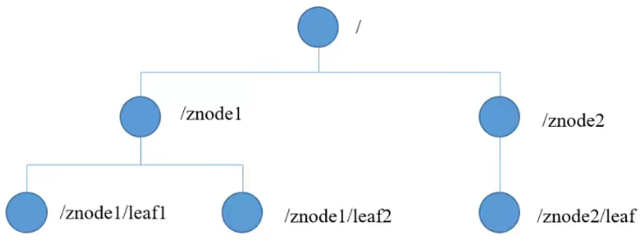
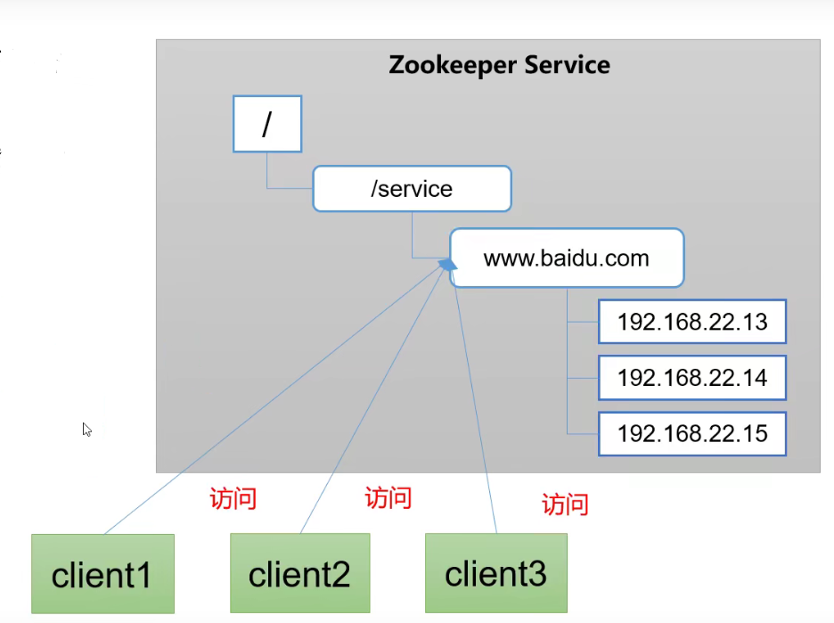
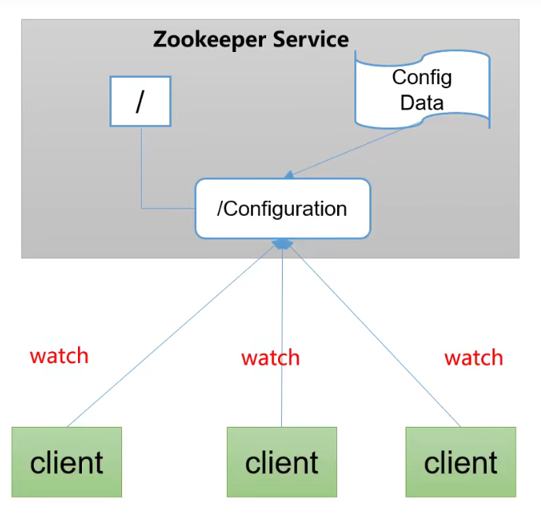
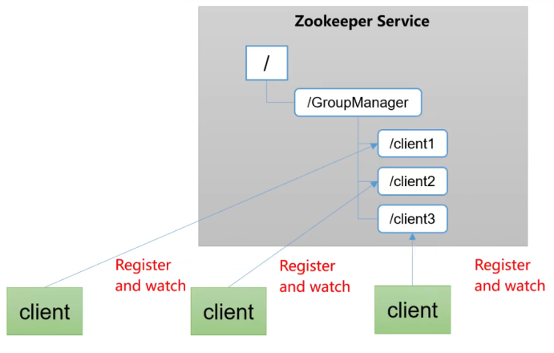
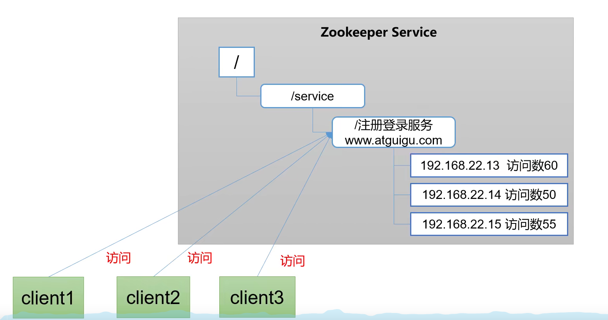

# 概述

分布式协调系统。从设计模式角度来理解:是一个基于观察者模式设计的分布式服务管理框架，它负责存储和管理大家都关心的数据，然后接受观察者的注册，一旦这些数据的状态发生变化，Zookeeper就将负责通知已经在Zookeeper,上注册的那些观察者做出相应的反应。

## 特点

* 一个 领导者(Leader) ，多个跟随者(Follower) 组成的集群。
* 集群中只要有半数以上节点存活，Zookeeper集 群就能正常服务。所以Zookeeper适合安装奇数台服务器。
* 全局数据一致:每个Server保存一份相同的数据副本，Client无论连接到哪个Server，数据都是一致的。
* 更新请求顺序执行，来自同一个Client的更新请求按其发送顺序依次执行。
* 数据更新原子性，一次数据更新要么成功，要么失败。
* 实时性，在一定时间范围内，Client能读到最新数据。
  

## 数据结构

ZooKeeper数据模型的结构与Unix文件系统很类似，整体上可以看作是一棵树，每个
节点称做一个ZNode。每一个ZNode,默认能够存储1MB的数据，每个ZNode都可以通过
其路径唯一标识：



## 使用场景

###  统一命名服务

在分布式环境下，经常需要对应用/服务进行统一命名，便于识别。例如: IP不容易记住，而域名容易记住。

### 统一配置管理

分布式环境下，配置文件同步非常常见。一般要求一个集群中，所有节点的配置信息是一致的， 比如Kafka集群。对配置文件修改后，希望能够快速同步到各个节点上。配置管理可交由ZooKeeper实现。

* 可将配置信息写入ZooKeeper上的一个Znode.
* 各个客户端服务器监听这个Znode。
* 一旦Znode中的数据被修改 ，ZooKeeper将 通知各个客户端服务器



### 集群管理（服务上下线）

分布式环境中，实时掌握每个节点的状态是必要的。可根据节点实时状态做出一些调整。ZooKeeper可以实现实时监控节点状态变化

* 可将节点信息写入ZooKeeper上的一 个ZNode。
* 监听这个ZNode可获取它的实时状态变化。



### 软负载均衡

在Zookeeper中记录每台服务器的访问数，让访问数最少的服务器去处理最新的客户端请求



### 分布式锁


## 安装

### 本地安装

1. 重命名 `conf\zoo_sample.cfg` 文件名为 `zoo.cfg`，修改数据目录：

```sh
tickTime=2000
initLimit=10
syncLimit=5
dataDir=/tmp/zookeeper
clientPort=2181
maxClientCnxns=60
```

2. 启动：双击zkServer.cmd

3. 测试：双击zkClient.cmd:

   ```sh
   [zk: localhost:2181(CONNECTED) 4] ls /
   [zookeeper]
   ```

**配置选项说明**

* tickTime：这个时间是作为 Zookeeper 服务器之间或客户端与服务器之间维持心跳的时间间隔，也就是每个 tickTime 时间就会发送一个心跳。
* initLimit：这个配置项是用来配置 Zookeeper 接受客户端（这里所说的客户端不是用户连接 Zookeeper 服务器的客户端，而是 Zookeeper 服务器集群中连接到 Leader 的 Follower 服务器）初始化连接时最长能忍受多少个心跳时间间隔数。当已经超过 10 个心跳的时间（也就是 tickTime）长度后 Zookeeper 服务器还没有收到客户端的返回信息，那么表明这个客户端连接失败。总的时间长度就是 *2000=10 秒*
* syncLimit：这个配置项标识 Leader 与 Follower 之间发送消息，请求和应答时间长度，最长不能超过多少个 tickTime 的时间长度，总的时间长度就是 `2*2000=4` 秒

### 集群安装

单机集群模式，同一服务器上部署多个实例，必须保证每个配置文档的各个端口号不能冲突，除了clientPort不同之外，dataDir也不同。另外，还要在dataDir所对应的目录中创建myid文件来指定对应的Zookeeper服务器实例。

1. 创建三个配置文件zoo_cluster1、zoo_cluster2、zoo_cluster3：

```sh
tickTime=2000
initLimit=10
syncLimit=5
#########不同项############
dataDir=/usr/local/zookeeper/zk1/data
clientPort=2182
dataLogDir=/usr/local/zookeeper/zk1/logs

server.1=localhost:2287:3387
server.2=localhost:2288:3388
server.3=localhost:2289:3389
```

2. 在 dataDir目录下面创建myid文件，内容是数字，标识实例id。

3. 启动三个实例： `./zkServer.sh start ../conf/zoo_cluster1.cfg `

4. 查看集群状态： ` ./zkServer.sh status ../conf/zoo_cluster1.cfg `

   > 在运行完第一条指令之后，会出现一些错误异常，产生异常信息的原因是由于Zookeeper 服务的每个实例都拥有全局配置信息，他们在启动的时候会随时随地的进行Leader选举操作。此时，第一个启动的Zookeeper需要和另外两个 Zookeeper实例进行通信。但是，另外两个Zookeeper实例还没有启动起来，因此就产生了这的异样信息。我们直接将其忽略即可，待把“2 号”和“3号”Zookeeper实例启动起来之后，相应的异常信息自然会消失。

#### 集群启停脚本


## 选举机制

### 第一次启动选举

1. 服务器1启动，发起一次选举。服务器1投自己一票。此时服务器1票数一票，不够半数以上(3票)，选举无法完成，服务器1状态保持为
   LOOKING;
2. 服务器2启动，再发起一次选举。服务器1和2分别投自己一 票并交换选票信息:此时服务器1发现服务器2的myid比自己目前投票推举的(服务器1)
   大，更改选票为推举服务器2。此时服务器1票数0票，服务器2票数2票，没有半数以上结果，选举无法完成，服务器1, 2状态保持LOOKING
3. 服务器3启动，发起一次选举。此时服务器1和2都会更改选票为服务器3。此次投票结果:服务器1为0票，服务器2为0票，服务器3为3票。此时服
   务器3的票数已经超过半数，服务器3当选Leader。服务器1，2更改状态为FOLLOWING，服务器3更改状态为LEADING;
4. 服务器4启动，发起一次选举。此时服务器1，2，3已经不是LOOKING状态，不会更改选票信息。交换选票信息结果:服务器3为3票，服务器4为
   1票。此时服务器4服从多数，更改选票信息为服务器3，并更改状态为FOLLOWING; .
5. 服务器5启动，同4-样当小弟。


SID:服务器ID。用来唯一标识一台ZooKeeper集群中的机器，每台机器不能重复，和myid一致。
ZXID:事务ID。ZXID是一一个事务ID，用来标识一次服务器状态的变更。在某时刻，集群中的每台机器的ZXID值不一定完全一致，这和ZooKeeper服务器对于客户端“更新请求”的处理逻辑有关。
Epoch:每个Leader任期的代号。没有Leader时同一轮投票过程中的逻辑时钟值是相同的。每投完一次票这个数据就会增加

### 非第一次启动选举

当ZooKeeper集群中的一台服务器出现以下两种情况之一-时， 就会开始进入Leader选举: 

* 服务器初始化启动。
* 服务器运行期间无法和L eader保持连接。

而当一台机器进入Leader选举流程时，当前集群也可能会处于以下两种状态:

* 集群中本来就已经存在一个Leader。
  对于第一种已经存在Leader的情况，机器试图去选举Leader时，会被告知当前服务器的Leader信息，对于该机器来说，仅仅需要和Leader机器建立连接，并进行状态同步即可。

* 集群中不存在leader

  假设ZooKeeper由5台服务器组成，SID分别为1、 2、3、4、5, ZXID分别为8、8、8、7、7,并且此时SID为3的服务器是Leader。某时 刻，3和5服务器出现故障，因此开始进行Leader选举。SID为1、2、4的机器投票情况:

  ```sj
  (EPOCH，ZXID，SID )
  (1，8，1)
  (1，8, 2)
  (1，7，4)
  ```

  选举Leader规则: 

  ① EPOCH大的直接胜出 

  ② EPOCH相同， 事务id大的胜出

  ③ 事务id相同，服务器id大的胜出

  

# API操作

## 节点类型


## 客户端操作

